<div align="center">

# Brody

**Repository intelligence for any codebase.**
Evidence-backed code review, Lean 4 proofs of real defects, plain-language system explanations,
interactive code maps and executive reports, with the cost of every AI request shown live.

[](https://github.com/MoRohn/brody/actions/workflows/ci.yml)
&nbsp;Next.js 16 · TypeScript · SQLite · Lean 4 · Claude or OpenAI

</div>

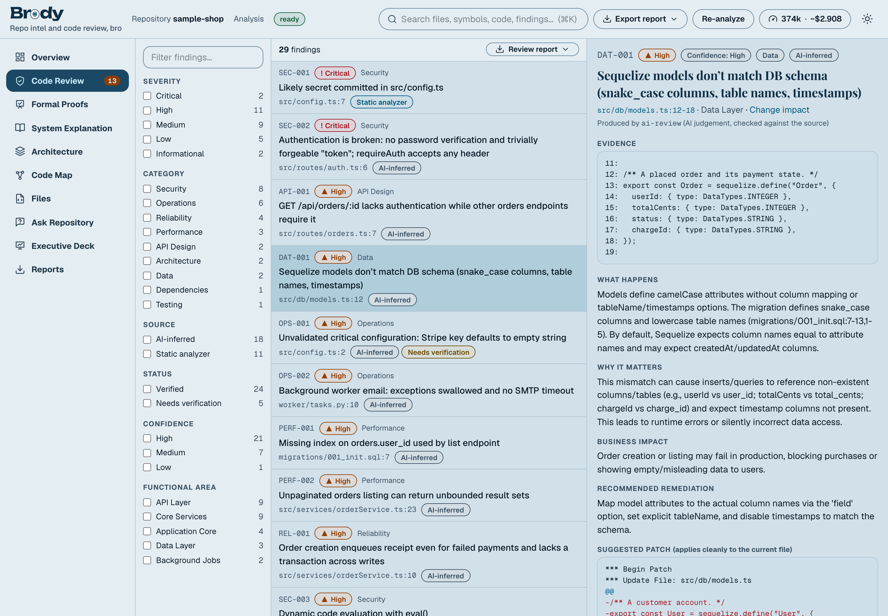

Give Brody a folder, a ZIP or a GitHub repository. It parses the code with real parsers, builds a symbol and dependency graph, reviews it with deterministic analyzers and (optionally) AI, **proves** what it can with the Lean 4 theorem prover, checks every claim against the source, explains what the system does at every level from one function to the whole product, and draws an interactive map of how it fits together.

An AI model never receives "the whole repo". It reasons over structured repository knowledge (symbols, the call graph, routes, models, retrieved excerpts), and everything it says must cite lines that exist. Imported code is treated as untrusted data and is **never executed**.

```
INGEST → PARSE → SYMBOL & DEPENDENCY GRAPH → RETRIEVE → ANALYZE → PROVE → VERIFY → EXPLAIN → MAP → REPORT
```

## Contents

[Tour](#tour) · [Quick start](#quick-start) · [How it works](#how-it-works) · [Features](#features) · [Configuration](#configuration) · [Security model](#security-model) · [Testing and validation](#testing-and-validation) · [Known limitations](#known-limitations)

## Tour

### Findings you can trust

Every finding has an ID, severity, confidence, the exact lines, what happens, why it matters, the business impact, a fix and, where possible, a patch that has been applied to the real file to prove it fits. Static analyzers, AI review and formal proofs are always labelled apart, and AI claims that cannot be grounded in the source are dropped or marked **Needs verification**.

### Defects proved, not guessed

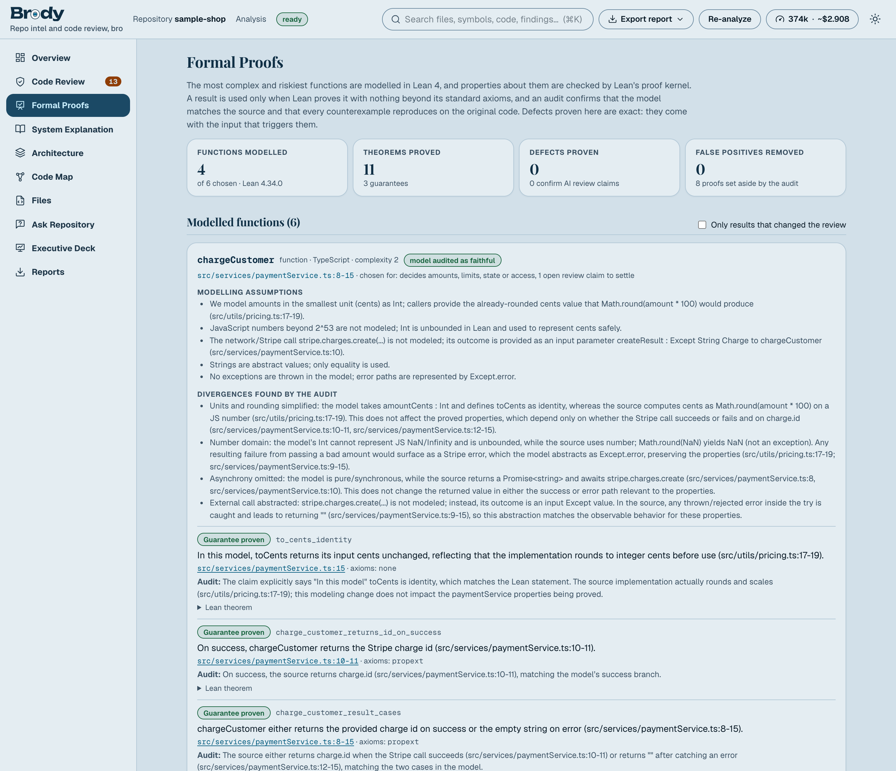

The most complex and riskiest functions are modelled in **Lean 4** and checked by Lean's proof kernel. Brody proves guarantees, proves **concrete counterexamples** for real defects (the exact input that breaks the code, ready to become a regression test), confirms AI claims with a proof, and removes false positives by proving the claimed failure cannot happen. A proof counts only if Lean accepts it with nothing beyond its standard axioms, and only after an audit confirms that the model matches the source.

### Know what every run costs

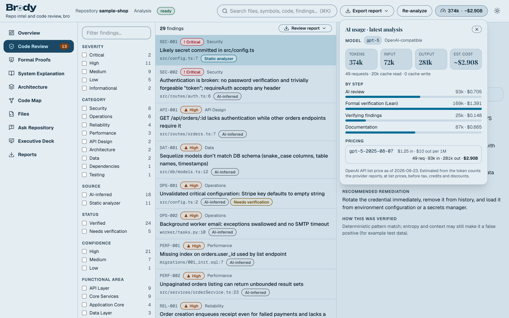

A gauge on every project page shows the AI tokens and estimated cost of the latest analysis, **updating live** while it runs, with the model that answered, a per-step breakdown and the prices used. Local or unpriced models show tokens and "cost n/a" rather than a guess.

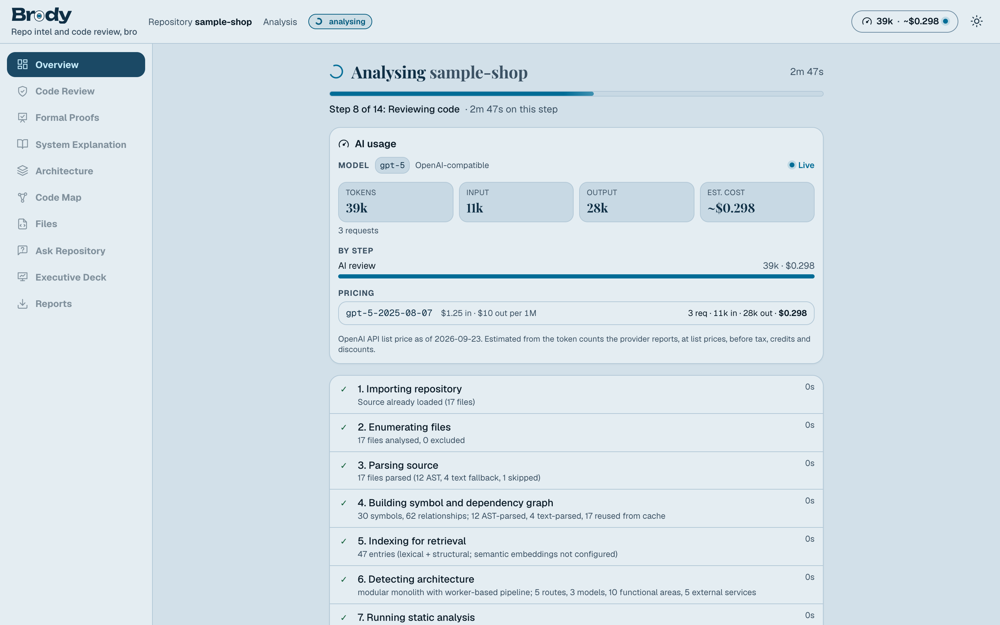

### See how it fits together

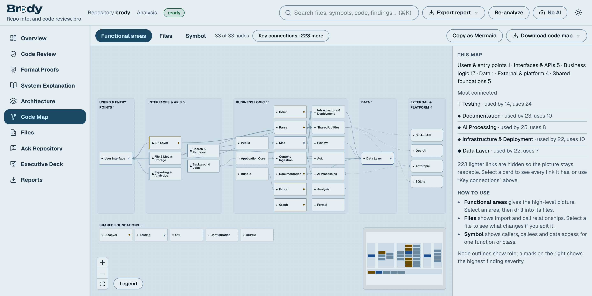

The **Code Map** goes from functional areas to files to a single symbol, marks risk, and answers "if I change this, what could I affect?". Shown here: Brody mapping its own code.

<table>
<tr>
<td width="50%">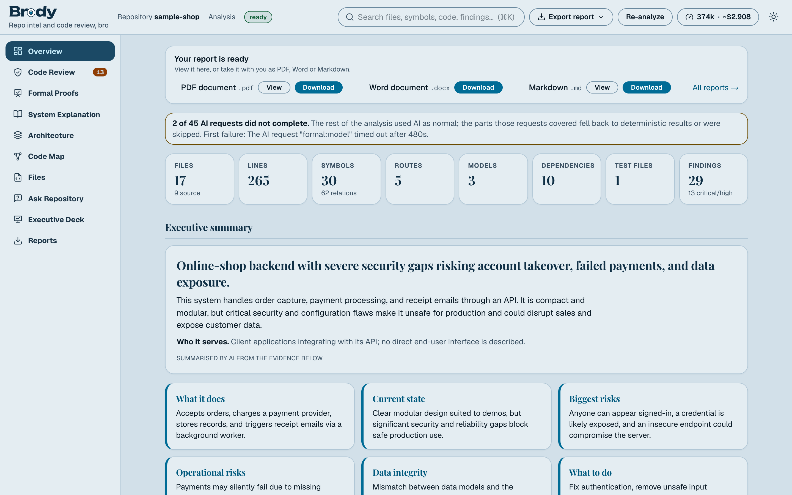<br><b>Overview.</b> What the system is and does, how it is built and where the risk is, in about 30 seconds.</td>
<td width="50%">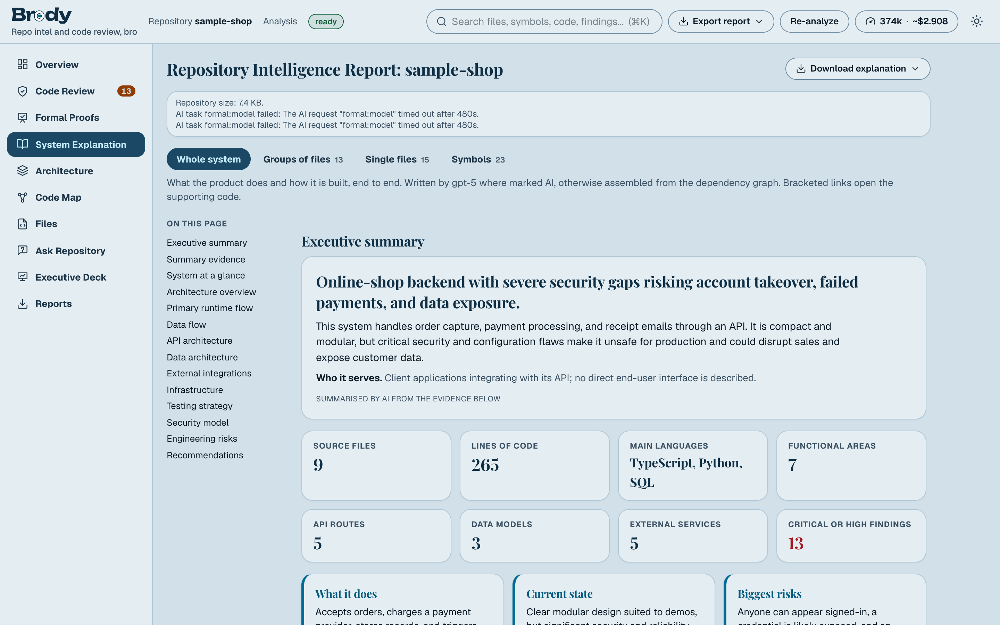<br><b>System Explanation.</b> Four zoom levels, from the whole system to groups of files, single files and symbols, every statement linked to its source.</td>
</tr>
<tr>
<td>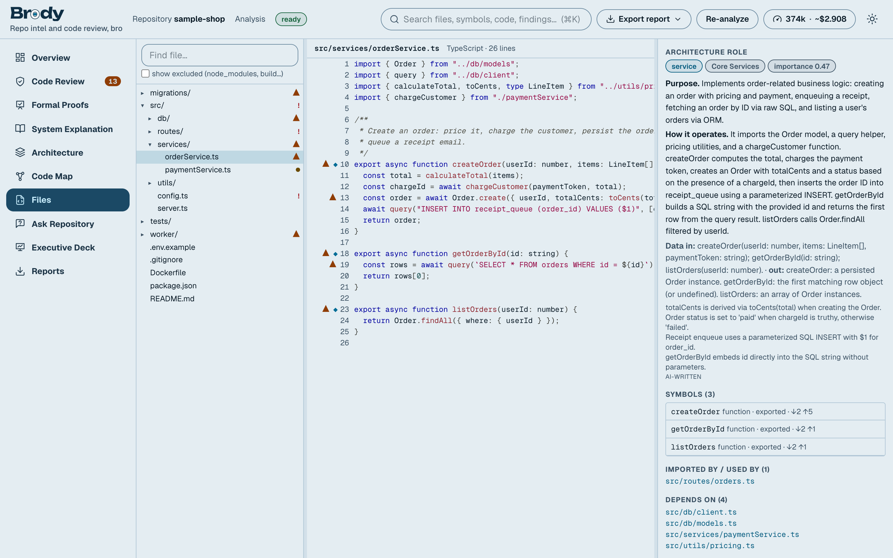<br><b>Files.</b> Source with symbol and finding markers, callers, callees, data access, tests and change impact.</td>
<td>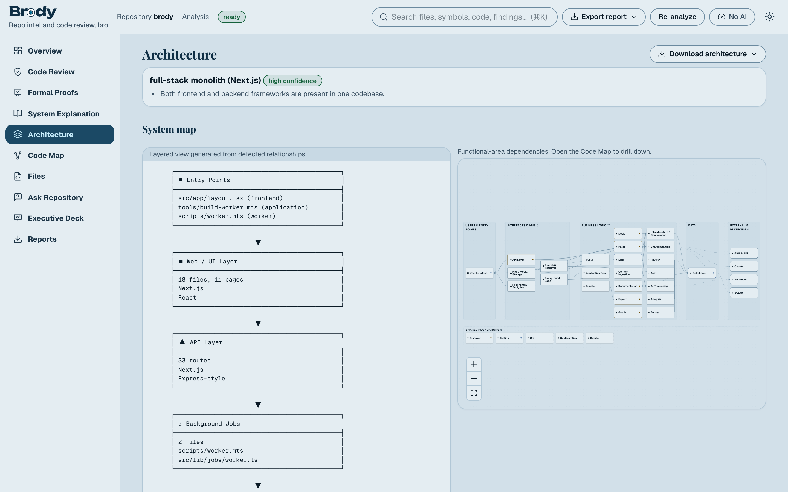<br><b>Architecture.</b> Layers, entry points, API and data-model maps, external services, configuration and CI.</td>
</tr>
<tr>
<td>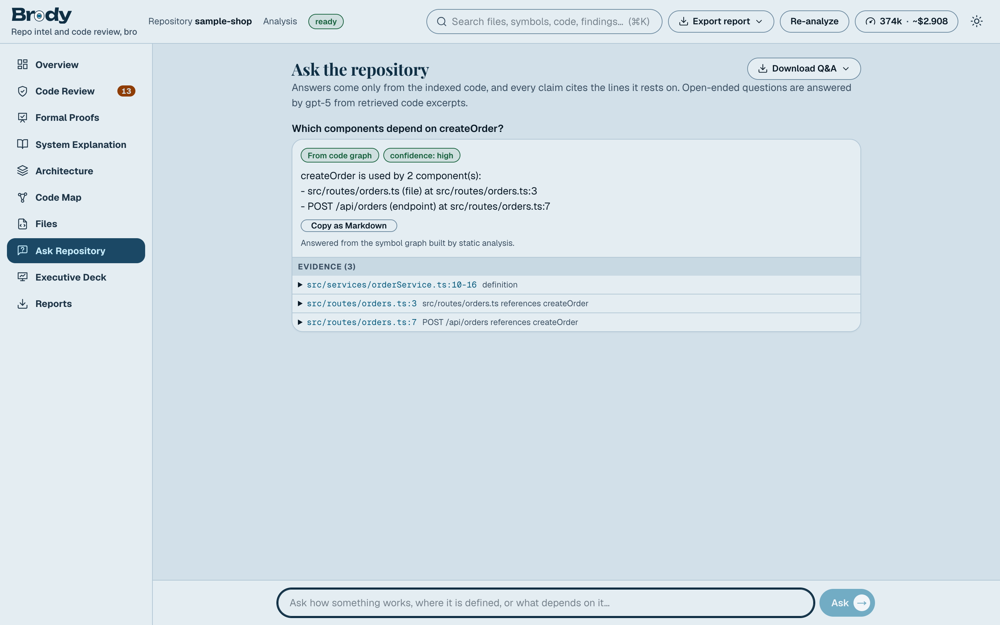<br><b>Ask Repository.</b> Structural questions answered exactly from the graph; open questions answered by the model with citations.</td>
<td>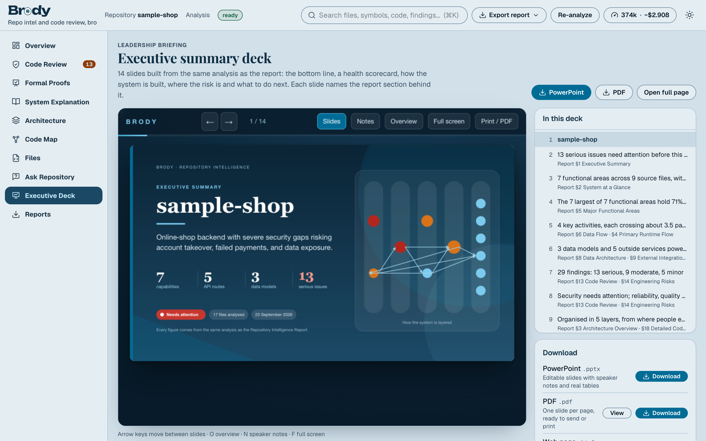<br><b>Executive Deck.</b> A 14-slide briefing in business language, as PowerPoint, PDF or a web page.</td>
</tr>
<tr>
<td>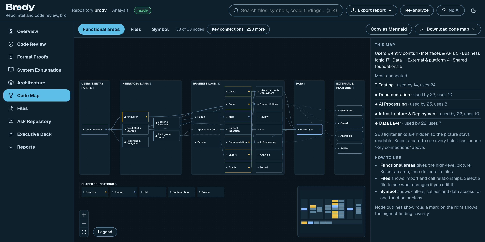<br><b>Five brightness levels,</b> all checked for WCAG AA contrast.</td>
<td>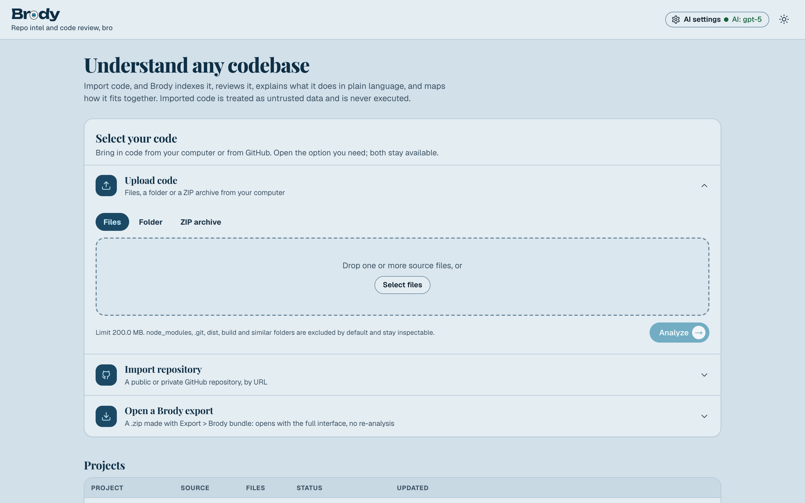<br><b>Start</b> with files, a folder, a ZIP, a GitHub repository or a Brody export.</td>
</tr>
</table>

## Quick start

### Docker

```bash
cp .env.example .env        # optional: add ANTHROPIC_API_KEY or OPENAI_API_KEY to enable AI features
docker compose up --build   # then open http://brody:3003
```

The image (Node 24, non-root, all capabilities dropped) includes Ruff for Python analysis and a Lean 4 toolchain for formal verification, and keeps its SQLite database in the `brody-data` volume.

### Local

Requires Node 24+ (optionally `ruff` and `python3` for Python analysis, and [Lean 4](https://lean-lang.org/install) for formal verification).

```bash
npm install
cp .env.example .env        # optional
npm run dev                 # http://brody:3003
```

Brody answers at **http://brody:3003** and refuses other host names (`ALLOWED_HOSTS`). Make the name resolve once with `echo "127.0.0.1 brody" | sudo tee -a /etc/hosts`, or set `ALLOWED_HOSTS=` (empty) to turn the check off. Then upload `fixtures/sample-shop`, a small, deliberately flawed shop backend, to see the whole workflow.

### One command, in the background

```bash
start brody             # builds if needed, starts in the background and opens the browser
brody stop              # also: brody status | restart | logs | open
start brody --no-open   # or set BRODY_OPEN=0
```

`start brody` and `brody` point at `scripts/brody.sh`; install them elsewhere with `ln -s "$(pwd)/scripts/brody.sh" ~/.local/bin/brody`. Inside the repository, `npm run brody` does the same. Logs are in `data/brody.log`.

### Command line

```bash
npm run analyze -- ./path/to/project --out ./report   # CODEBASE_REPORT.md, report.pdf, report.docx, report.html, report.json
npm run convert -- notes.md                            # any Markdown file to PDF and Word with the same renderers
npm run worker                                         # optional standalone job worker (EMBEDDED_WORKER=off on the web server)
```

## How it works

**Deterministic first.** Files are classified (source, test, config, docs, schema, CI, infra, manifest, generated, vendor, binary), hashed and language-detected. Tree-sitter grammars (TypeScript/TSX, JavaScript, Python, Go, Java, C#, Ruby, Rust, PHP, CSS, HTML, JSON, Shell) produce symbols, imports, calls and inheritance; SQL, Prisma, GraphQL, Markdown and YAML have purpose-built parsers; other languages fall back to text inspection and are marked as such, never as AST. Imports are resolved to files (including tsconfig path aliases), calls to symbols with a confidence score, and ORM and query calls become `READS_FROM`/`WRITES_TO` edges. Routes, models, entry points, external services, environment variables, tests and infrastructure are detected from those facts, and importance is a PageRank over the graph.

**Review is layered and honest about origin.**

1. **Static:** built-in pattern rules, TypeScript syntax diagnostics, ESLint with a fixed embedded rule set, Python `ast` and Ruff (`--isolated`), `gofmt -e`, plus structural checks (size, complexity, tests, secrets, auth consistency, operations).
2. **AI:** five focused passes (security; reliability and correctness; performance and data; architecture and API; testing and operations), each over retrieved excerpts plus graph facts (callers, callees, routes, packages).
3. **Formal verification (Lean 4):** the functions that most need it (open AI claims first, then high complexity, arithmetic and comparison density, and names that decide amounts, limits, state or access) are modelled in Lean by the AI and checked by Lean's kernel. Lean's exact errors are fed back for repair rounds, and complex functions get more rounds and more properties. A theorem counts only if Lean proves it with nothing beyond its three standard axioms (`#print axioms`, added by Brody), so `sorry`, custom axioms and compiler-trusted tactics cannot pass. Because a proof about the wrong model proves nothing, a separate audit compares the model with the source and replays every counterexample by hand on the original code. A counterexample becomes a *Proved (Lean 4)* finding with the failing input; a claim proved true is **Verified**; a claim proved impossible is removed. Unchanged functions reuse their proofs.
4. **Verification:** an AI finding survives only if its file exists, its quoted evidence is found in that file (line numbers are re-anchored to where the quote really is), its patch applies cleanly, and a second sceptical AI pass does not reject it. Otherwise it is dropped or marked **Needs verification**.

**Documentation is built bottom-up:** symbol → file → functional area → architecture → executive summary. A deterministic baseline is generated from the graph for everything, and AI enriches it with narrative. Statements whose evidence does not resolve to real lines are dropped, contradictions are re-checked against the source, and data-access claims are cross-checked against the graph.

**Incremental.** Parses are cached by content hash and AI explanations and proofs by the content they depend on, so re-analysing a changed repository re-processes only what changed ("18 changed, 242 unchanged, 3 removed, 5 added").

See [`docs/ARCHITECTURE.md`](docs/ARCHITECTURE.md) for design decisions and extension points.

## Features

| Area | What it does |
| --- | --- |
| **Intake** | Upload files, a folder or a ZIP, or import from GitHub (branch, tag, commit, optional token for private repositories). Repository metadata is shown before analysis; long waits show the current step, a moving progress bar and live timers. |
| **Overview** | What the system is, what it does, how it works, its technology, statistics and the engineering review, answerable in about 30 seconds. No meaningless quality score. |
| **Code Review** | Findings with ID (`SEC-004`), severity, confidence, file and lines, evidence, plain-English behaviour, why it matters, business impact, remediation and a validated patch. Filter by severity, category, source, status, confidence and functional area. |
| **Formal Proofs** | Lean 4 models of the riskiest functions, with guarantees, counterexamples, confirmed and refuted AI claims, the axioms each proof rests on, the modelling assumptions and the fidelity audit. |
| **AI usage and cost** | Live tokens and estimated cost in the header of every project page and on the progress screen: model and provider, input, output and cache tokens, requests, a per-step breakdown and the pricing basis. Fallback models are listed and priced separately. |
| **System Explanation** | Four zoom levels on separate tabs: the whole system; groups of files (functional areas and folders, or any set you pick); single files; symbols. Evidence links open the code. |
| **Architecture** | Layer map, entry points, API map, data-model map with ER diagram, external services (and what fails if they are down), dependencies, environment variables (names only), ports, feature flags, CI and infrastructure, test map. |
| **Code Map** | Interactive graph at three levels (functional areas → files → one symbol) with drill-down, a consistent legend, risk marks, Mermaid export and a change-impact panel. |
| **Files** | File tree, source with symbol and finding markers, and a code-intelligence panel (purpose, symbols, callers, callees, data access, tests, findings, impact). |
| **Ask Repository** | Structural questions ("who depends on X?", "what writes to `orders`?", "what happens after `POST /checkout`?") answered exactly from the graph; open questions answered by the model from retrieved excerpts. Every answer cites lines and says when the evidence is insufficient. |
| **Search** | ⌘K across files, paths, symbols, code, findings and generated documentation, with filters. |
| **Reports** | Every view downloads as PDF, Word or Markdown, plus a web page and JSON. The main report opens with a business Executive Summary; the Complete Technical Report keeps every finding, file, symbol and map. |
| **Executive Deck** | A 14-slide leadership briefing from the same analysis, as editable PowerPoint with speaker notes, PDF or a web page you can present from. Every slide names the report section behind it. |
| **Brody bundle** | Export a whole project as one `.zip` (analysis, source with secrets redacted, reports, one-click launchers) and reopen it in any Brody with the full interface and no re-analysis. |

### Brody bundle

**Export > Brody bundle** downloads one `.zip` with the analysis behind every view, the source (detected secrets redacted), ready-made reports, a README and one-click launchers. Open it from **Open a Brody export** on the home page (or drop it on the ZIP upload); run `Open in Brody.command` (macOS), `open-in-brody.sh` (Linux) or `Open in Brody.bat` (Windows, untested) to send it to a running Brody; or read `reports/Report.html` without Brody at all. Bundles are validated before anything is written, and importing always creates a new project. API: `GET /api/projects/:id/export?format=bundle`, `POST /api/projects/import-bundle`.

### Look and feel

One blue palette family (deep navy `#1B4965`, cerulean `#006C96`), Geist for text, Playfair Display for headings and Lora for long-form documentation. The sun or moon button offers five brightness levels, from Bright to Darkest, remembered and applied before the page paints. Every text and surface pair is checked against WCAG AA at all five levels, and every page is scanned with axe at every level.

## Configuration

All configuration is environment variables; see [`.env.example`](.env.example).

| Variable | Purpose |
| --- | --- |
| `AI_PROVIDER` | `auto` (Anthropic if its key is set, otherwise OpenAI), `anthropic`, `openai-compatible`, `none`. Overridden by the AI settings panel |
| `ANTHROPIC_API_KEY`, `ANTHROPIC_MODEL` | Anthropic access; default model `claude-opus-5` |
| `ANTHROPIC_WORKSPACE_ID` | Needed if your key is not scoped to one workspace |
| `OPENAI_API_KEY`, `OPENAI_MODEL`, `OPENAI_BASE_URL` | OpenAI or any compatible endpoint (Azure OpenAI v1, vLLM, Ollama, gateways); default model `gpt-4.1`. A local endpoint needs no key |
| `AI_EMBEDDING_MODEL` | Semantic retrieval through an OpenAI-compatible embeddings endpoint |
| `AI_CONCURRENCY`, `AI_MAX_FILES_REVIEWED`, `AI_MAX_MODULES_EXPLAINED`, … | Concurrency and token budgeting |
| `AI_PRICING` | Your own rates for the cost estimate, as JSON in USD per million tokens, e.g. `{"llama3:70b": {"input": 0.5, "output": 1}}`. Overrides the dated list prices in `src/lib/ai/pricing.ts` |
| `FORMAL_VERIFICATION`, `LEAN_BIN`, `FORMAL_MAX_TARGETS`, `FORMAL_MAX_REPAIR_ROUNDS`, `FORMAL_CONCURRENCY`, `FORMAL_TIMEOUT_MS`, `FORMAL_MEMORY_MB`, `FORMAL_MAX_HEARTBEATS`, `FORMAL_SANDBOX` | Lean 4 formal verification. Needs an AI provider and Lean (`lean` on PATH or in `~/.elan/bin`, or `LEAN_BIN`); otherwise the stage is skipped with the reason |
| `GITHUB_TOKEN` | Optional server-wide token; users can also paste a token per import |
| `CREDENTIAL_SECRET` | Encrypts stored GitHub tokens across restarts |
| `DATABASE_PATH`, `MAX_*` | Storage location and hard limits on files, bytes, ZIP entries and compression ratio (`MAX_UPLOAD_BYTES`, 200 MB by default) |
| `STATIC_ANALYSIS`, `RUFF_PATH`, `PYTHON_PATH` | Language analyzer controls |
| `PARSE_WORKERS`, `PARSE_WORKER_MIN_FILES` | Parse worker threads (up to 4 by default, sized to the memory available, from 400 files) |
| `EMBEDDED_WORKER` | `off` to run the job worker separately with `npm run worker` |

### Using Claude or OpenAI

Click the AI chip on the home page to open **AI settings**: choose a provider (Automatic, Anthropic, OpenAI or compatible, or Off) and a model from the provider's own list, then **Save and test** to apply it without a restart and confirm the key, endpoint and model with one small request. Keys are read from `.env` only and are never displayed, returned by the API or stored by the panel. The same is available over HTTP: `GET /api/ai/settings`, `PUT /api/ai/settings[?test=1]`, `GET /api/ai/models?provider=…`.

OpenAI-compatible endpoints differ, so the client adapts and remembers: `max_completion_tokens` or `max_tokens`, `json_schema` structured output falling back to `json_object` and then prompt-only JSON, retries with backoff, and a larger budget when a reasoning model runs out of tokens. Without an AI provider every deterministic stage still runs, and the AI stages say plainly that they were skipped.

## Security model

Imported code is **untrusted data** and is never executed.

* ZIPs are read in memory with entry-count, size and compression-ratio limits; `..`, absolute and drive paths are rejected and symlinks skipped.
* Analyzers only parse: TypeScript syntax, ESLint with an embedded config (repository configs are JavaScript and are ignored), Python `ast` in isolated mode, Ruff `--isolated`, `gofmt -e`. `mypy` and `go vet` are deliberately not run because they load plugins or resolve modules. Subprocesses use no shell, a minimal environment and a timeout.
* Lean source is written by a model that read untrusted code, so it is treated as hostile: every construct that can execute code or fake a proof is refused before Lean runs (`#eval` and every `#` command, `import`, `macro`/`syntax`/`elab`, `initialize`, `unsafe`, `extern`/`implemented_by`, `native_decide`, `IO`, `set_option`, `sorry`, `axiom`), and Lean runs with no inherited environment, a private temporary directory, a memory cap, a heartbeat limit and a hard kill. `FORMAL_SANDBOX` can add an isolation wrapper such as bubblewrap without network.
* Every repository-derived string sent to a model sits inside `<untrusted_repository_content>` tags with embedded delimiters neutralised; a test proves injected text stays inside.
* Secrets are detected before model use and replaced with `[REDACTED_SECRET]`. GitHub tokens are only sent as an `Authorization` header, encrypted at rest with AES-256-GCM, scrubbed from logs and never returned by the API.
* Exports escape all repository-derived content.

**There is no user authentication.** Brody is a single-tenant tool: anyone who can reach the port can read every project. Run it locally or behind an authenticating reverse proxy, not on the open internet.

## Testing and validation

```bash
npm run validate    # everything below with zero warnings allowed, plus both production builds and the performance budgets
npm test            # 379 unit and integration tests, including formal verification against the real Lean kernel
npm run test:e2e    # Playwright: the full workflow and downloads, 4 widths x 5 brightness levels, axe accessibility, keyboard, performance budgets
npm run benchmark -- --budget 200 1000   # pipeline speed and memory, failing if a budget is exceeded
npm run verify:ai   # live check of your AI provider on the sample repository (billable: about $3 with gpt-5)
npm run screenshots -- --url http://brody:3003 --shop <id> --self <id>   # regenerate the images in this README
```

CI runs `npm run validate` and the browser suite on every push. The full validation of this repository (syntax, correctness, performance, styling, accessibility, live AI behaviour and cost, downloads, Docker) is in [`docs/validation/VALIDATION_REPORT.pdf`](docs/validation/VALIDATION_REPORT.pdf), with Brody's analysis of its own code in [`docs/validation/self-analysis/`](docs/validation/self-analysis). Headline numbers: 3,000 source files analyse in about 6 seconds; every page loads in under 60 ms with 159 to 232 KB of JavaScript; no serious or critical accessibility violations at any brightness level; a live `gpt-5` analysis of the sample repository costs about $3.30.

## Project layout

```
src/lib/ingest      upload, ZIP and GitHub ingestion, classification, secrets, credentials
src/lib/parse       tree-sitter extractors, text fallbacks, parse worker threads
src/lib/graph       import resolution, symbol, call and data-access graph, importance
src/lib/discover    architecture: routes, models, services, env, tests, areas, flows
src/lib/analysis    pattern rules, analyzer adapters, structural checks
src/lib/review      AI review passes, verification, patch validation, dedupe
src/lib/formal      Lean 4 formal verification: targets, models, proof repair, audit, source policy
src/lib/ai          provider abstraction (Anthropic, OpenAI-compatible), prompts, usage and pricing
src/lib/docs        hierarchical documentation, conflict detection, caches
src/lib/retrieval   BM25 + graph + importance (+ optional embeddings) retrieval
src/lib/map         tree, graphs, change impact, diagrams, legend
src/lib/ask         repository Q&A
src/lib/export      Markdown, HTML, PDF, Word, JSON
src/lib/deck        the executive deck (HTML, PowerPoint, PDF)
src/lib/jobs        persisted job pipeline, worker, cancellation, recovery
src/app             Next.js UI and API routes
fixtures/sample-shop  the demonstration repository
```

## Known limitations

* **Formal verification proves facts about a model of the code.** Lean guarantees the proofs; whether the model matches the source is judged by an AI audit, so every result lists its modelling assumptions and a proof the audit disputes is never used. Floating-point arithmetic, string processing and IO-heavy code are not modelled. A property Lean could not prove is *unproven*, which says nothing about whether it holds.
* **AI cost.** With a reasoning model such as `gpt-5`, a small project costs a few dollars, about 60% of it formal verification. The usage gauge shows it live; `FORMAL_MAX_TARGETS` or `FORMAL_VERIFICATION=off` bound it.
* The live AI path is verified with OpenAI `gpt-5`; the Anthropic path is verified against test doubles.
* Call and data-flow graphs come from static, name-based resolution. Dynamic dispatch, reflection, dependency injection and runtime-registered routes are not visible; edges carry confidence scores.
* Languages without a tree-sitter grammar here (Kotlin, Swift, Scala, C/C++, Dart, …) use text inspection, so their symbols and imports are approximate.
* Route and model detection covers the frameworks and ORMs listed in `src/lib/discover/catalog.ts`; others appear as ordinary symbols.
* Storage is SQLite with in-process retrieval, chosen for a one-command install; it suits repositories up to tens of thousands of files.
* The interface is verified in Chrome only.
