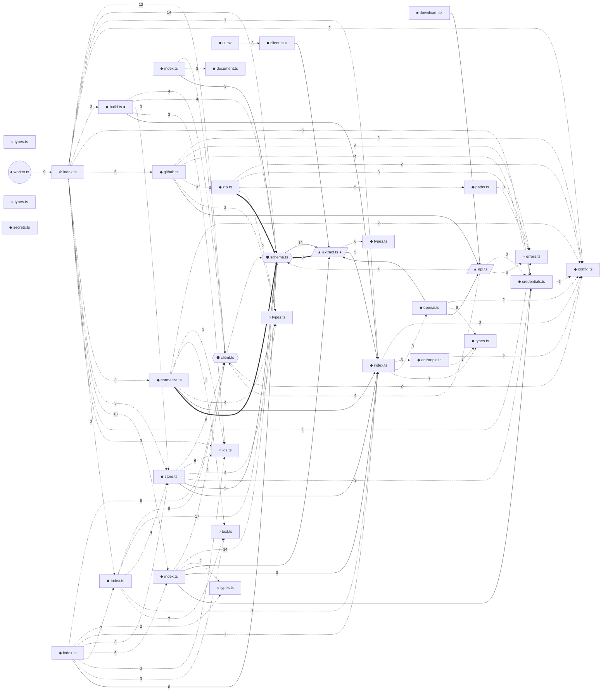

# Repository Intelligence Report

**brody**  
Generated 2026-09-20T15:31:05.740Z · deterministic (no AI provider)  
Statements are backed by repository evidence in the form `path:line-range`. Findings are labelled **static analyzer** (deterministic) or **AI-inferred**, and **needs verification** where evidence is incomplete.


## 1. Executive Summary

brody: Repository intelligence, code review and code mapping. (Stated in the project's own documentation.) _(`package.json`)_

The repository contains 118 source files (29,317 lines across 178 files) organised into 23 functional areas: API Layer, Content Ingestion, Application Core, Infrastructure & Deployment, User Interface, Export.

Execution begins at src/app/layout.tsx (Next.js root layout (package.json script "dev")), scripts/worker.mts (package.json script "worker"), Dockerfile (CMD node -e "require('http').get({host:'127.0.0.1',port:process.env.PORT||3003,path:). _(`src/app/layout.tsx`, `scripts/worker.mts:8`, `Dockerfile:38`)_

Data enters through 25 API route(s) and 9 page(s) built with Next.js, React. Data is persisted in SQLite through Drizzle ORM, modelled by 12 entities such as projects, credentials, blobs, files. _(`src/app/page.tsx:15`, `src/app/api/github/validate/route.ts:10`)_

It integrates with Anthropic, OpenAI, SQLite, GitHub API. _(`package.json`, `src/lib/config.ts:39`, `package.json`)_

Engineering review found 21 finding(s): 0 critical, 0 high, 8 medium, 13 lower-priority. 21 came from deterministic analyzers and 0 from AI review. 34 test file(s) exist.


## 2. System at a Glance

| Area | Description |
| --- | --- |
| Primary Purpose | Repository intelligence, code review and code mapping |
| Application Type | full-stack monolith (Next.js) (high confidence) |
| Primary Languages | TypeScript (143 files), SQL (2 files), CSS (1 files), JavaScript (2 files), Python (1 files) |
| Frontend | Next.js, React, Tailwind CSS |
| Backend | custom HTTP handlers |
| Data Layer | Database: SQLite; Access: Drizzle ORM; 12 modelled entities |
| Authentication | no authentication mechanism detected |
| External Services | Anthropic, OpenAI, SQLite, GitHub API |
| Infrastructure | GitHub Actions, Docker, Docker Compose |
| Testing | 34 test files; Vitest, Playwright |

## 3. Architecture Overview

The codebase is best described as a full-stack monolith (Next.js) (high confidence). Both frontend and backend frameworks are present in one codebase.

Files divide into these layers: Entry Points (5), Presentation / UI (8), API / Transport (33), Domain / Services (63), Background Processing (2), AI (6), Data (3), Infrastructure & Config (11), Tests & Docs (39).

The largest functional areas are Testing (34 files), API Layer (21 files), Content Ingestion (13 files), Documentation (12 files), Application Core (11 files).

**Layers:** Entry Points (5 files) · Presentation / UI (8 files) · API / Transport (33 files) · Domain / Services (63 files) · Background Processing (2 files) · AI (6 files) · Data (3 files) · Infrastructure & Config (11 files) · Tests & Docs (39 files)


## 4. Primary Runtime Flow

GET /api/projects/:id/files/content is handled by GET /api/projects/:id/files/content, which calls guard, getReadyProject, AppError, getDb, getFileContent; along the way it reads files, symbols, relationships, findings. _(`src/app/api/projects/[id]/files/content/route.ts:13`)_

1. **GET /api/projects/:id/files/content** — function at src/app/api/projects/[id]/files/content/route.ts:13 _(`src/app/api/projects/[id]/files/content/route.ts:13`)_
2. **guard** — function at src/lib/api.ts:20 _(`src/lib/api.ts:20`)_
3. **getReadyProject** — function at src/lib/api.ts:34 _(`src/lib/api.ts:34`)_
4. **AppError** — class at src/lib/util/errors.ts:2 _(`src/lib/util/errors.ts:2`)_
5. **getDb** — function at src/lib/db/client.ts:48 _(`src/lib/db/client.ts:48`)_
6. **getFileContent** — function at src/lib/ingest/store.ts:86 _(`src/lib/ingest/store.ts:86`)_
7. **changeImpact** — function at src/lib/map/index.ts:364 _(`src/lib/map/index.ts:364`)_
8. **json** — function at src/lib/api.ts:8 _(`src/lib/api.ts:8`)_
9. **reads files** — model at src/lib/db/schema.ts:42 _(`src/lib/db/schema.ts:42`)_
10. **reads symbols** — model at src/lib/db/schema.ts:82 _(`src/lib/db/schema.ts:82`)_
11. **reads relationships** — model at src/lib/db/schema.ts:110 _(`src/lib/db/schema.ts:110`)_
12. **reads findings** — model at src/lib/db/schema.ts:128 _(`src/lib/db/schema.ts:128`)_
13. **UsageMeter.add** — method at src/lib/ai/index.ts:51 _(`src/lib/ai/index.ts:51`)_
14. **fail** — function at src/lib/api.ts:12 _(`src/lib/api.ts:12`)_

## 5. Major Functional Areas


### Testing

- **Purpose:** Automated tests, fixtures and mocks.
- **Business function:** Supports the full-stack monolith (Next.js) through 34 file(s).
- **Primary components:** `Order` (model, fixtures/sample-shop/src/db/models.ts:13); `User` (model, fixtures/sample-shop/src/db/models.ts:7); `MockProvider` (service, tests/helpers/index.ts:50); `authRouter` (service, fixtures/sample-shop/src/routes/auth.ts:4); `ordersRouter` (service, fixtures/sample-shop/src/routes/orders.ts:5); `app` (service, fixtures/sample-shop/worker/tasks.py:7); `send_receipt` (job, fixtures/sample-shop/worker/tasks.py:10); `EmbedProvider` (service, tests/analyzers.test.ts:60)
- **Inputs:** Startup and configuration
- **Processing:** 34 file(s), key components: Order, User, MockProvider, authRouter, ordersRouter.
- **Outputs:** Results consumed via Content Ingestion, Background Jobs, Map and 17 more
- **Dependencies:** Content Ingestion, Background Jobs, Map, Data Layer, Analysis, AI Processing, Export, Review, API Layer, Shared Utilities, Infrastructure & Deployment, Search & Retrieval, Documentation, Parse, Graph, Ask, Discover, File & Media Storage, Util, Reporting & Analytics
- **Failure modes:** none identified
- **Important relationships:** No other area depends on it directly.
- **Source of explanation:** deterministic, derived from the repository graph _(`fixtures/sample-shop/src/db/models.ts:13`, `fixtures/sample-shop/src/db/models.ts:7`, `tests/helpers/index.ts:50`)_

### API Layer

- **Purpose:** HTTP/RPC endpoints and request handling.
- **Business function:** Serves GET /, POST /api/github/validate, GET /api/projects, DELETE /api/projects/:id and 19 more to callers.
- **Primary components:** `POST` (function, src/app/api/github/validate/route.ts:10); `POST` (function, src/app/api/projects/[id]/analyze/route.ts:17); `GET` (function, src/app/api/projects/[id]/architecture/route.ts:8); `GET` (function, src/app/api/projects/[id]/ask/route.ts:11); `POST` (function, src/app/api/projects/[id]/ask/route.ts:19); `GET` (function, src/app/api/projects/[id]/export/route.ts:13); `GET` (function, src/app/api/projects/[id]/findings/route.ts:9); `GET` (function, src/app/api/projects/[id]/graph/route.ts:9)
- **Inputs:** Requests to GET /, POST /api/github/validate, GET /api/projects, DELETE /api/projects/:id and 19 more
- **Processing:** 21 file(s), key components: POST, POST, GET, GET, POST.
- **Outputs:** Results consumed via Shared Utilities, User Interface, Map and 10 more
- **Dependencies:** Shared Utilities, User Interface, Map, Content Ingestion, Data Layer, Util, Documentation, Background Jobs, Discover, AI Processing, Ask, Export, Infrastructure & Deployment
- **Failure modes:** none identified
- **Important relationships:** Used by Testing.
- **Source of explanation:** deterministic, derived from the repository graph _(`src/app/api/github/validate/route.ts:10`, `src/app/api/projects/[id]/analyze/route.ts:17`, `src/app/api/projects/[id]/architecture/route.ts:8`)_

### Content Ingestion

- **Purpose:** Collecting and importing data from external sources.
- **Business function:** Supports the full-stack monolith (Next.js) through 13 file(s).
- **Primary components:** `scrubToken` (function, src/lib/ingest/credentials.ts:36); `redactSecrets` (function, src/lib/ingest/secrets.ts:65); `getFileContents` (function, src/lib/ingest/store.ts:91); `detectLanguage` (function, src/lib/ingest/languages.ts:84); `sanitizeRelativePath` (function, src/lib/ingest/paths.ts:9); `CreateProjectResult` (interface, src/lib/ingest/store.ts:73); `normalizeFiles` (function, src/lib/ingest/normalize.ts:15); `encryptSecret` (function, src/lib/ingest/credentials.ts:16)
- **Inputs:** Calls from Testing, API Layer, Infrastructure & Deployment, Background Jobs and 8 more
- **Processing:** 13 file(s), key components: scrubToken, redactSecrets, getFileContents, detectLanguage, sanitizeRelativePath.
- **Outputs:** Results consumed via Util, Shared Utilities, Data Layer and 3 more
- **Dependencies:** Util, Shared Utilities, Data Layer, Infrastructure & Deployment, AI Processing, Parse
- **Failure modes:** none identified
- **Important relationships:** Used by Testing, API Layer, Infrastructure & Deployment, Background Jobs, File & Media Storage and 7 more.
- **Source of explanation:** deterministic, derived from the repository graph _(`src/lib/ingest/credentials.ts:36`, `src/lib/ingest/secrets.ts:65`, `src/lib/ingest/store.ts:91`)_

### Application Core

- **Purpose:** Top-level application code.
- **Business function:** Supports the full-stack monolith (Next.js) through 11 file(s).
- **Primary components:** `RootLayout` (component, src/app/layout.tsx:9); `register` (function, src/instrumentation.ts:2); `proxy` (function, src/proxy.ts:8); `nextConfig.headers` (method, next.config.ts:15); `PORT` (constant, playwright.config.ts:5)
- **Inputs:** Startup and configuration
- **Processing:** 11 file(s), key components: RootLayout, register, proxy, nextConfig.headers, PORT.
- **Outputs:** Results consumed via Background Jobs
- **Dependencies:** Background Jobs
- **Failure modes:** none identified
- **Important relationships:** No other area depends on it directly.
- **Source of explanation:** deterministic, derived from the repository graph _(`src/app/layout.tsx:9`, `src/instrumentation.ts:2`, `src/proxy.ts:8`)_

### Infrastructure & Deployment

- **Purpose:** Build, deployment and operations.
- **Business function:** Supports the full-stack monolith (Next.js) through 9 file(s).
- **Primary components:** `jobs.push` (job, .github/workflows/ci.yml:3); `jobs.verify` (job, .github/workflows/ci.yml:8); `jobs.pull_request` (job, .github/workflows/ci.yml:5); `services.app` (service, docker-compose.yml:3); `services.brody-data` (service, docker-compose.yml:28); `opt` (function, scripts/analyze.mts:20); `synth` (function, scripts/benchmark.mts:19); `ms` (function, scripts/benchmark.mts:39)
- **Inputs:** Calls from Parse, Export, Discover, Map and 14 more
- **Processing:** 9 file(s), key components: jobs.push, jobs.verify, jobs.pull_request, services.app, services.brody-data.
- **Outputs:** Results consumed via Background Jobs, Content Ingestion, Export and 6 more
- **Dependencies:** Background Jobs, Content Ingestion, Export, Data Layer, Map, AI Processing, Ask, Search & Retrieval, Documentation
- **Failure modes:** none identified
- **Important relationships:** Used by Parse, Export, Discover, Map, Testing and 13 more.
- **Source of explanation:** deterministic, derived from the repository graph _(`.github/workflows/ci.yml:3`, `.github/workflows/ci.yml:8`, `.github/workflows/ci.yml:5`)_

### User Interface

- **Purpose:** Pages, components and client-side state.
- **Business function:** Supports the full-stack monolith (Next.js) through 7 file(s).
- **Primary components:** `Loading` (component, src/components/ui.tsx:37); `ErrorBox` (component, src/components/ui.tsx:41); `Chip` (component, src/components/ui.tsx:23); `DownloadMenu` (component, src/components/download.tsx:63); `layout` (function, src/components/graph.tsx:43); `FormatRow` (component, src/components/download.tsx:41); `Empty` (component, src/components/ui.tsx:51); `SourceLink` (component, src/components/ui.tsx:70)
- **Inputs:** Calls from API Layer, File & Media Storage, Reporting & Analytics
- **Processing:** 7 file(s), key components: Loading, ErrorBox, Chip, DownloadMenu, layout.
- **Outputs:** Results consumed via Shared Utilities, Map, Export and 2 more
- **Dependencies:** Shared Utilities, Map, Export, Infrastructure & Deployment, Data Layer
- **Failure modes:** none identified
- **Important relationships:** Used by API Layer, File & Media Storage, Reporting & Analytics.
- **Source of explanation:** deterministic, derived from the repository graph _(`src/components/ui.tsx:37`, `src/components/ui.tsx:41`, `src/components/ui.tsx:23`)_

### Export

- **Purpose:** Code under src/lib/export/.
- **Business function:** Supports the full-stack monolith (Next.js) through 7 file(s).
- **Primary components:** `plain` (function, src/lib/export/document.ts:117); `parseReport` (function, src/lib/export/document.ts:100); `outline` (function, src/lib/export/document.ts:120); `loadReportData` (function, src/lib/export/markdown.ts:16); `buildMarkdown` (function, src/lib/export/markdown.ts:35); `markdownToHtml` (function, src/lib/export/html.ts:12); `ReportScope` (type, src/lib/export/scopes.ts:2); `SCOPES` (constant, src/lib/export/scopes.ts:4)
- **Inputs:** Calls from Infrastructure & Deployment, Testing, API Layer, User Interface and 1 more
- **Processing:** 7 file(s), key components: plain, parseReport, outline, loadReportData, buildMarkdown.
- **Outputs:** Results consumed via Map, Infrastructure & Deployment, Data Layer and 4 more
- **Dependencies:** Map, Infrastructure & Deployment, Data Layer, Util, Parse, Documentation, Discover
- **Failure modes:** none identified
- **Important relationships:** Used by Infrastructure & Deployment, Testing, API Layer, User Interface, Reporting & Analytics.
- **Source of explanation:** deterministic, derived from the repository graph _(`src/lib/export/document.ts:117`, `src/lib/export/document.ts:100`, `src/lib/export/document.ts:120`)_

### AI Processing

- **Purpose:** Language-model prompts, agents and inference.
- **Business function:** Supports the full-stack monolith (Next.js) through 6 file(s).
- **Primary components:** `UsageMeter.add` (method, src/lib/ai/index.ts:51); `AIProvider` (interface, src/lib/ai/types.ts:30); `AnthropicProvider` (service, src/lib/ai/anthropic.ts:21); `OpenAICompatibleProvider` (service, src/lib/ai/openai.ts:6); `getAIProvider` (function, src/lib/ai/index.ts:26); `AIResponseError` (class, src/lib/ai/types.ts:45); `neutralizeDelimiters` (function, src/lib/ai/prompt.ts:21); `untrusted` (function, src/lib/ai/prompt.ts:29)
- **Inputs:** Calls from Testing, Review, Documentation, API Layer and 11 more
- **Processing:** 6 file(s), key components: UsageMeter.add, AIProvider, AnthropicProvider, OpenAICompatibleProvider, getAIProvider.
- **Outputs:** Results consumed via Shared Utilities, Content Ingestion, Infrastructure & Deployment and 1 more
- **Dependencies:** Shared Utilities, Content Ingestion, Infrastructure & Deployment, Parse, Anthropic
- **Failure modes:** Anthropic unavailable: AI-generated features stop producing output
- **Important relationships:** Used by Testing, Review, Documentation, API Layer, Search & Retrieval and 10 more.
- **Source of explanation:** deterministic, derived from the repository graph _(`src/lib/ai/index.ts:51`, `src/lib/ai/types.ts:30`, `src/lib/ai/anthropic.ts:21`)_

### Parse

- **Purpose:** Code under src/lib/parse/.
- **Business function:** Serves GET /x to callers.
- **Primary components:** `text` (function, src/lib/parse/extract.ts:20); `emptyParse` (function, src/lib/parse/types.ts:70); `loadLanguage` (function, src/lib/parse/treesitter.ts:56); `ParsedFile` (interface, src/lib/parse/types.ts:53); `parseFile` (function, src/lib/parse/index.ts:14); `serializeParsed` (function, src/lib/parse/cache.ts:19); `SymbolKind` (type, src/lib/parse/types.ts:1); `extractFromTree` (function, src/lib/parse/extract.ts:778)
- **Inputs:** Requests to GET /x
- **Processing:** 6 file(s), key components: text, emptyParse, loadLanguage, ParsedFile, parseFile.
- **Outputs:** Results consumed via Infrastructure & Deployment, AI Processing, Data Layer and 1 more
- **Dependencies:** Infrastructure & Deployment, AI Processing, Data Layer, Search & Retrieval
- **Failure modes:** none identified
- **Important relationships:** Used by Data Layer, Graph, Testing, Export, AI Processing and 3 more.
- **Source of explanation:** deterministic, derived from the repository graph _(`src/lib/parse/extract.ts:20`, `src/lib/parse/types.ts:70`, `src/lib/parse/treesitter.ts:56`)_

### Configuration

- **Purpose:** Runtime configuration and tooling settings.
- **Business function:** Supports the full-stack monolith (Next.js) through 5 file(s).
- **Primary components:** none extracted
- **Inputs:** Calls from Documentation
- **Processing:** 5 file(s), key components: none extracted.
- **Outputs:** Return values to callers
- **Dependencies:** Anthropic, OpenAI, SQLite
- **Failure modes:** Anthropic unavailable: AI-generated features stop producing output; OpenAI unavailable: AI-generated features stop producing output; SQLite unavailable: persisted reads and writes fail
- **Important relationships:** Used by Documentation.
- **Source of explanation:** deterministic, derived from the repository graph

### Public

- **Purpose:** Code under public/.
- **Business function:** Supports the full-stack monolith (Next.js) through 5 file(s).
- **Primary components:** none extracted
- **Inputs:** Startup and configuration
- **Processing:** 5 file(s), key components: none extracted.
- **Outputs:** Return values to callers
- **Dependencies:** none
- **Failure modes:** none identified
- **Important relationships:** No other area depends on it directly.
- **Source of explanation:** deterministic, derived from the repository graph

### Background Jobs

- **Purpose:** Asynchronous and scheduled work.
- **Business function:** Serves GET /api/jobs/:id, POST /api/jobs/:id/cancel to callers.
- **Primary components:** `Tracker.flush` (method, src/lib/jobs/index.ts:70); `getJob` (function, src/lib/jobs/index.ts:36); `enqueueAnalysis` (function, src/lib/jobs/index.ts:24); `initialStages` (function, src/lib/jobs/stages.ts:18); `claimNextJob` (function, src/lib/jobs/index.ts:253); `processJob` (function, src/lib/jobs/index.ts:122); `startWorker` (function, src/lib/jobs/worker.ts:7); `recoverStaleJobs` (function, src/lib/jobs/index.ts:264)
- **Inputs:** Requests to GET /api/jobs/:id, POST /api/jobs/:id/cancel
- **Processing:** 5 file(s), key components: Tracker.flush, getJob, enqueueAnalysis, initialStages, claimNextJob.
- **Outputs:** Results consumed via Data Layer, Content Ingestion, Map and 9 more
- **Dependencies:** Data Layer, Content Ingestion, Map, Shared Utilities, Util, AI Processing, Discover, Documentation, Graph, Search & Retrieval, Review, Infrastructure & Deployment
- **Failure modes:** none identified
- **Important relationships:** Used by Testing, Infrastructure & Deployment, API Layer, File & Media Storage, Application Core.
- **Source of explanation:** deterministic, derived from the repository graph _(`src/lib/jobs/index.ts:70`, `src/lib/jobs/index.ts:36`, `src/lib/jobs/index.ts:24`)_

### Review

- **Purpose:** Code under src/lib/review/.
- **Business function:** Supports the full-stack monolith (Next.js) through 5 file(s).
- **Primary components:** `FindingDraft` (interface, src/lib/review/types.ts:11); `Severity` (type, src/lib/review/types.ts:1); `Confidence` (type, src/lib/review/types.ts:2); `Category` (type, src/lib/review/types.ts:3); `applyUnifiedDiff` (function, src/lib/review/patch.ts:37); `dedupe` (function, src/lib/review/verify.ts:182); `verifyDeterministic` (function, src/lib/review/verify.ts:25); `assignCodes` (function, src/lib/review/verify.ts:208)
- **Inputs:** Calls from Testing, Analysis, Background Jobs, Ask
- **Processing:** 5 file(s), key components: FindingDraft, Severity, Confidence, Category, applyUnifiedDiff.
- **Outputs:** Results consumed via Analysis, AI Processing, Util and 5 more
- **Dependencies:** Analysis, AI Processing, Util, Data Layer, Graph, Infrastructure & Deployment, Shared Utilities, Discover
- **Failure modes:** none identified
- **Important relationships:** Used by Testing, Analysis, Background Jobs, Ask.
- **Source of explanation:** deterministic, derived from the repository graph _(`src/lib/review/types.ts:11`, `src/lib/review/types.ts:1`, `src/lib/review/types.ts:2`)_

### File & Media Storage

- **Purpose:** Uploads and stored media.
- **Business function:** Serves GET /api/projects/:id/files, GET /api/projects/:id/files/content, POST /api/projects/upload, GET /p/:id/files to callers.
- **Primary components:** `GET` (function, src/app/api/projects/[id]/files/content/route.ts:13); `GET` (function, src/app/api/projects/[id]/files/route.ts:9); `POST` (function, src/app/api/projects/upload/route.ts:14); `FilesPage` (component, src/app/p/[id]/files/page.tsx:115); `usePersisted` (hook, src/app/p/[id]/files/page.tsx:29); `Ctx` (type, src/app/api/projects/[id]/files/content/route.ts:10); `MAX_RETURN` (constant, src/app/api/projects/[id]/files/content/route.ts:11); `Ctx` (type, src/app/api/projects/[id]/files/route.ts:7)
- **Inputs:** Requests to GET /api/projects/:id/files, GET /api/projects/:id/files/content, POST /api/projects/upload, GET /p/:id/files
- **Processing:** 4 file(s), key components: GET, GET, POST, FilesPage, usePersisted.
- **Outputs:** Results consumed via Shared Utilities, User Interface, Map and 7 more
- **Dependencies:** Shared Utilities, User Interface, Map, Data Layer, Content Ingestion, Documentation, Util, Background Jobs, AI Processing, Infrastructure & Deployment
- **Failure modes:** none identified
- **Important relationships:** Used by Testing.
- **Source of explanation:** deterministic, derived from the repository graph _(`src/app/api/projects/[id]/files/content/route.ts:13`, `src/app/api/projects/[id]/files/route.ts:9`, `src/app/api/projects/upload/route.ts:14`)_

### Discover

- **Purpose:** Code under src/lib/discover/.
- **Business function:** Serves GET /path to callers.
- **Primary components:** `Architecture` (interface, src/lib/discover/types.ts:129); `callArgs` (function, src/lib/discover/detect.ts:218); `AREA_HINTS` (constant, src/lib/discover/catalog.ts:211); `discoverArchitecture` (function, src/lib/discover/index.ts:205); `detectDependencies` (function, src/lib/discover/detect.ts:15); `detectExternalServices` (function, src/lib/discover/detect.ts:80); `detectEnvVars` (function, src/lib/discover/detect.ts:144); `detectRoutes` (function, src/lib/discover/detect.ts:250)
- **Inputs:** Requests to GET /path
- **Processing:** 4 file(s), key components: Architecture, callArgs, AREA_HINTS, discoverArchitecture, detectDependencies.
- **Outputs:** Results consumed via Infrastructure & Deployment, Data Layer, Graph and 4 more
- **Dependencies:** Infrastructure & Deployment, Data Layer, Graph, AI Processing, Util, Content Ingestion, Search & Retrieval
- **Failure modes:** none identified
- **Important relationships:** Used by API Layer, Documentation, Map, Review, Testing and 4 more.
- **Source of explanation:** deterministic, derived from the repository graph _(`src/lib/discover/types.ts:129`, `src/lib/discover/detect.ts:218`, `src/lib/discover/catalog.ts:211`)_

### Util

- **Purpose:** Code under src/lib/util/.
- **Business function:** Supports the full-stack monolith (Next.js) through 4 file(s).
- **Primary components:** `AppError` (class, src/lib/util/errors.ts:2); `escapeHtml` (function, src/lib/util/text.ts:39); `sha256` (function, src/lib/util/ids.ts:8); `newId` (function, src/lib/util/ids.ts:3); `isAppError` (function, src/lib/util/errors.ts:14); `sliceLines` (function, src/lib/util/text.ts:8); `tokenize` (function, src/lib/util/text.ts:19); `mapLimit` (function, src/lib/util/concurrency.ts:2)
- **Inputs:** Calls from Content Ingestion, API Layer, Review, Documentation and 9 more
- **Processing:** 4 file(s), key components: AppError, escapeHtml, sha256, newId, isAppError.
- **Outputs:** Results consumed via Infrastructure & Deployment
- **Dependencies:** Infrastructure & Deployment
- **Failure modes:** none identified
- **Important relationships:** Used by Content Ingestion, API Layer, Review, Documentation, Background Jobs and 8 more.
- **Source of explanation:** deterministic, derived from the repository graph _(`src/lib/util/errors.ts:2`, `src/lib/util/text.ts:39`, `src/lib/util/ids.ts:8`)_

### Data Layer

- **Purpose:** Schemas, models, migrations and data access.
- **Business function:** Persists and retrieves projects, credentials, blobs, files, symbols and 7 more.
- **Primary components:** `getDb` (function, src/lib/db/client.ts:48); `openDatabase` (function, src/lib/db/client.ts:32); `migrationsFolder` (function, src/lib/db/client.ts:20); `files` (model, src/lib/db/schema.ts:42); `symbols` (model, src/lib/db/schema.ts:82); `jobs` (model, src/lib/db/schema.ts:159); `findings` (model, src/lib/db/schema.ts:128); `projects` (model, src/lib/db/schema.ts:4)
- **Inputs:** Calls from Testing, API Layer, Background Jobs, Infrastructure & Deployment and 14 more
- **Processing:** 3 file(s), key components: getDb, openDatabase, migrationsFolder, files, symbols.
- **Outputs:** Records for projects, credentials, blobs, files and 8 more
- **Dependencies:** Parse, Shared Utilities, SQLite
- **Failure modes:** SQLite unavailable: persisted reads and writes fail
- **Important relationships:** Used by Testing, API Layer, Background Jobs, Infrastructure & Deployment, Documentation and 13 more.
- **Source of explanation:** deterministic, derived from the repository graph _(`src/lib/db/client.ts:48`, `src/lib/db/client.ts:32`, `src/lib/db/client.ts:20`)_

### Analysis

- **Purpose:** Code under src/lib/analysis/.
- **Business function:** Supports the full-stack monolith (Next.js) through 3 file(s).
- **Primary components:** `scanText` (function, src/lib/analysis/rules.ts:162); `blankLiterals` (function, src/lib/analysis/rules.ts:114); `runTypeScriptSyntax` (function, src/lib/analysis/analyzers.ts:73); `runEslint` (function, src/lib/analysis/analyzers.ts:99); `runPython` (function, src/lib/analysis/analyzers.ts:160); `runGo` (function, src/lib/analysis/analyzers.ts:213); `structuralFindings` (function, src/lib/analysis/structural.ts:9); `AnalyzerStatus` (interface, src/lib/analysis/analyzers.ts:11)
- **Inputs:** Calls from Testing, Review
- **Processing:** 3 file(s), key components: scanText, blankLiterals, runTypeScriptSyntax, runEslint, runPython.
- **Outputs:** Results consumed via Review, Infrastructure & Deployment, Graph and 4 more
- **Dependencies:** Review, Infrastructure & Deployment, Graph, Shared Utilities, Data Layer, Discover, AI Processing
- **Failure modes:** none identified
- **Important relationships:** Used by Testing, Review.
- **Source of explanation:** deterministic, derived from the repository graph _(`src/lib/analysis/rules.ts:162`, `src/lib/analysis/rules.ts:114`, `src/lib/analysis/analyzers.ts:73`)_

### Shared Utilities

- **Purpose:** Reusable helpers and shared code.
- **Business function:** Supports the full-stack monolith (Next.js) through 3 file(s).
- **Primary components:** `json` (function, src/lib/api.ts:8); `fail` (function, src/lib/api.ts:12); `guard` (function, src/lib/api.ts:20); `useApi` (hook, src/lib/client.ts:35); `getReadyProject` (function, src/lib/api.ts:34); `parseCite` (function, src/lib/client.ts:84); `getProject` (function, src/lib/api.ts:28); `keyOf` (function, src/lib/client.ts:33)
- **Inputs:** Calls from API Layer, File & Media Storage, User Interface, Content Ingestion and 9 more
- **Processing:** 3 file(s), key components: json, fail, guard, useApi, getReadyProject.
- **Outputs:** Results consumed via Data Layer, Util, Content Ingestion and 1 more
- **Dependencies:** Data Layer, Util, Content Ingestion, Parse, Anthropic, OpenAI, GitHub API
- **Failure modes:** Anthropic unavailable: AI-generated features stop producing output; OpenAI unavailable: AI-generated features stop producing output; GitHub API unavailable: GitHub-backed features fail
- **Important relationships:** Used by API Layer, File & Media Storage, User Interface, Content Ingestion, Background Jobs and 8 more.
- **Source of explanation:** deterministic, derived from the repository graph _(`src/lib/api.ts:8`, `src/lib/api.ts:12`, `src/lib/api.ts:20`)_

### Drizzle

- **Purpose:** Code under drizzle/.
- **Business function:** Supports the full-stack monolith (Next.js) through 2 file(s).
- **Primary components:** none extracted
- **Inputs:** Startup and configuration
- **Processing:** 2 file(s), key components: none extracted.
- **Outputs:** Return values to callers
- **Dependencies:** none
- **Failure modes:** none identified
- **Important relationships:** No other area depends on it directly.
- **Source of explanation:** deterministic, derived from the repository graph

### Reporting & Analytics

- **Purpose:** Aggregations, reporting and analytics.
- **Business function:** Serves GET /api/projects/:id/report, GET /p/:id/reports to callers.
- **Primary components:** `GET` (function, src/app/api/projects/[id]/report/route.ts:8); `ReportsPage` (component, src/app/p/[id]/reports/page.tsx:16); `Ctx` (type, src/app/api/projects/[id]/report/route.ts:5); `ORDER` (constant, src/app/p/[id]/reports/page.tsx:6); `FOR` (constant, src/app/p/[id]/reports/page.tsx:7)
- **Inputs:** Requests to GET /api/projects/:id/report, GET /p/:id/reports
- **Processing:** 2 file(s), key components: GET, ReportsPage, Ctx, ORDER, FOR.
- **Outputs:** Results consumed via Shared Utilities, User Interface, Export and 1 more
- **Dependencies:** Shared Utilities, User Interface, Export, Documentation
- **Failure modes:** none identified
- **Important relationships:** Used by Testing.
- **Source of explanation:** deterministic, derived from the repository graph _(`src/app/api/projects/[id]/report/route.ts:8`, `src/app/p/[id]/reports/page.tsx:16`, `src/app/api/projects/[id]/report/route.ts:5`)_

### Search & Retrieval

- **Purpose:** Indexing and querying content.
- **Business function:** Serves GET /api/projects/:id/search to callers.
- **Primary components:** `search` (function, src/lib/retrieval/index.ts:197); `SearchFilters` (interface, src/lib/retrieval/index.ts:24); `queryTerms` (function, src/lib/retrieval/index.ts:164); `invalidateIndex` (function, src/lib/retrieval/index.ts:63); `retrieveContext` (function, src/lib/retrieval/index.ts:326); `searchCode` (function, src/lib/retrieval/index.ts:291); `buildSearchIndex` (function, src/lib/retrieval/index.ts:68); `indexFindingsAndDocs` (function, src/lib/retrieval/index.ts:107)
- **Inputs:** Requests to GET /api/projects/:id/search
- **Processing:** 2 file(s), key components: search, SearchFilters, queryTerms, invalidateIndex, retrieveContext.
- **Outputs:** Results consumed via Data Layer, Shared Utilities, AI Processing and 3 more
- **Dependencies:** Data Layer, Shared Utilities, AI Processing, Util, Infrastructure & Deployment, Content Ingestion
- **Failure modes:** none identified
- **Important relationships:** Used by Testing, Ask, Documentation, Infrastructure & Deployment, Background Jobs and 2 more.
- **Source of explanation:** deterministic, derived from the repository graph _(`src/lib/retrieval/index.ts:197`, `src/lib/retrieval/index.ts:24`, `src/lib/retrieval/index.ts:164`)_

### Graph

- **Purpose:** Code under src/lib/graph/.
- **Business function:** Supports the full-stack monolith (Next.js) through 2 file(s).
- **Primary components:** `LoadedFile` (interface, src/lib/graph/build.ts:22); `loadProjectFiles` (function, src/lib/graph/build.ts:54); `resolveImport` (function, src/lib/graph/resolve.ts:7); `readPathAliases` (function, src/lib/graph/resolve.ts:118); `externalPackageName` (function, src/lib/graph/resolve.ts:139); `buildGraph` (function, src/lib/graph/build.ts:62); `computeImportance` (function, src/lib/graph/build.ts:325); `BuildResult` (interface, src/lib/graph/build.ts:10)
- **Inputs:** Calls from Documentation, Review, Discover, Testing and 2 more
- **Processing:** 2 file(s), key components: LoadedFile, loadProjectFiles, resolveImport, readPathAliases, externalPackageName.
- **Outputs:** Results consumed via Parse, Data Layer, Content Ingestion and 3 more
- **Dependencies:** Parse, Data Layer, Content Ingestion, Util, Infrastructure & Deployment, AI Processing
- **Failure modes:** none identified
- **Important relationships:** Used by Documentation, Review, Discover, Testing, Analysis and 1 more.
- **Source of explanation:** deterministic, derived from the repository graph _(`src/lib/graph/build.ts:22`, `src/lib/graph/build.ts:54`, `src/lib/graph/resolve.ts:7`)_

### Map

- **Purpose:** Code under src/lib/map/.
- **Business function:** Supports the full-stack monolith (Next.js) through 2 file(s).
- **Primary components:** `loadModel` (function, src/lib/map/index.ts:55); `Graph` (interface, src/lib/map/index.ts:29); `nodeTypeForFile` (function, src/lib/map/index.ts:106); `riskGlyph` (function, src/lib/map/legend.ts:39); `glyphFor` (function, src/lib/map/legend.ts:35); `graphToMermaid` (function, src/lib/map/index.ts:493); `areaGraph` (function, src/lib/map/index.ts:214); `nodeTypeForSymbol` (function, src/lib/map/index.ts:121)
- **Inputs:** Calls from API Layer, Testing, Export, Background Jobs and 4 more
- **Processing:** 2 file(s), key components: loadModel, Graph, nodeTypeForFile, riskGlyph, glyphFor.
- **Outputs:** Results consumed via Infrastructure & Deployment, Data Layer, Discover and 3 more
- **Dependencies:** Infrastructure & Deployment, Data Layer, Discover, AI Processing, Parse, Content Ingestion
- **Failure modes:** none identified
- **Important relationships:** Used by API Layer, Testing, Export, Background Jobs, User Interface and 3 more.
- **Source of explanation:** deterministic, derived from the repository graph _(`src/lib/map/index.ts:55`, `src/lib/map/index.ts:29`, `src/lib/map/index.ts:106`)_

### Ask

- **Purpose:** Code under src/lib/ask/.
- **Business function:** Supports the full-stack monolith (Next.js) through 1 file(s).
- **Primary components:** `askRepository` (function, src/lib/ask/index.ts:138); `relevantHits` (function, src/lib/ask/index.ts:183); `recentQuestions` (function, src/lib/ask/index.ts:198); `Answer` (interface, src/lib/ask/index.ts:20); `Citation` (interface, src/lib/ask/index.ts:12); `cite` (function, src/lib/ask/index.ts:39); `withSnippets` (function, src/lib/ask/index.ts:44); `findSymbolByName` (function, src/lib/ask/index.ts:70)
- **Inputs:** Calls from API Layer, Infrastructure & Deployment, Testing
- **Processing:** 1 file(s), key components: askRepository, relevantHits, recentQuestions, Answer, Citation.
- **Outputs:** Results consumed via AI Processing, Search & Retrieval, Data Layer and 6 more
- **Dependencies:** AI Processing, Search & Retrieval, Data Layer, Map, Util, Content Ingestion, Discover, Infrastructure & Deployment, Review
- **Failure modes:** none identified
- **Important relationships:** Used by API Layer, Infrastructure & Deployment, Testing.
- **Source of explanation:** deterministic, derived from the repository graph _(`src/lib/ask/index.ts:138`, `src/lib/ask/index.ts:183`, `src/lib/ask/index.ts:198`)_

## 6. Data Flow


### GET /path

```text
GET /path
   ↓
lineAt
   ↓
callArgs
   ↓
isInlineFn
   ↓
reads symbols
   ↓
jobs.push
```
GET /path is handled by GET /path, which calls lineAt, callArgs, isInlineFn, jobs.push; along the way it reads symbols. _(`src/lib/discover/detect.ts:315`)_

Data touched: symbols; external: none.

### POST /api/github/validate

```text
POST /api/github/validate
   ↓
guard
   ↓
json
   ↓
AppError
   ↓
parseGitHubUrl
   ↓
fetchGitHubMetadata
   ↓
fail
   ↓
isAppError
   ↓
scrubToken
```
POST /api/github/validate is handled by POST /api/github/validate, which calls guard, json, AppError, parseGitHubUrl, fetchGitHubMetadata. _(`src/app/api/github/validate/route.ts:10`)_

### GET /api/jobs/:id

```text
GET /api/jobs/:id
   ↓
guard
   ↓
getJob
   ↓
AppError
   ↓
json
   ↓
fail
   ↓
getDb
   ↓
reads jobs
   ↓
isAppError
   ↓
scrubToken
   ↓
openDatabase
```
GET /api/jobs/:id is handled by GET /api/jobs/:id, which calls guard, getJob, AppError, json, fail; along the way it reads jobs. _(`src/app/api/jobs/[id]/route.ts:8`)_

Data touched: jobs; external: none.

### POST /api/jobs/:id/cancel

```text
POST /api/jobs/:id/cancel
   ↓
guard
   ↓
requestCancel
   ↓
AppError
   ↓
json
   ↓
fail
   ↓
getDb
   ↓
getJob
   ↓
isAppError
   ↓
scrubToken
   ↓
openDatabase
   ↓
reads jobs
```
POST /api/jobs/:id/cancel is handled by POST /api/jobs/:id/cancel, which calls guard, requestCancel, AppError, json, fail; along the way it reads jobs. _(`src/app/api/jobs/[id]/cancel/route.ts:8`)_

Data touched: jobs; external: none.

### GET /api/projects

```text
GET /api/projects
   ↓
guard
   ↓
getDb
   ↓
json
   ↓
reads projects
   ↓
fail
   ↓
openDatabase
   ↓
isAppError
   ↓
scrubToken
   ↓
migrationsFolder
```
GET /api/projects is handled by GET /api/projects, which calls guard, getDb, json, fail, openDatabase; along the way it reads projects. _(`src/app/api/projects/route.ts:7`)_

Data touched: projects; external: none.

### DELETE /api/projects/:id

```text
DELETE /api/projects/:id
   ↓
guard
   ↓
getProject
   ↓
listJobs
   ↓
requestCancel
   ↓
deleteProject
   ↓
json
   ↓
fail
   ↓
getDb
   ↓
AppError
   ↓
reads projects
   ↓
reads jobs
   ↓
getJob
   ↓
isAppError
```
DELETE /api/projects/:id is handled by DELETE /api/projects/:id, which calls guard, getProject, listJobs, requestCancel, deleteProject; along the way it reads projects, jobs. _(`src/app/api/projects/[id]/route.ts:15`)_

Data touched: projects, jobs; external: none.

### GET /api/projects/:id

```text
GET /api/projects/:id
   ↓
guard
   ↓
json
   ↓
projectSummary
   ↓
getProject
   ↓
fail
   ↓
getDb
   ↓
reads jobs
   ↓
AppError
   ↓
reads projects
   ↓
isAppError
   ↓
scrubToken
   ↓
openDatabase
```
GET /api/projects/:id is handled by GET /api/projects/:id, which calls guard, json, projectSummary, getProject, fail; along the way it reads jobs, projects. _(`src/app/api/projects/[id]/route.ts:8`)_

Data touched: jobs, projects; external: none.

### POST /api/projects/:id/analyze

```text
POST /api/projects/:id/analyze
   ↓
guard
   ↓
getProject
   ↓
getDb
   ↓
decryptSecret
   ↓
parseGitHubUrl
   ↓
fetchGitHubMetadata
   ↓
createPendingProject
   ↓
enqueueAnalysis
   ↓
json
   ↓
projectSummary
   ↓
reads credentials
   ↓
reads projects
   ↓
fail
```
POST /api/projects/:id/analyze is handled by POST /api/projects/:id/analyze, which calls guard, getProject, getDb, decryptSecret, parseGitHubUrl; along the way it reads credentials, projects. _(`src/app/api/projects/[id]/analyze/route.ts:17`)_

Data touched: credentials, projects; external: none.

### GET /api/projects/:id/architecture

```text
GET /api/projects/:id/architecture
   ↓
guard
   ↓
getReadyProject
   ↓
json
   ↓
architectureDiagramText
   ↓
architectureMermaid
   ↓
erMermaid
   ↓
legendText
   ↓
fail
   ↓
AppError
   ↓
getProject
   ↓
glyphFor
   ↓
loadModel
   ↓
box
```
GET /api/projects/:id/architecture is handled by GET /api/projects/:id/architecture, which calls guard, getReadyProject, json, architectureDiagramText, architectureMermaid. _(`src/app/api/projects/[id]/architecture/route.ts:8`)_

### GET /api/projects/:id/ask

```text
GET /api/projects/:id/ask
   ↓
guard
   ↓
getReadyProject
   ↓
json
   ↓
recentQuestions
   ↓
fail
   ↓
AppError
   ↓
getProject
   ↓
getDb
   ↓
reads questions
   ↓
isAppError
   ↓
scrubToken
   ↓
reads projects
   ↓
openDatabase
```
GET /api/projects/:id/ask is handled by GET /api/projects/:id/ask, which calls guard, getReadyProject, json, recentQuestions, fail; along the way it reads questions, projects. _(`src/app/api/projects/[id]/ask/route.ts:11`)_

Data touched: questions, projects; external: none.

### POST /api/projects/:id/ask

```text
POST /api/projects/:id/ask
   ↓
guard
   ↓
getReadyProject
   ↓
json
   ↓
AppError
   ↓
askRepository
   ↓
fail
   ↓
getProject
   ↓
getDb
   ↓
getAIProvider
   ↓
retrieveContext
   ↓
queryTerms
   ↓
UsageMeter
   ↓
tryAnalyze
```
POST /api/projects/:id/ask is handled by POST /api/projects/:id/ask, which calls guard, getReadyProject, json, AppError, askRepository. _(`src/app/api/projects/[id]/ask/route.ts:19`)_

### GET /api/projects/:id/export

```text
GET /api/projects/:id/export
   ↓
guard
   ↓
getReadyProject
   ↓
isFormat
   ↓
AppError
   ↓
exportFile
   ↓
isScope
   ↓
fail
   ↓
getProject
   ↓
loadReportData
   ↓
buildMarkdown
   ↓
parseReport
   ↓
renderPdf
   ↓
renderDocx
```
GET /api/projects/:id/export is handled by GET /api/projects/:id/export, which calls guard, getReadyProject, isFormat, AppError, exportFile. _(`src/app/api/projects/[id]/export/route.ts:13`)_

### GET /api/projects/:id/files

```text
GET /api/projects/:id/files
   ↓
guard
   ↓
getReadyProject
   ↓
getDb
   ↓
json
   ↓
repositoryTree
   ↓
treeToText
   ↓
reads files
   ↓
fail
   ↓
AppError
   ↓
getProject
   ↓
openDatabase
   ↓
loadModel
   ↓
jobs.push
```
GET /api/projects/:id/files is handled by GET /api/projects/:id/files, which calls guard, getReadyProject, getDb, json, repositoryTree; along the way it reads files. _(`src/app/api/projects/[id]/files/route.ts:9`)_

Data touched: files; external: none.

### GET /api/projects/:id/files/content

```text
GET /api/projects/:id/files/content
   ↓
guard
   ↓
getReadyProject
   ↓
AppError
   ↓
getDb
   ↓
getFileContent
   ↓
changeImpact
   ↓
json
   ↓
reads files
   ↓
reads symbols
   ↓
reads relationships
   ↓
reads findings
   ↓
UsageMeter.add
   ↓
fail
```
GET /api/projects/:id/files/content is handled by GET /api/projects/:id/files/content, which calls guard, getReadyProject, AppError, getDb, getFileContent; along the way it reads files, symbols, relationships, findings. _(`src/app/api/projects/[id]/files/content/route.ts:13`)_

Data touched: files, symbols, relationships, findings; external: none.

### GET /api/projects/:id/findings

```text
GET /api/projects/:id/findings
   ↓
guard
   ↓
getReadyProject
   ↓
getDb
   ↓
intParam
   ↓
json
   ↓
reads findings
   ↓
list
   ↓
fail
   ↓
AppError
   ↓
getProject
   ↓
openDatabase
   ↓
isAppError
   ↓
scrubToken
```
GET /api/projects/:id/findings is handled by GET /api/projects/:id/findings, which calls guard, getReadyProject, getDb, intParam, json; along the way it reads findings. _(`src/app/api/projects/[id]/findings/route.ts:9`)_

Data touched: findings; external: none.

## 7. API Architecture

34 route(s) were detected across Next.js, Express-style: 25 API and 9 page routes. _(`src/app/page.tsx:15`, `src/app/api/github/validate/route.ts:10`, `src/app/api/jobs/[id]/route.ts:8`)_

0 route(s) show an authentication or authorization check near their definition; 25 API route(s) show none, which means either the check lives in shared middleware or the route is open.

| Method | Route | Handler | Authentication | Kind | Location |
| --- | --- | --- | --- | --- | --- |
| GET | `/` | uploadWithProgress | Not visible | page · Next.js | `src/app/page.tsx:15` |
| POST | `/api/github/validate` | POST (route handler) | Not visible | api · Next.js | `src/app/api/github/validate/route.ts:10` |
| GET | `/api/jobs/:id` | GET (route handler) | Not visible | api · Next.js | `src/app/api/jobs/[id]/route.ts:8` |
| POST | `/api/jobs/:id/cancel` | POST (route handler) | Not visible | api · Next.js | `src/app/api/jobs/[id]/cancel/route.ts:8` |
| GET | `/api/projects` | GET (route handler) | Not visible | api · Next.js | `src/app/api/projects/route.ts:7` |
| DELETE | `/api/projects/:id` | DELETE (route handler) | Not visible | api · Next.js | `src/app/api/projects/[id]/route.ts:15` |
| GET | `/api/projects/:id` | GET (route handler) | Not visible | api · Next.js | `src/app/api/projects/[id]/route.ts:8` |
| POST | `/api/projects/:id/analyze` | POST (route handler) | Not visible | api · Next.js | `src/app/api/projects/[id]/analyze/route.ts:17` |
| GET | `/api/projects/:id/architecture` | GET (route handler) | Not visible | api · Next.js | `src/app/api/projects/[id]/architecture/route.ts:8` |
| GET | `/api/projects/:id/ask` | GET (route handler) | Not visible | api · Next.js | `src/app/api/projects/[id]/ask/route.ts:11` |
| POST | `/api/projects/:id/ask` | POST (route handler) | Not visible | api · Next.js | `src/app/api/projects/[id]/ask/route.ts:19` |
| GET | `/api/projects/:id/export` | GET (route handler) | Not visible | api · Next.js | `src/app/api/projects/[id]/export/route.ts:13` |
| GET | `/api/projects/:id/files` | GET (route handler) | Not visible | api · Next.js | `src/app/api/projects/[id]/files/route.ts:9` |
| GET | `/api/projects/:id/files/content` | GET (route handler) | Not visible | api · Next.js | `src/app/api/projects/[id]/files/content/route.ts:13` |
| GET | `/api/projects/:id/findings` | GET (route handler) | Not visible | api · Next.js | `src/app/api/projects/[id]/findings/route.ts:9` |
| GET | `/api/projects/:id/graph` | GET (route handler) | Not visible | api · Next.js | `src/app/api/projects/[id]/graph/route.ts:9` |
| GET | `/api/projects/:id/impact` | GET (route handler) | Not visible | api · Next.js | `src/app/api/projects/[id]/impact/route.ts:8` |
| GET | `/api/projects/:id/overview` | GET (route handler) | Not visible | api · Next.js | `src/app/api/projects/[id]/overview/route.ts:11` |
| GET | `/api/projects/:id/report` | GET (route handler) | Not visible | api · Next.js | `src/app/api/projects/[id]/report/route.ts:8` |
| GET | `/api/projects/:id/search` | GET (route handler) | Not visible | api · Next.js | `src/app/api/projects/[id]/search/route.ts:8` |
| GET | `/api/projects/:id/symbols/:symbolId` | GET (route handler) | Not visible | api · Next.js | `src/app/api/projects/[id]/symbols/[symbolId]/route.ts:13` |
| POST | `/api/projects/github` | POST (route handler) | Not visible | api · Next.js | `src/app/api/projects/github/route.ts:16` |
| POST | `/api/projects/upload` | POST (route handler) | Not visible | api · Next.js | `src/app/api/projects/upload/route.ts:14` |
| GET | `/api/status` | GET (route handler) | Not visible | api · Next.js | `src/app/api/status/route.ts:30` |
| GET | `/p/:id` | OverviewPage | Not visible | page · Next.js | `src/app/p/[id]/page.tsx:26` |
| GET | `/p/:id/architecture` | ArchitecturePage | Not visible | page · Next.js | `src/app/p/[id]/architecture/page.tsx:16` |
| GET | `/p/:id/ask` | Cite | Not visible | page · Next.js | `src/app/p/[id]/ask/page.tsx:20` |
| GET | `/p/:id/explain` | Origin | Not visible | page · Next.js | `src/app/p/[id]/explain/page.tsx:11` |
| GET | `/p/:id/files` | Splitter | Not visible | page · Next.js | `src/app/p/[id]/files/page.tsx:36` |
| GET | `/p/:id/map` | ImpactPanel | Not visible | page · Next.js | `src/app/p/[id]/map/page.tsx:18` |
| GET | `/p/:id/reports` | ReportsPage | Not visible | page · Next.js | `src/app/p/[id]/reports/page.tsx:16` |
| GET | `/p/:id/review` | Diff | Not visible | page · Next.js | `src/app/p/[id]/review/page.tsx:14` |
| GET | `/path` | handler | Not visible | api · Express-style | `src/lib/discover/detect.ts:315` |
| GET | `/x` | GET /x (inline) | Not visible | api · Express-style | `src/lib/parse/extract.ts:306` |


## 8. Data Architecture

12 data model(s) were found using Drizzle + SQL table projects (drizzle/0000_robust_hawkeye.sql:117), Drizzle + SQL table credentials (drizzle/0000_robust_hawkeye.sql:7), Drizzle + SQL table blobs (drizzle/0000_robust_hawkeye.sql:1), Drizzle + SQL table files (drizzle/0000_robust_hawkeye.sql:20) and 8 more. _(`src/lib/db/schema.ts:4-26`, `src/lib/db/schema.ts:29-33`, `src/lib/db/schema.ts:36-40`)_


## 9. External Integrations

| Service | Category | Where used | Why | If unavailable |
| --- | --- | --- | --- | --- |
| Anthropic | ai | `package.json`, `src/lib/ai/anthropic.ts:1`, `src/lib/config.ts:35` | language model inference | AI-generated features stop producing output |
| OpenAI | ai | `src/lib/config.ts:39`, `src/lib/config.ts:38`, `.env.example:12` | language model inference and embeddings | AI-generated features stop producing output |
| SQLite | database | `package.json`, `src/lib/db/client.ts:1` | embedded relational storage | persisted reads and writes fail |
| GitHub API | developer-platform | `src/lib/config.ts:57`, `src/lib/config.ts:56` | repository and identity integration | GitHub-backed features fail |

## 10. Infrastructure & Deployment

Deployment and operations assets: GitHub Actions, Docker, Docker Compose. _(`.github/workflows/ci.yml`, `Dockerfile`, `docker-compose.yml`)_

Network ports referenced: 3003, 3211. _(`Dockerfile:36`, `playwright.config.ts:5`)_

41 environment variable(s) configure the application, 5 of which look sensitive (names only: ANTHROPIC_API_KEY, CREDENTIAL_SECRET, GITHUB_TOKEN, OPENAI_API_KEY, OPENAI_BASE_URL).


**Configuration (variable names only; values are never exported):**

| Variable | Sensitive | Read in | Declared in |
| --- | --- | --- | --- |
| `AI_CONCURRENCY` | no |  | .env.example |
| `AI_EMBEDDING_MODEL` | no | src/lib/config.ts:40 | .env.example |
| `AI_MAX_FILES_EXPLAINED` | no |  | .env.example |
| `AI_MAX_FILES_REVIEWED` | no |  | .env.example |
| `AI_MAX_SYMBOLS_EXPLAINED` | no |  | .env.example |
| `AI_MODEL` | no | src/lib/config.ts:34 | .env.example |
| `AI_PROVIDER` | no | src/lib/config.ts:33 | .env.example |
| `AI_REFUSAL_FALLBACKS` | no | src/lib/ai/anthropic.ts:31 | .env.example |
| `ALLOWED_HOSTS` | no | src/proxy.ts:9 | .env.example, docker-compose.yml |
| `ANTHROPIC_API_KEY` | yes | src/lib/config.ts:35 | .env.example |
| `ANTHROPIC_WORKSPACE_ID` | no | src/lib/config.ts:37 | .env.example |
| `CLOSE_TAG` | no | src/lib/ai/prompt.ts:30 |  |
| `CREDENTIAL_SECRET` | yes | src/lib/config.ts:66 | .env.example |
| `DATABASE_PATH` | no | drizzle.config.ts:7, src/lib/config.ts:15 | .env.example, docker-compose.yml |
| `E2E_PORT` | no | playwright.config.ts:5 |  |
| `EMBEDDED_WORKER` | no | src/instrumentation.ts:3 | .env.example |
| `GITHUB_API_BASE` | no | src/lib/config.ts:57 |  |
| `GITHUB_TOKEN` | yes | src/lib/config.ts:56 | .env.example |
| `GO_PATH` | no | src/lib/config.ts:63 |  |
| `MAX_FILE_BYTES` | no |  | .env.example |
| `MAX_FILES` | no |  | .env.example |
| `MAX_TOTAL_BYTES` | no |  | .env.example |
| `MAX_UPLOAD_BYTES` | no |  | .env.example |
| `MAX_ZIP_ENTRIES` | no |  | .env.example |
| `MAX_ZIP_RATIO` | no |  | .env.example |
| `MERMAID_ONLOAD` | no | src/lib/export/html.ts:86 |  |
| `NEXT_BUILD_CPUS` | no | next.config.ts:14 |  |
| `NEXT_RUNTIME` | no | src/instrumentation.ts:3 |  |
| `NEXT_TELEMETRY_DISABLED` | no |  | Dockerfile |
| `NODE_ENV` | no |  | Dockerfile |
| `OPEN_TAG` | no | src/lib/ai/prompt.ts:30 |  |
| `OPENAI_API_KEY` | yes | src/lib/config.ts:39 | .env.example |
| `OPENAI_BASE_URL` | yes | src/lib/config.ts:38 | .env.example |
| `PARSER_VERSION` | no | src/lib/parse/cache.ts:10 |  |
| `PATH` | no | src/lib/analysis/analyzers.ts:34 |  |
| `PORT` | no | Dockerfile:38, docker-compose.yml:7 | .env.example, docker-compose.yml |
| `PROMPT_VERSION` | no | src/lib/docs/cache.ts:13 |  |
| `PW_CHANNEL` | no | playwright.config.ts:17 |  |
| `PYTHON_PATH` | no | src/lib/config.ts:62 | .env.example |
| `RUFF_PATH` | no | src/lib/config.ts:61 | .env.example |
| `STATIC_ANALYSIS` | no | src/lib/config.ts:60 | .env.example |

## 11. Testing Strategy

34 test file(s): 3 e2e, 17 fixture, 13 unit, 1 integration; frameworks: Vitest, Playwright. _(`e2e/performance.spec.ts`, `e2e/styling.spec.ts`)_

Important files with no test referencing them include src/lib/client.ts, src/lib/util/text.ts, src/components/ui.tsx. _(`src/lib/client.ts`, `src/lib/util/text.ts`, `src/components/ui.tsx`)_


## 12. Security Model

Authentication: no mechanism detected. 25 of 25 API route(s) have no visible access check.

Secrets: 8 likely secret value(s) were found in source (redacted in this report). _(`fixtures/sample-shop/src/config.ts:7`, `tests/ai.test.ts:150`)_

6 security finding(s) were recorded: 0 critical/high.


## 13. Code Review

21 finding(s): 0 critical, 0 high, 8 medium, 13 low, 0 informational. 21 from static analyzers, 0 AI-inferred (0 need verification).

By category: Maintainability 14 · Security 6 · Testing 1

**Analyzers run:**

| Analyzer | Status | Findings | Detail |
| --- | --- | --- | --- |
| brody-rules | ran | 0 | Built-in deterministic pattern rules (security, reliability, performance, operations). |
| brody-structure | ran | 21 | Structural checks over the repository model (size, complexity, tests, operations, dependencies, secrets). |
| typescript | ran | 0 | Syntactic diagnostics via the TypeScript compiler API (no type resolution, no code execution). |
| eslint | ran | 0 | ESLint Linter API with a fixed embedded rule set; repository ESLint configs are not executed. |
| python-ast | ran | 0 | ast.parse validation in isolated mode (code is parsed, never executed). |
| ruff | ran | 0 | Ruff in --isolated mode with a fixed rule selection; repository Ruff configuration is ignored. |
| mypy | skipped | 0 | Skipped for safety: mypy loads plugins named in repository configuration, which would execute untrusted code outside a sandbox. |

_AI review did not run because no provider was configured; only deterministic findings are shown._


#### MNT-001 — High cyclomatic complexity in FilesPage (88)

| Severity | Confidence | Category | Source | Status | Location |
| --- | --- | --- | --- | --- | --- |
| Medium | High | Maintainability | Static analyzer (brody-structure) | Verified | `src/app/p/[id]/files/page.tsx:115-251` |

**Evidence**

```
function FilesPage() { — 88 independent branches counted by the parser.
```
**What happens.** The function contains about 88 decision points (if/loops/case/catch/logical operators).

**Why it matters.** Each decision path needs its own test; high branching correlates with defects and makes behaviour hard to reason about.

**Recommended remediation.** Simplify with early returns, lookup tables or smaller functions, and add tests covering each branch.

**Related components:** `FilesPage`

_Verification: Computed from the syntax tree._


#### MNT-002 — High cyclomatic complexity in Home (88)

| Severity | Confidence | Category | Source | Status | Location |
| --- | --- | --- | --- | --- | --- |
| Medium | High | Maintainability | Static analyzer (brody-structure) | Verified | `src/app/page.tsx:47-241` |

**Evidence**

```
function Home() { — 88 independent branches counted by the parser.
```
**What happens.** The function contains about 88 decision points (if/loops/case/catch/logical operators).

**Why it matters.** Each decision path needs its own test; high branching correlates with defects and makes behaviour hard to reason about.

**Recommended remediation.** Simplify with early returns, lookup tables or smaller functions, and add tests covering each branch.

**Related components:** `Home`

_Verification: Computed from the syntax tree._


#### MNT-003 — High cyclomatic complexity in detectRoutes (190)

| Severity | Confidence | Category | Source | Status | Location |
| --- | --- | --- | --- | --- | --- |
| Medium | High | Maintainability | Static analyzer (brody-structure) | Verified | `src/lib/discover/detect.ts:250-439` |

**Evidence**

```
function detectRoutes(files: LoadedFile[], symbols: SymbolRow[]): RouteInfo[] { — 190 independent branches counted by the parser.
```
**What happens.** The function contains about 190 decision points (if/loops/case/catch/logical operators).

**Why it matters.** Each decision path needs its own test; high branching correlates with defects and makes behaviour hard to reason about.

**Recommended remediation.** Simplify with early returns, lookup tables or smaller functions, and add tests covering each branch.

**Related components:** `detectRoutes`

_Verification: Computed from the syntax tree._


#### MNT-004 — High cyclomatic complexity in detectEntryPoints (100)

| Severity | Confidence | Category | Source | Status | Location |
| --- | --- | --- | --- | --- | --- |
| Medium | High | Maintainability | Static analyzer (brody-structure) | Verified | `src/lib/discover/detect.ts:492-566` |

**Evidence**

```
function detectEntryPoints(files: LoadedFile[], symbols: SymbolRow[], deps: DependencyInfo[]): EntryPoint[] { — 100 independent branches counted by the parser.
```
**What happens.** The function contains about 100 decision points (if/loops/case/catch/logical operators).

**Why it matters.** Each decision path needs its own test; high branching correlates with defects and makes behaviour hard to reason about.

**Recommended remediation.** Simplify with early returns, lookup tables or smaller functions, and add tests covering each branch.

**Related components:** `detectEntryPoints`

_Verification: Computed from the syntax tree._


#### MNT-005 — High cyclomatic complexity in enhanceWithAI (100)

| Severity | Confidence | Category | Source | Status | Location |
| --- | --- | --- | --- | --- | --- |
| Medium | High | Maintainability | Static analyzer (brody-structure) | Verified | `src/lib/docs/ai.ts:69-288` |

**Evidence**

```
async function enhanceWithAI(opts: AiDocOptions): Promise<DocReport> { — 100 independent branches counted by the parser.
```
**What happens.** The function contains about 100 decision points (if/loops/case/catch/logical operators).

**Why it matters.** Each decision path needs its own test; high branching correlates with defects and makes behaviour hard to reason about.

**Recommended remediation.** Simplify with early returns, lookup tables or smaller functions, and add tests covering each branch.

**Related components:** `enhanceWithAI`

_Verification: Computed from the syntax tree._


#### MNT-006 — High cyclomatic complexity in buildGraph (151)

| Severity | Confidence | Category | Source | Status | Location |
| --- | --- | --- | --- | --- | --- |
| Medium | High | Maintainability | Static analyzer (brody-structure) | Verified | `src/lib/graph/build.ts:62-322` |

**Evidence**

```
async function buildGraph(projectId: string, onProgress?: (done: number, total: number) => void, onPhase?: (phase: "parse" | "graph") => void): Promise<BuildResult> { — 151 independent branches counted by the parser.
```
**What happens.** The function contains about 151 decision points (if/loops/case/catch/logical operators).

**Why it matters.** Each decision path needs its own test; high branching correlates with defects and makes behaviour hard to reason about.

**Recommended remediation.** Simplify with early returns, lookup tables or smaller functions, and add tests covering each branch.

**Related components:** `buildGraph`

_Verification: Computed from the syntax tree._


#### MNT-007 — High cyclomatic complexity in extractTsJs (166)

| Severity | Confidence | Category | Source | Status | Location |
| --- | --- | --- | --- | --- | --- |
| Medium | High | Maintainability | Static analyzer (brody-structure) | Verified | `src/lib/parse/extract.ts:146-341` |

**Evidence**

```
function extractTsJs(ctx: Ctx, tree: Tree): void { — 166 independent branches counted by the parser.
```
**What happens.** The function contains about 166 decision points (if/loops/case/catch/logical operators).

**Why it matters.** Each decision path needs its own test; high branching correlates with defects and makes behaviour hard to reason about.

**Recommended remediation.** Simplify with early returns, lookup tables or smaller functions, and add tests covering each branch.

**Related components:** `extractTsJs`

_Verification: Computed from the syntax tree._


#### MNT-008 — High cyclomatic complexity in extractPython (83)

| Severity | Confidence | Category | Source | Status | Location |
| --- | --- | --- | --- | --- | --- |
| Medium | High | Maintainability | Static analyzer (brody-structure) | Verified | `src/lib/parse/extract.ts:346-430` |

**Evidence**

```
function extractPython(ctx: Ctx, tree: Tree): void { — 83 independent branches counted by the parser.
```
**What happens.** The function contains about 83 decision points (if/loops/case/catch/logical operators).

**Why it matters.** Each decision path needs its own test; high branching correlates with defects and makes behaviour hard to reason about.

**Recommended remediation.** Simplify with early returns, lookup tables or smaller functions, and add tests covering each branch.

**Related components:** `extractPython`

_Verification: Computed from the syntax tree._


#### MNT-009 — Very long component: Home (195 lines)

| Severity | Confidence | Category | Source | Status | Location |
| --- | --- | --- | --- | --- | --- |
| Low | High | Maintainability | Static analyzer (brody-structure) | Verified | `src/app/page.tsx:47-241` |

**Evidence**

```
function Home() {
```
**What happens.** Home spans 195 lines.

**Why it matters.** Long functions mix several steps, which hides bugs and makes unit testing difficult.

**Recommended remediation.** Extract cohesive steps into named helper functions.

**Related components:** `Home`

_Verification: Computed from parsed symbol ranges._


#### MNT-010 — Very long function: detectRoutes (190 lines)

| Severity | Confidence | Category | Source | Status | Location |
| --- | --- | --- | --- | --- | --- |
| Low | High | Maintainability | Static analyzer (brody-structure) | Verified | `src/lib/discover/detect.ts:250-439` |

**Evidence**

```
function detectRoutes(files: LoadedFile[], symbols: SymbolRow[]): RouteInfo[] {
```
**What happens.** detectRoutes spans 190 lines.

**Why it matters.** Long functions mix several steps, which hides bugs and makes unit testing difficult.

**Recommended remediation.** Extract cohesive steps into named helper functions.

**Related components:** `detectRoutes`

_Verification: Computed from parsed symbol ranges._


#### MNT-011 — Very long function: discoverArchitecture (155 lines)

| Severity | Confidence | Category | Source | Status | Location |
| --- | --- | --- | --- | --- | --- |
| Low | High | Maintainability | Static analyzer (brody-structure) | Verified | `src/lib/discover/index.ts:205-359` |

**Evidence**

```
async function discoverArchitecture(projectId: string): Promise<Architecture> {
```
**What happens.** discoverArchitecture spans 155 lines.

**Why it matters.** Long functions mix several steps, which hides bugs and makes unit testing difficult.

**Recommended remediation.** Extract cohesive steps into named helper functions.

**Related components:** `discoverArchitecture`

_Verification: Computed from parsed symbol ranges._


#### MNT-012 — Very long function: enhanceWithAI (220 lines)

| Severity | Confidence | Category | Source | Status | Location |
| --- | --- | --- | --- | --- | --- |
| Low | High | Maintainability | Static analyzer (brody-structure) | Verified | `src/lib/docs/ai.ts:69-288` |

**Evidence**

```
async function enhanceWithAI(opts: AiDocOptions): Promise<DocReport> {
```
**What happens.** enhanceWithAI spans 220 lines.

**Why it matters.** Long functions mix several steps, which hides bugs and makes unit testing difficult.

**Recommended remediation.** Extract cohesive steps into named helper functions.

**Related components:** `enhanceWithAI`

_Verification: Computed from parsed symbol ranges._


#### MNT-013 — Very long function: buildGraph (261 lines)

| Severity | Confidence | Category | Source | Status | Location |
| --- | --- | --- | --- | --- | --- |
| Low | High | Maintainability | Static analyzer (brody-structure) | Verified | `src/lib/graph/build.ts:62-322` |

**Evidence**

```
async function buildGraph(projectId: string, onProgress?: (done: number, total: number) => void, onPhase?: (phase: "parse" | "graph") => void): Promise<BuildResult> {
```
**What happens.** buildGraph spans 261 lines.

**Why it matters.** Long functions mix several steps, which hides bugs and makes unit testing difficult.

**Recommended remediation.** Extract cohesive steps into named helper functions.

**Related components:** `buildGraph`

_Verification: Computed from parsed symbol ranges._


#### MNT-014 — Very long function: extractTsJs (196 lines)

| Severity | Confidence | Category | Source | Status | Location |
| --- | --- | --- | --- | --- | --- |
| Low | High | Maintainability | Static analyzer (brody-structure) | Verified | `src/lib/parse/extract.ts:146-341` |

**Evidence**

```
function extractTsJs(ctx: Ctx, tree: Tree): void {
```
**What happens.** extractTsJs spans 196 lines.

**Why it matters.** Long functions mix several steps, which hides bugs and makes unit testing difficult.

**Recommended remediation.** Extract cohesive steps into named helper functions.

**Related components:** `extractTsJs`

_Verification: Computed from parsed symbol ranges._


#### SEC-001 — Secret-like value in test or fixture file fixtures/sample-shop/src/config.ts

| Severity | Confidence | Category | Source | Status | Location |
| --- | --- | --- | --- | --- | --- |
| Low | Low | Security | Static analyzer (brody-structure) | Verified | `fixtures/sample-shop/src/config.ts:7` |

**Evidence**

```
line 7: AWS Access Key AKIA…********TB
```
**What happens.** Pattern matching found 1 value(s) that look like credentials (AWS Access Key). Values are redacted in this report.

**Why it matters.** Credentials committed to a repository are visible to everyone with access and persist in git history even after deletion.

**Business impact.** Unauthorised access to the connected service and potential data exposure until the credential is rotated.

**Recommended remediation.** Rotate the credential immediately, remove it from history, and load it from environment configuration or a secrets manager.

_Verification: Deterministic pattern match; entropy and context may still make it a false positive (for example test data)._


#### SEC-002 — None of the 25 API routes has an authentication check

| Severity | Confidence | Category | Source | Status | Location |
| --- | --- | --- | --- | --- | --- |
| Low | Low | Security | Static analyzer (brody-structure) | Verified | `src/app/api/github/validate/route.ts:10` |

**Evidence**

```
POST /api/github/validate (src/app/api/github/validate/route.ts:10)
GET /api/jobs/:id (src/app/api/jobs/[id]/route.ts:8)
POST /api/jobs/:id/cancel (src/app/api/jobs/[id]/cancel/route.ts:8)
GET /api/projects (src/app/api/projects/route.ts:7)
DELETE /api/projects/:id (src/app/api/projects/[id]/route.ts:15)
GET /api/projects/:id (src/app/api/projects/[id]/route.ts:8)
```
**What happens.** No route has authentication middleware or guard, and no authentication library or provider was detected.

**Why it matters.** Anyone who can reach the service can call every route. That is acceptable for a local single-user tool but not for a shared or internet-facing deployment.

**Recommended remediation.** Put the service behind an authenticating reverse proxy, or add authentication and authorization to the routes before exposing it.

_Verification: Checked middleware visible at each route definition and imports of common authentication libraries._


#### SEC-003 — Secret-like value in test or fixture file tests/ai.test.ts

| Severity | Confidence | Category | Source | Status | Location |
| --- | --- | --- | --- | --- | --- |
| Low | Low | Security | Static analyzer (brody-structure) | Verified | `tests/ai.test.ts:150` |

**Evidence**

```
line 150: AWS Access Key AKIA…********TB
```
**What happens.** Pattern matching found 1 value(s) that look like credentials (AWS Access Key). Values are redacted in this report.

**Why it matters.** Credentials committed to a repository are visible to everyone with access and persist in git history even after deletion.

**Business impact.** Unauthorised access to the connected service and potential data exposure until the credential is rotated.

**Recommended remediation.** Rotate the credential immediately, remove it from history, and load it from environment configuration or a secrets manager.

_Verification: Deterministic pattern match; entropy and context may still make it a false positive (for example test data)._


#### SEC-004 — Secret-like value in test or fixture file tests/api.test.ts

| Severity | Confidence | Category | Source | Status | Location |
| --- | --- | --- | --- | --- | --- |
| Low | Low | Security | Static analyzer (brody-structure) | Verified | `tests/api.test.ts:117` |

**Evidence**

```
line 117: AWS Access Key AKIA…********TB
line 120: AWS Access Key AKIA…********TB
```
**What happens.** Pattern matching found 2 value(s) that look like credentials (AWS Access Key). Values are redacted in this report.

**Why it matters.** Credentials committed to a repository are visible to everyone with access and persist in git history even after deletion.

**Business impact.** Unauthorised access to the connected service and potential data exposure until the credential is rotated.

**Recommended remediation.** Rotate the credential immediately, remove it from history, and load it from environment configuration or a secrets manager.

_Verification: Deterministic pattern match; entropy and context may still make it a false positive (for example test data)._


#### SEC-005 — Secret-like value in test or fixture file tests/pipeline.test.ts

| Severity | Confidence | Category | Source | Status | Location |
| --- | --- | --- | --- | --- | --- |
| Low | Low | Security | Static analyzer (brody-structure) | Verified | `tests/pipeline.test.ts:87` |

**Evidence**

```
line 87: AWS Access Key AKIA…********TB
```
**What happens.** Pattern matching found 1 value(s) that look like credentials (AWS Access Key). Values are redacted in this report.

**Why it matters.** Credentials committed to a repository are visible to everyone with access and persist in git history even after deletion.

**Business impact.** Unauthorised access to the connected service and potential data exposure until the credential is rotated.

**Recommended remediation.** Rotate the credential immediately, remove it from history, and load it from environment configuration or a secrets manager.

_Verification: Deterministic pattern match; entropy and context may still make it a false positive (for example test data)._


#### SEC-006 — Secret-like value in test or fixture file tests/secrets.test.ts

| Severity | Confidence | Category | Source | Status | Location |
| --- | --- | --- | --- | --- | --- |
| Low | Low | Security | Static analyzer (brody-structure) | Verified | `tests/secrets.test.ts:5` |

**Evidence**

```
line 5: AWS Access Key AKIA…********TB
line 33: Bearer Token Bear…********56
```
**What happens.** Pattern matching found 2 value(s) that look like credentials (AWS Access Key, Bearer Token). Values are redacted in this report.

**Why it matters.** Credentials committed to a repository are visible to everyone with access and persist in git history even after deletion.

**Business impact.** Unauthorised access to the connected service and potential data exposure until the credential is rotated.

**Recommended remediation.** Rotate the credential immediately, remove it from history, and load it from environment configuration or a secrets manager.

_Verification: Deterministic pattern match; entropy and context may still make it a false positive (for example test data)._


#### TST-001 — 3 important files have no tests

| Severity | Confidence | Category | Source | Status | Location |
| --- | --- | --- | --- | --- | --- |
| Low | Medium | Testing | Static analyzer (brody-structure) | Verified | `src/lib/client.ts:1` |

**Evidence**

```
src/lib/client.ts
src/lib/util/text.ts
src/components/ui.tsx
```
**What happens.** These files rank highest by how many other files depend on them, but no test imports them or calls their symbols.

**Why it matters.** Failures in highly depended-upon code propagate to many callers, and regressions here are not caught by the build.

**Recommended remediation.** Add unit tests for the exported functions and failure paths of these files, starting with the request handlers and payment or data-access code.

**Related components:** `src/lib/client.ts`, `src/lib/util/text.ts`, `src/components/ui.tsx`

_Verification: Derived from TESTS relationships in the dependency graph; coverage through end-to-end tests would not be visible._


## 14. Engineering Risks

No critical or high-severity findings were recorded.


## 15. File & Component Explanations


#### `src/lib/db/client.ts`

**Purpose.** src/lib/db/client.ts is a data-layer TypeScript file in the Data Layer area. It declares 4 functions, 1 type, 1 interface, 1 variable. Its documentation says: "Return the open database, opening the configured one on first use."

**Key symbols:** `getDb()`, `openDatabase()`, `migrationsFolder()`, `closeDatabase()`, `Db()`, `DbHolder()`, `holder()`

**How it operates.** Exposes 4 exported symbol(s) that other modules call; internal helpers are 3.

**Called by:** scripts/analyze.mts, scripts/benchmark.mts, scripts/verify-ai.mts, src/app/api/projects/[id]/analyze/route.ts, src/app/api/projects/[id]/files/content/route.ts, src/app/api/projects/[id]/files/route.ts, src/app/api/projects/[id]/findings/route.ts, src/app/api/projects/[id]/overview/route.ts, src/app/api/projects/[id]/symbols/[symbolId]/route.ts, src/app/api/projects/github/route.ts, src/app/api/projects/route.ts, src/app/api/projects/upload/route.ts · **Depends on:** src/lib/db/schema.ts, src/lib/config.ts, better-sqlite3, drizzle-orm

**Data in:** Arguments from scripts/analyze.mts, scripts/benchmark.mts, scripts/verify-ai.mts and 30 more · **Data out:** Return values to callers


#### `src/lib/db/schema.ts`

**Purpose.** src/lib/db/schema.ts is a TypeScript file in the Data Layer area. It defines the data models projects, credentials, blobs, files and 8 more. It declares 12 models, 7 types, 1 interface. Its documentation says: "Projects: one row per ingested codebase (a repository or an upload)."

**Responsibilities:** Define model projects; Define model credentials; Define model blobs; Define model files; Define model symbols

**Key symbols:** `files`, `symbols`, `jobs`, `findings`, `projects`, `blobs`, `relationships`, `questions`

**How it operates.** Exposes 20 exported symbol(s) that other modules call; internal helpers are 0.

**Called by:** src/app/p/[id]/files/page.tsx, src/app/p/[id]/review/page.tsx, src/components/project.tsx, src/lib/analysis/structural.ts, src/lib/api.ts, src/lib/db/client.ts, src/lib/discover/detect.ts, src/lib/discover/index.ts, src/lib/docs/ai.ts, src/lib/docs/deterministic.ts, src/lib/export/markdown.ts, src/lib/graph/build.ts · **Depends on:** drizzle-orm

**Data in:** Arguments from src/app/p/[id]/files/page.tsx, src/app/p/[id]/review/page.tsx, src/components/project.tsx and 16 more · **Data out:** Return values to callers


#### `src/lib/api.ts`

**Purpose.** src/lib/api.ts is an API layer TypeScript file in the Shared Utilities area. It declares 7 functions. Its documentation says: "Wrap a handler so AppErrors become structured JSON with actionable hints."

**Key symbols:** `json()`, `fail()`, `guard()`, `getReadyProject()`, `getProject()`, `projectSummary()`, `intParam()`

**How it operates.** Exposes 7 exported symbol(s) that other modules call; internal helpers are 0.

**Called by:** src/app/api/github/validate/route.ts, src/app/api/jobs/[id]/cancel/route.ts, src/app/api/jobs/[id]/route.ts, src/app/api/projects/[id]/analyze/route.ts, src/app/api/projects/[id]/architecture/route.ts, src/app/api/projects/[id]/ask/route.ts, src/app/api/projects/[id]/export/route.ts, src/app/api/projects/[id]/files/content/route.ts, src/app/api/projects/[id]/files/route.ts, src/app/api/projects/[id]/findings/route.ts, src/app/api/projects/[id]/graph/route.ts, src/app/api/projects/[id]/impact/route.ts · **Depends on:** src/lib/db/client.ts, src/lib/db/schema.ts, src/lib/ingest/credentials.ts, src/lib/util/errors.ts, drizzle-orm, next

**Data in:** Records read from projects, jobs · **Data out:** Return values to callers


#### `src/lib/config.ts`

**Purpose.** src/lib/config.ts is a service-layer TypeScript file in the Shared Utilities area. It declares 1 variable, 1 function, 1 type.

**Key symbols:** `config()`, `int()`, `AppConfig()`

**How it operates.** Exposes 2 exported symbol(s) that other modules call; internal helpers are 1.

**Called by:** src/app/api/projects/github/route.ts, src/app/api/projects/upload/route.ts, src/app/api/status/route.ts, src/lib/ai/anthropic.ts, src/lib/ai/index.ts, src/lib/ai/openai.ts, src/lib/analysis/analyzers.ts, src/lib/db/client.ts, src/lib/docs/ai.ts, src/lib/ingest/credentials.ts, src/lib/ingest/fs.ts, src/lib/ingest/github.ts · **Depends on:** nothing indexed

**Data in:** Arguments from src/app/api/projects/github/route.ts, src/app/api/projects/upload/route.ts, src/app/api/status/route.ts and 17 more · **Data out:** Return values to callers


#### `src/lib/util/errors.ts`

**Purpose.** src/lib/util/errors.ts is a TypeScript file in the Util area. It declares 1 class, 2 functions, 3 propertys, 1 method. Its documentation says: "Application error with an HTTP status and a user-facing, actionable message."

**Key symbols:** `AppError`, `isAppError()`, `errorMessage()`, `AppError.status()`, `AppError.code()`, `AppError.hint()`, `AppError.constructor()`

**How it operates.** Exposes 3 exported symbol(s) that other modules call; internal helpers are 4.

**Called by:** src/app/api/github/validate/route.ts, src/app/api/jobs/[id]/cancel/route.ts, src/app/api/jobs/[id]/route.ts, src/app/api/projects/[id]/ask/route.ts, src/app/api/projects/[id]/export/route.ts, src/app/api/projects/[id]/files/content/route.ts, src/app/api/projects/[id]/graph/route.ts, src/app/api/projects/[id]/impact/route.ts, src/app/api/projects/[id]/symbols/[symbolId]/route.ts, src/app/api/projects/github/route.ts, src/app/api/projects/upload/route.ts, src/lib/api.ts · **Depends on:** nothing indexed

**Data in:** Arguments from src/app/api/github/validate/route.ts, src/app/api/jobs/[id]/cancel/route.ts, src/app/api/jobs/[id]/route.ts and 16 more · **Data out:** Return values to callers


#### `src/lib/parse/extract.ts`

**Purpose.** src/lib/parse/extract.ts is an API layer TypeScript file in the Parse area. It handles GET /x. It declares 27 functions, 2 constants, 1 interface. Its documentation says: "Determine the enclosing symbol index for a node given recorded symbol ranges."

**Responsibilities:** Serve GET /x

**Key symbols:** `text()`, `extractFromTree()`, `cleanComment()`, `walk()`, `lineOf()`, `endLineOf()`, `firstLine()`, `addSymbol()`

**How it operates.** Requests matching its routes are dispatched to GET /x (inline).

**Called by:** src/lib/parse/index.ts · **Depends on:** src/lib/parse/treesitter.ts, src/lib/parse/types.ts

**Data in:** HTTP request parameters, headers and bodies · **Data out:** Persists to symbols

**Engineering notes:** Large file (799 lines). Contains a function with cyclomatic complexity 166.


#### `.github/workflows/ci.yml`

**Purpose.** .github/workflows/ci.yml is an infrastructure YAML file in the Infrastructure & Deployment area. It declares 3 jobs.

**Responsibilities:** job push; job verify; job pull_request

**Key symbols:** `jobs.push()`, `jobs.verify()`, `jobs.pull_request()`

**How it operates.** Exposes 3 exported symbol(s) that other modules call; internal helpers are 0.

**Called by:** no indexed importers · **Depends on:** nothing indexed

**Data in:** n/a · **Data out:** Return values to callers

**Engineering notes:** Parsed with text-based heuristics, so symbol data is approximate.


#### `src/lib/ai/index.ts`

**Purpose.** src/lib/ai/index.ts is a TypeScript file in the AI Processing area. It declares 1 method, 6 functions, 2 interfaces, 1 class, 2 variables, 2 propertys. Its documentation says: "Run a structured request and swallow provider failures into the meter so one failed pass never aborts the whole job."

**Key symbols:** `UsageMeter.add()`, `getAIProvider()`, `providerStatus()`, `ProviderStatus()`, `tryAnalyze()`, `setAIProvider()`, `UsageMeter`, `checkProvider()`

**How it operates.** Exposes 9 exported symbol(s) that other modules call; internal helpers are 5.

**Called by:** scripts/analyze.mts, scripts/verify-ai.mts, src/app/api/projects/[id]/overview/route.ts, src/app/api/status/route.ts, src/lib/ask/index.ts, src/lib/docs/ai.ts, src/lib/docs/index.ts, src/lib/jobs/index.ts, src/lib/retrieval/index.ts, src/lib/review/ai.ts, src/lib/review/index.ts, src/lib/review/verify.ts · **Depends on:** src/lib/config.ts, src/lib/ai/anthropic.ts, src/lib/ai/errors.ts, src/lib/ai/openai.ts, src/lib/ai/types.ts, src/lib/ai/prompt.ts, zod

**Data in:** Arguments from scripts/analyze.mts, scripts/verify-ai.mts, src/app/api/projects/[id]/overview/route.ts and 12 more · **Data out:** Return values to callers


#### `src/lib/ingest/store.ts`

**Purpose.** src/lib/ingest/store.ts is a service-layer TypeScript file in the Content Ingestion area. It declares 6 functions, 1 interface, 1 type. Its documentation says: "Insert an empty project row (used when file contents arrive later, e.g. a GitHub download inside a job)."

**Key symbols:** `getFileContents()`, `CreateProjectResult()`, `createPendingProject()`, `createProject()`, `attachFiles()`, `getFileContent()`, `deleteProject()`, `IncrementalStats()`

**How it operates.** Exposes 7 exported symbol(s) that other modules call; internal helpers are 1.

**Called by:** scripts/analyze.mts, scripts/benchmark.mts, scripts/verify-ai.mts, src/app/api/projects/[id]/analyze/route.ts, src/app/api/projects/[id]/files/content/route.ts, src/app/api/projects/[id]/route.ts, src/app/api/projects/[id]/symbols/[symbolId]/route.ts, src/app/api/projects/github/route.ts, src/lib/ask/index.ts, src/lib/graph/build.ts, src/lib/ingest/index.ts, src/lib/ingest/upload.ts · **Depends on:** src/lib/db/client.ts, src/lib/util/ids.ts, src/lib/ingest/types.ts, src/lib/ingest/credentials.ts, drizzle-orm

**Data in:** Records read from projects, files, blobs · **Data out:** Return values to callers

**Engineering notes:** Contains a function with cyclomatic complexity 17.


#### `src/lib/discover/types.ts`

**Purpose.** src/lib/discover/types.ts is a TypeScript file in the Discover area. It declares 15 interfaces.

**Key symbols:** `Architecture()`, `Evidence()`, `EntryPoint()`, `RouteInfo()`, `ModelInfo()`, `ExternalService()`, `DependencyInfo()`, `EnvVar()`

**How it operates.** Exposes 15 exported symbol(s) that other modules call; internal helpers are 0.

**Called by:** src/app/api/projects/[id]/architecture/route.ts, src/app/api/projects/[id]/overview/route.ts, src/app/p/[id]/architecture/page.tsx, src/app/p/[id]/explain/page.tsx, src/app/p/[id]/page.tsx, src/lib/analysis/structural.ts, src/lib/ask/index.ts, src/lib/discover/detect.ts, src/lib/discover/index.ts, src/lib/docs/deterministic.ts, src/lib/docs/index.ts, src/lib/export/markdown.ts · **Depends on:** nothing indexed

**Data in:** Arguments from src/app/api/projects/[id]/architecture/route.ts, src/app/api/projects/[id]/overview/route.ts, src/app/p/[id]/architecture/page.tsx and 14 more · **Data out:** Return values to callers


#### `src/lib/jobs/index.ts`

**Purpose.** src/lib/jobs/index.ts is a background-processing TypeScript file in the Background Jobs area. It declares 12 methods, 8 functions, 2 classs, 5 propertys, 1 constant. Its documentation says: "Atomically claim the oldest queued job."

**Key symbols:** `Tracker.flush()`, `getJob()`, `enqueueAnalysis()`, `claimNextJob()`, `processJob()`, `recoverStaleJobs()`, `requestCancel()`, `listJobs()`

**How it operates.** Exposes 8 exported symbol(s) that other modules call; internal helpers are 20.

**Called by:** scripts/analyze.mts, scripts/benchmark.mts, scripts/verify-ai.mts, src/app/api/jobs/[id]/cancel/route.ts, src/app/api/jobs/[id]/route.ts, src/app/api/projects/[id]/analyze/route.ts, src/app/api/projects/[id]/route.ts, src/app/api/projects/github/route.ts, src/app/api/projects/upload/route.ts, src/lib/jobs/worker.ts, tests/api.test.ts, tests/helpers/index.ts · **Depends on:** src/lib/db/client.ts, src/lib/db/schema.ts, src/lib/ai/index.ts, src/lib/config.ts, src/lib/discover/index.ts, src/lib/docs/index.ts, src/lib/graph/build.ts, src/lib/ingest/credentials.ts, src/lib/ingest/github.ts, src/lib/ingest/normalize.ts, src/lib/ingest/store.ts, src/lib/map/index.ts, src/lib/retrieval/index.ts, src/lib/review/index.ts, src/lib/util/errors.ts, src/lib/util/ids.ts

**Data in:** Records read from projects, jobs, credentials, files · **Data out:** Return values to callers

**Engineering notes:** Contains a function with cyclomatic complexity 67.


#### `src/lib/map/index.ts`

**Purpose.** src/lib/map/index.ts is a service-layer TypeScript file in the Map area. It declares 20 functions, 8 interfaces, 2 variables, 2 constants. Its documentation says: "---------------------------------------------------------------------------"

**Key symbols:** `loadModel()`, `Graph()`, `nodeTypeForFile()`, `graphToMermaid()`, `areaGraph()`, `nodeTypeForSymbol()`, `changeImpact()`, `repositoryTree()`

**How it operates.** Exposes 22 exported symbol(s) that other modules call; internal helpers are 10.

**Called by:** scripts/benchmark.mts, src/app/api/projects/[id]/architecture/route.ts, src/app/api/projects/[id]/files/content/route.ts, src/app/api/projects/[id]/files/route.ts, src/app/api/projects/[id]/graph/route.ts, src/app/api/projects/[id]/impact/route.ts, src/app/api/projects/[id]/symbols/[symbolId]/route.ts, src/app/p/[id]/architecture/page.tsx, src/app/p/[id]/files/page.tsx, src/app/p/[id]/map/page.tsx, src/components/graph.tsx, src/lib/ask/index.ts · **Depends on:** src/lib/db/client.ts, src/lib/db/schema.ts, src/lib/discover/types.ts, src/lib/discover/catalog.ts, src/lib/map/legend.ts, drizzle-orm

**Data in:** Records read from projects, files, symbols, relationships, findings · **Data out:** Return values to callers

**Engineering notes:** Contains a function with cyclomatic complexity 51.


#### `src/lib/graph/build.ts`

**Purpose.** src/lib/graph/build.ts is a service-layer TypeScript file in the Graph area. It declares 4 interfaces, 3 functions, 3 constants. Its documentation says: "Load included, text-bearing files for a project along with content."

**Key symbols:** `LoadedFile()`, `loadProjectFiles()`, `buildGraph()`, `computeImportance()`, `BuildResult()`, `SymRef()`, `RelDraft()`, `CALLABLE_KINDS()`

**How it operates.** Exposes 5 exported symbol(s) that other modules call; internal helpers are 5.

**Called by:** src/lib/analysis/analyzers.ts, src/lib/analysis/structural.ts, src/lib/discover/detect.ts, src/lib/discover/index.ts, src/lib/docs/ai.ts, src/lib/docs/cache.ts, src/lib/docs/deterministic.ts, src/lib/docs/index.ts, src/lib/jobs/index.ts, src/lib/review/ai.ts, src/lib/review/index.ts, src/lib/review/verify.ts · **Depends on:** src/lib/db/client.ts, src/lib/db/schema.ts, src/lib/ingest/store.ts, src/lib/parse/index.ts, src/lib/parse/cache.ts, src/lib/util/ids.ts, src/lib/graph/resolve.ts, drizzle-orm

**Data in:** Records read from files · **Data out:** Return values to callers

**Engineering notes:** Contains a function with cyclomatic complexity 151.


#### `src/lib/docs/types.ts`

**Purpose.** src/lib/docs/types.ts is a TypeScript file in the Documentation area. It declares 8 interfaces. Its documentation says: "A single claim with the repository evidence that supports it."

**Key symbols:** `DocReport()`, `FileDoc()`, `SymbolDoc()`, `Statement()`, `AreaDoc()`, `DocSection()`, `FlowDoc()`, `ConflictRecord()`

**How it operates.** Exposes 8 exported symbol(s) that other modules call; internal helpers are 0.

**Called by:** scripts/verify-ai.mts, src/app/api/projects/[id]/files/content/route.ts, src/app/api/projects/[id]/overview/route.ts, src/app/api/projects/[id]/report/route.ts, src/app/api/projects/[id]/symbols/[symbolId]/route.ts, src/app/p/[id]/explain/page.tsx, src/app/p/[id]/files/page.tsx, src/app/p/[id]/page.tsx, src/lib/docs/ai.ts, src/lib/docs/cache.ts, src/lib/docs/deterministic.ts, src/lib/docs/index.ts · **Depends on:** nothing indexed

**Data in:** Arguments from scripts/verify-ai.mts, src/app/api/projects/[id]/files/content/route.ts, src/app/api/projects/[id]/overview/route.ts and 12 more · **Data out:** Return values to callers


#### `src/lib/ingest/normalize.ts`

**Purpose.** src/lib/ingest/normalize.ts is a service-layer TypeScript file in the Content Ingestion area. It declares 1 function. Its documentation says: "Turn raw bytes into the normalized file model: gitignore filtering, binary detection, hashing, classification, duplicate detection, size flags. Files excluded by default are kept as metadata so users "

**Key symbols:** `normalizeFiles()`

**How it operates.** Exposes 1 exported symbol(s) that other modules call; internal helpers are 0.

**Called by:** scripts/analyze.mts, scripts/benchmark.mts, scripts/verify-ai.mts, src/lib/ingest/index.ts, src/lib/ingest/upload.ts, src/lib/jobs/index.ts, tests/api.test.ts, tests/helpers/index.ts, tests/ingest.test.ts, tests/pipeline.test.ts · **Depends on:** src/lib/config.ts, src/lib/util/ids.ts, src/lib/util/text.ts, src/lib/ingest/classify.ts, src/lib/ingest/languages.ts, src/lib/ingest/types.ts, ignore, isbinaryfile

**Data in:** Arguments from scripts/analyze.mts, scripts/benchmark.mts, scripts/verify-ai.mts and 7 more · **Data out:** Persists to files

**Engineering notes:** Contains a function with cyclomatic complexity 39.


#### `src/lib/client.ts`

**Purpose.** src/lib/client.ts is a user-interface TypeScript file in the Shared Utilities area. It declares 1 hook, 5 functions, 1 class, 3 propertys, 1 method. Its documentation says: "Parse "path:12-30" citations into a navigable link target."

**Key symbols:** `useApi()`, `parseCite()`, `keyOf()`, `ApiError`, `api()`, `fmtDuration()`, `fmtBytes()`, `ApiError.code()`

**How it operates.** Exposes 6 exported symbol(s) that other modules call; internal helpers are 5.

**Called by:** src/app/p/[id]/architecture/page.tsx, src/app/p/[id]/ask/page.tsx, src/app/p/[id]/explain/page.tsx, src/app/p/[id]/files/page.tsx, src/app/p/[id]/layout.tsx, src/app/p/[id]/map/page.tsx, src/app/p/[id]/page.tsx, src/app/p/[id]/review/page.tsx, src/app/page.tsx, src/components/project.tsx, src/components/ui.tsx · **Depends on:** react

**Data in:** Arguments from src/app/p/[id]/architecture/page.tsx, src/app/p/[id]/ask/page.tsx, src/app/p/[id]/explain/page.tsx and 8 more · **Data out:** Return values to callers

**Engineering notes:** Contains a function with cyclomatic complexity 18.


#### `src/lib/util/text.ts`

**Purpose.** src/lib/util/text.ts is a TypeScript file in the Util area. It declares 6 functions. Its documentation says: "Split identifiers into searchable terms: camelCase, snake_case, kebab-case, paths."

**Key symbols:** `escapeHtml()`, `sliceLines()`, `tokenize()`, `countLines()`, `formatBytes()`, `truncate()`

**How it operates.** Exposes 6 exported symbol(s) that other modules call; internal helpers are 0.

**Called by:** src/app/api/projects/[id]/symbols/[symbolId]/route.ts, src/lib/ask/index.ts, src/lib/docs/ai.ts, src/lib/docs/deterministic.ts, src/lib/export/html.ts, src/lib/export/markdown.ts, src/lib/ingest/normalize.ts, src/lib/retrieval/index.ts, src/lib/review/ai.ts, src/lib/review/verify.ts · **Depends on:** nothing indexed

**Data in:** Arguments from src/app/api/projects/[id]/symbols/[symbolId]/route.ts, src/lib/ask/index.ts, src/lib/docs/ai.ts and 7 more · **Data out:** Return values to callers


#### `src/components/ui.tsx`

**Purpose.** src/components/ui.tsx is a user-interface TypeScript file in the User Interface area. It declares 11 components, 1 constant. Its documentation says: "Link to a source location in the code explorer."

**Responsibilities:** component Loading; component ErrorBox; component Chip; component Empty; component SourceLink

**Key symbols:** `Loading()`, `ErrorBox()`, `Chip()`, `Empty()`, `SourceLink()`, `SeverityBadge()`, `OriginBadge()`, `Evidence()`

**How it operates.** Exposes 12 exported symbol(s) that other modules call; internal helpers are 0.

**Called by:** src/app/p/[id]/architecture/page.tsx, src/app/p/[id]/ask/page.tsx, src/app/p/[id]/explain/page.tsx, src/app/p/[id]/files/page.tsx, src/app/p/[id]/layout.tsx, src/app/p/[id]/map/page.tsx, src/app/p/[id]/page.tsx, src/app/p/[id]/review/page.tsx, src/app/page.tsx, src/components/project.tsx · **Depends on:** src/lib/client.ts, next, react

**Data in:** Arguments from src/app/p/[id]/architecture/page.tsx, src/app/p/[id]/ask/page.tsx, src/app/p/[id]/explain/page.tsx and 7 more · **Data out:** Return values to callers


#### `src/lib/jobs/worker.ts`

**Purpose.** src/lib/jobs/worker.ts is an entry-point TypeScript file in the Background Jobs area. It declares 3 functions, 1 interface, 1 variable. Its documentation says: "Start the in-process job loop. Safe to call more than once."

**Key symbols:** `startWorker()`, `drainQueue()`, `stopWorker()`, `WorkerState()`, `state()`

**How it operates.** Exposes 3 exported symbol(s) that other modules call; internal helpers are 2.

**Called by:** scripts/analyze.mts, scripts/benchmark.mts, scripts/verify-ai.mts, scripts/worker.mts, src/instrumentation.ts, tests/helpers/index.ts, tests/pipeline.test.ts · **Depends on:** src/lib/jobs/index.ts

**Data in:** Arguments from scripts/analyze.mts, scripts/benchmark.mts, scripts/verify-ai.mts and 4 more · **Data out:** Return values to callers


#### `src/lib/retrieval/index.ts`

**Purpose.** src/lib/retrieval/index.ts is a service-layer TypeScript file in the Search & Retrieval area. It declares 10 functions, 6 interfaces, 1 type, 1 constant, 1 variable. Its documentation says: "Hybrid retrieval: lexical BM25, structural graph expansion, importance prior, optional semantic similarity."

**Key symbols:** `search()`, `SearchFilters()`, `queryTerms()`, `invalidateIndex()`, `retrieveContext()`, `searchCode()`, `buildSearchIndex()`, `indexFindingsAndDocs()`

**How it operates.** Exposes 12 exported symbol(s) that other modules call; internal helpers are 7.

**Called by:** scripts/benchmark.mts, src/app/api/projects/[id]/search/route.ts, src/lib/ask/index.ts, src/lib/docs/ai.ts, src/lib/docs/index.ts, src/lib/jobs/index.ts, tests/analyzers.test.ts, tests/map.test.ts · **Depends on:** src/lib/db/client.ts, src/lib/db/schema.ts, src/lib/ingest/store.ts, src/lib/ai/index.ts, src/lib/ai/prompt.ts, src/lib/util/text.ts, drizzle-orm

**Data in:** Records read from files, symbols, findings, projects, indexEntries and 1 more · **Data out:** Return values to callers

**Engineering notes:** Contains a function with cyclomatic complexity 53.


#### `src/components/download.tsx`

**Purpose.** src/components/download.tsx is a user-interface TypeScript file in the User Interface area. It declares 2 components, 2 functions, 1 constant, 1 type. Its documentation says: "One control on every result view: view or download that result as PDF, Word or Markdown."

**Responsibilities:** component DownloadMenu; component FormatRow

**Key symbols:** `DownloadMenu()`, `FormatRow()`, `exportUrl()`, `saveReport()`, `FORMAT_INFO()`, `Format()`

**How it operates.** Exposes 5 exported symbol(s) that other modules call; internal helpers are 1.

**Called by:** src/app/p/[id]/architecture/page.tsx, src/app/p/[id]/ask/page.tsx, src/app/p/[id]/explain/page.tsx, src/app/p/[id]/layout.tsx, src/app/p/[id]/map/page.tsx, src/app/p/[id]/page.tsx, src/app/p/[id]/reports/page.tsx, src/app/p/[id]/review/page.tsx, src/app/page.tsx · **Depends on:** src/lib/export/scopes.ts, react

**Data in:** Arguments from src/app/p/[id]/architecture/page.tsx, src/app/p/[id]/ask/page.tsx, src/app/p/[id]/explain/page.tsx and 6 more · **Data out:** Return values to callers


#### `src/lib/util/ids.ts`

**Purpose.** src/lib/util/ids.ts is a TypeScript file in the Util area. It declares 3 functions.

**Key symbols:** `sha256()`, `newId()`, `shortHash()`

**How it operates.** Exposes 3 exported symbol(s) that other modules call; internal helpers are 0.

**Called by:** src/lib/ask/index.ts, src/lib/discover/index.ts, src/lib/docs/cache.ts, src/lib/graph/build.ts, src/lib/ingest/normalize.ts, src/lib/ingest/store.ts, src/lib/jobs/index.ts, src/lib/review/index.ts · **Depends on:** nothing indexed

**Data in:** Arguments from src/lib/ask/index.ts, src/lib/discover/index.ts, src/lib/docs/cache.ts and 5 more · **Data out:** Return values to callers


#### `src/lib/ingest/credentials.ts`

**Purpose.** src/lib/ingest/credentials.ts is a service-layer TypeScript file in the Content Ingestion area. It declares 4 functions, 1 variable. Its documentation says: "Scrub anything that looks like a token from a string before it is logged."

**Key symbols:** `scrubToken()`, `encryptSecret()`, `key()`, `decryptSecret()`, `processKey()`

**How it operates.** Exposes 3 exported symbol(s) that other modules call; internal helpers are 2.

**Called by:** src/app/api/projects/[id]/analyze/route.ts, src/lib/api.ts, src/lib/ingest/github.ts, src/lib/ingest/store.ts, src/lib/jobs/index.ts, tests/secrets.test.ts · **Depends on:** src/lib/config.ts

**Data in:** Arguments from src/app/api/projects/[id]/analyze/route.ts, src/lib/api.ts, src/lib/ingest/github.ts and 3 more · **Data out:** Return values to callers


#### `src/lib/ingest/zip.ts`

**Purpose.** src/lib/ingest/zip.ts is a service-layer TypeScript file in the Content Ingestion area. It declares 1 function, 1 interface. Its documentation says: "Extract a ZIP buffer defensively: entry count limits, per-file and total size limits, compression ratio checks (zip bombs), symlink rejection and path traversal rejection. Nothing is written to disk."

**Key symbols:** `extractZip()`, `ZipExtractResult()`

**How it operates.** Exposes 2 exported symbol(s) that other modules call; internal helpers are 0.

**Called by:** src/lib/ingest/github.ts, src/lib/ingest/index.ts, src/lib/ingest/upload.ts, tests/exports.test.ts, tests/ingest.test.ts · **Depends on:** src/lib/config.ts, src/lib/util/errors.ts, src/lib/ingest/paths.ts, src/lib/ingest/types.ts, yauzl

**Data in:** Arguments from src/lib/ingest/github.ts, src/lib/ingest/index.ts, src/lib/ingest/upload.ts and 2 more · **Data out:** Persists to files

**Engineering notes:** Contains a function with cyclomatic complexity 21.


#### `src/lib/ask/index.ts`

**Purpose.** src/lib/ask/index.ts is a service-layer TypeScript file in the Ask area. It declares 9 functions, 2 interfaces, 1 variable. Its documentation says: "---------------------------------------------------------------------------"

**Key symbols:** `askRepository()`, `relevantHits()`, `recentQuestions()`, `Answer()`, `Citation()`, `cite()`, `withSnippets()`, `findSymbolByName()`

**How it operates.** Exposes 5 exported symbol(s) that other modules call; internal helpers are 7.

**Called by:** scripts/benchmark.mts, scripts/verify-ai.mts, src/app/api/projects/[id]/ask/route.ts, src/app/p/[id]/ask/page.tsx, tests/exports.test.ts, tests/map.test.ts · **Depends on:** src/lib/db/client.ts, src/lib/discover/types.ts, src/lib/ai/index.ts, src/lib/ingest/store.ts, src/lib/map/index.ts, src/lib/retrieval/index.ts, src/lib/util/ids.ts, src/lib/util/text.ts, drizzle-orm, zod

**Data in:** Records read from files, symbols, projects, questions · **Data out:** Return values to callers

**Engineering notes:** Contains a function with cyclomatic complexity 42.


#### `src/lib/review/types.ts`

**Purpose.** src/lib/review/types.ts is a TypeScript file in the Review area. It declares 1 interface, 4 types, 2 constants.

**Key symbols:** `FindingDraft()`, `Severity()`, `Confidence()`, `Category()`, `CATEGORY_PREFIX()`, `SEVERITY_ORDER()`, `Verification()`

**How it operates.** Exposes 7 exported symbol(s) that other modules call; internal helpers are 0.

**Called by:** src/lib/analysis/analyzers.ts, src/lib/analysis/rules.ts, src/lib/analysis/structural.ts, src/lib/review/ai.ts, src/lib/review/index.ts, src/lib/review/verify.ts, tests/review.test.ts · **Depends on:** nothing indexed

**Data in:** Arguments from src/lib/analysis/analyzers.ts, src/lib/analysis/rules.ts, src/lib/analysis/structural.ts and 4 more · **Data out:** Return values to callers


#### `src/lib/ingest/github.ts`

**Purpose.** src/lib/ingest/github.ts is a service-layer TypeScript file in the Content Ingestion area. It declares 5 functions, 5 interfaces. Its documentation says: "Download the repository snapshot as a zipball and extract it in memory."

**Key symbols:** `parseGitHubUrl()`, `fetchGitHubMetadata()`, `downloadGitHubSnapshot()`, `GitHubMetadata()`, `GitHubRef()`, `headers()`, `gh()`, `RepoResponse()`

**How it operates.** Exposes 5 exported symbol(s) that other modules call; internal helpers are 5.

**Called by:** src/app/api/github/validate/route.ts, src/app/api/projects/[id]/analyze/route.ts, src/app/api/projects/github/route.ts, src/app/page.tsx, src/lib/ingest/index.ts, src/lib/jobs/index.ts, tests/ingest.test.ts · **Depends on:** src/lib/config.ts, src/lib/util/errors.ts, src/lib/ingest/credentials.ts, src/lib/ingest/zip.ts, src/lib/ingest/types.ts

**Data in:** Arguments from src/app/api/github/validate/route.ts, src/app/api/projects/[id]/analyze/route.ts, src/app/api/projects/github/route.ts and 4 more · **Data out:** Return values to callers


#### `src/lib/export/document.ts`

**Purpose.** src/lib/export/document.ts is a service-layer TypeScript file in the Export area. It declares 6 functions, 2 interfaces, 1 type. Its documentation says: "Parse the report Markdown into a format-neutral document that the PDF and DOCX renderers share."

**Key symbols:** `plain()`, `parseReport()`, `outline()`, `Run()`, `Block()`, `ReportDocument()`, `blocks()`, `runs()`

**How it operates.** Exposes 6 exported symbol(s) that other modules call; internal helpers are 3.

**Called by:** scripts/convert.mts, src/lib/export/docx.ts, src/lib/export/index.ts, src/lib/export/pdf.ts, tests/exports.test.ts · **Depends on:** marked

**Data in:** Arguments from scripts/convert.mts, src/lib/export/docx.ts, src/lib/export/index.ts and 2 more · **Data out:** Return values to callers

**Engineering notes:** Contains a function with cyclomatic complexity 23.


#### `src/lib/ingest/types.ts`

**Purpose.** src/lib/ingest/types.ts is a TypeScript file in the Content Ingestion area. It declares 4 interfaces.

**Key symbols:** `RawFile()`, `NormalizedFile()`, `IngestStats()`, `IngestSource()`

**How it operates.** Exposes 4 exported symbol(s) that other modules call; internal helpers are 0.

**Called by:** src/lib/ingest/fs.ts, src/lib/ingest/github.ts, src/lib/ingest/index.ts, src/lib/ingest/normalize.ts, src/lib/ingest/store.ts, src/lib/ingest/upload.ts, src/lib/ingest/zip.ts · **Depends on:** nothing indexed

**Data in:** Arguments from src/lib/ingest/fs.ts, src/lib/ingest/github.ts, src/lib/ingest/index.ts and 4 more · **Data out:** Return values to callers


#### `src/lib/ai/types.ts`

**Purpose.** src/lib/ai/types.ts is a TypeScript file in the AI Processing area. It declares 4 interfaces, 2 classs, 4 methods. Its documentation says: "Provider abstraction. Repository intelligence code depends only on this interface, never on a specific vendor SDK."

**Key symbols:** `AIProvider()`, `AIResponseError`, `AnalysisRequest()`, `AnalysisResult()`, `AIUnavailableError`, `AnalysisUsage()`, `AIProvider.analyze()`, `AIProvider.embed()`

**How it operates.** Exposes 6 exported symbol(s) that other modules call; internal helpers are 4.

**Called by:** src/lib/ai/anthropic.ts, src/lib/ai/index.ts, src/lib/ai/openai.ts · **Depends on:** zod

**Data in:** Arguments from src/lib/ai/anthropic.ts, src/lib/ai/index.ts, src/lib/ai/openai.ts · **Data out:** Return values to callers


#### `src/lib/ingest/secrets.ts`

**Purpose.** src/lib/ingest/secrets.ts is a service-layer TypeScript file in the Content Ingestion area. It declares 4 functions, 1 interface, 4 constants. Its documentation says: "Replace likely secret values so they never reach a model or a log."

**Key symbols:** `redactSecrets()`, `detectSecrets()`, `SecretMatch()`, `scan()`, `redact()`, `PATTERNS()`, `PLACEHOLDER()`, `TEMPLATE_FILE()`

**How it operates.** Exposes 3 exported symbol(s) that other modules call; internal helpers are 6.

**Called by:** src/lib/ai/prompt.ts, src/lib/discover/index.ts, src/lib/ingest/index.ts, tests/secrets.test.ts · **Depends on:** nothing indexed

**Data in:** Arguments from src/lib/ai/prompt.ts, src/lib/discover/index.ts, src/lib/ingest/index.ts and 1 more · **Data out:** Return values to callers


#### `src/lib/export/index.ts`

**Purpose.** src/lib/export/index.ts is a service-layer TypeScript file in the Export area. It declares 5 functions, 3 constants, 1 type, 1 interface, 1 variable. Its documentation says: "Produce one report file. PDF and Word are generated from the same Markdown the app shows, so all formats agree."

**Key symbols:** `exportFile()`, `isFormat()`, `buildHtml()`, `buildJson()`, `FORMATS()`, `ExportFormat()`, `CONTENT_TYPES()`, `ExportResult()`

**How it operates.** Exposes 8 exported symbol(s) that other modules call; internal helpers are 3.

**Called by:** scripts/analyze.mts, scripts/benchmark.mts, src/app/api/projects/[id]/export/route.ts, tests/exports.test.ts, tests/map.test.ts · **Depends on:** src/lib/db/client.ts, src/lib/export/document.ts, src/lib/export/docx.ts, src/lib/export/html.ts, src/lib/export/markdown.ts, src/lib/export/pdf.ts, drizzle-orm

**Data in:** Records read from files, symbols, relationships · **Data out:** Return values to callers


#### `src/lib/ai/anthropic.ts`

**Purpose.** src/lib/ai/anthropic.ts is a TypeScript file in the AI Processing area. It declares 1 service, 4 methods, 1 interface. Its documentation says: "Anthropic provider using structured outputs. The response is parsed against the request's Zod schema by the SDK; a failed parse or truncated response is retried once, never more. On Fable/Opus 5 tier "

**Responsibilities:** service AnthropicProvider

**Key symbols:** `AnthropicProvider`, `AnthropicProvider.call()`, `AnthropicProvider.analyze()`, `AnthropicProvider.ping()`, `ParsedMessage()`, `AnthropicProvider.constructor()`

**How it operates.** Exposes 1 exported symbol(s) that other modules call; internal helpers are 5.

**Called by:** src/lib/ai/index.ts, tests/provider.test.ts · **Depends on:** src/lib/config.ts, src/lib/ai/types.ts, @anthropic-ai/sdk

**Data in:** Arguments from src/lib/ai/index.ts, tests/provider.test.ts · **Data out:** Return values to callers

**Engineering notes:** Contains a function with cyclomatic complexity 20.


#### `src/lib/ai/openai.ts`

**Purpose.** src/lib/ai/openai.ts is a TypeScript file in the AI Processing area. It declares 1 service, 4 methods. Its documentation says: "Provider for any OpenAI-compatible chat completions endpoint (OpenAI, Azure gateways, vLLM, Ollama, ...)."

**Responsibilities:** service OpenAICompatibleProvider

**Key symbols:** `OpenAICompatibleProvider`, `OpenAICompatibleProvider.post()`, `OpenAICompatibleProvider.constructor()`, `OpenAICompatibleProvider.analyze()`, `OpenAICompatibleProvider.embed()`

**How it operates.** Exposes 1 exported symbol(s) that other modules call; internal helpers are 4.

**Called by:** src/lib/ai/index.ts, tests/provider.test.ts · **Depends on:** src/lib/config.ts, src/lib/ai/types.ts, zod

**Data in:** Arguments from src/lib/ai/index.ts, tests/provider.test.ts · **Data out:** Return values to callers

**Engineering notes:** Contains a function with cyclomatic complexity 17.


#### `src/lib/ingest/paths.ts`

**Purpose.** src/lib/ingest/paths.ts is a service-layer TypeScript file in the Content Ingestion area. It declares 2 functions. Its documentation says: "Normalize an archive/upload path and reject anything that could escape the project root. Returns undefined for entries that should simply be skipped (directories, empty names)."

**Key symbols:** `sanitizeRelativePath()`, `stripCommonRoot()`

**How it operates.** Exposes 2 exported symbol(s) that other modules call; internal helpers are 0.

**Called by:** src/lib/ingest/fs.ts, src/lib/ingest/index.ts, src/lib/ingest/upload.ts, src/lib/ingest/zip.ts, tests/ingest.test.ts · **Depends on:** src/lib/util/errors.ts, src/lib/ingest/classify.ts

**Data in:** Arguments from src/lib/ingest/fs.ts, src/lib/ingest/index.ts, src/lib/ingest/upload.ts and 2 more · **Data out:** Return values to callers


#### `src/lib/parse/types.ts`

**Purpose.** src/lib/parse/types.ts is a service-layer TypeScript file in the Parse area. It declares 1 function, 5 interfaces, 1 type.

**Key symbols:** `emptyParse()`, `ParsedFile()`, `SymbolKind()`, `ParsedSymbol()`, `ParsedImport()`, `ParsedCall()`, `ParsedInheritance()`

**How it operates.** Exposes 7 exported symbol(s) that other modules call; internal helpers are 0.

**Called by:** src/lib/parse/cache.ts, src/lib/parse/extract.ts, src/lib/parse/index.ts, src/lib/parse/textfallback.ts · **Depends on:** nothing indexed

**Data in:** Arguments from src/lib/parse/cache.ts, src/lib/parse/extract.ts, src/lib/parse/index.ts and 1 more · **Data out:** Return values to callers


#### `src/lib/ingest/classify.ts`

**Purpose.** src/lib/ingest/classify.ts is a service-layer TypeScript file in the Content Ingestion area. It declares 2 functions, 13 constants, 1 type, 1 interface.

**Key symbols:** `isDefaultExcludedPath()`, `DEFAULT_EXCLUDED_DIRS()`, `classifyPath()`, `FileClassification()`, `Classified()`, `MANIFEST_NAMES()`, `CONFIG_NAMES()`, `SCHEMA_HINTS()`

**How it operates.** Exposes 5 exported symbol(s) that other modules call; internal helpers are 12.

**Called by:** src/app/page.tsx, src/lib/ingest/fs.ts, src/lib/ingest/index.ts, src/lib/ingest/normalize.ts, src/lib/ingest/paths.ts · **Depends on:** src/lib/ingest/languages.ts

**Data in:** Arguments from src/app/page.tsx, src/lib/ingest/fs.ts, src/lib/ingest/index.ts and 2 more · **Data out:** Return values to callers

**Engineering notes:** Contains a function with cyclomatic complexity 31.


#### `src/lib/analysis/rules.ts`

**Purpose.** src/lib/analysis/rules.ts is a service-layer TypeScript file in the Analysis area. It declares 4 functions, 1 interface, 2 constants. Its documentation says: "Blank the contents of string, template and regex literals and drop trailing // comments so code rules only see code. Line based and deliberately simple: an unterminated template continues on the next "

**Key symbols:** `scanText()`, `blankLiterals()`, `Rule()`, `RULES()`, `ignored()`, `toFinding()`, `JS()`

**How it operates.** Exposes 4 exported symbol(s) that other modules call; internal helpers are 3.

**Called by:** src/lib/review/index.ts, tests/precision.test.ts, tests/review.test.ts · **Depends on:** src/lib/review/types.ts

**Data in:** Arguments from src/lib/review/index.ts, tests/precision.test.ts, tests/review.test.ts · **Data out:** Return values to callers

**Engineering notes:** Contains a function with cyclomatic complexity 32.


#### `src/lib/map/legend.ts`

**Purpose.** src/lib/map/legend.ts is a service-layer TypeScript file in the Map area. It declares 3 functions, 2 types, 3 constants. Its documentation says: "Single source of truth for map symbols; used by the UI and by every export."

**Key symbols:** `riskGlyph()`, `glyphFor()`, `legendText()`, `RiskLevel()`, `NODE_LEGEND()`, `EDGE_LEGEND()`, `RISK_LEGEND()`, `NodeType()`

**How it operates.** Exposes 8 exported symbol(s) that other modules call; internal helpers are 0.

**Called by:** src/app/p/[id]/map/page.tsx, src/components/graph.tsx, src/components/legend.tsx, src/lib/map/index.ts · **Depends on:** nothing indexed

**Data in:** Arguments from src/app/p/[id]/map/page.tsx, src/components/graph.tsx, src/components/legend.tsx and 1 more · **Data out:** Return values to callers


#### `src/lib/ingest/languages.ts`

**Purpose.** src/lib/ingest/languages.ts is a service-layer TypeScript file in the Content Ingestion area. It declares 2 functions, 4 constants. Its documentation says: "Languages considered program source (as opposed to config/docs/data)."

**Key symbols:** `detectLanguage()`, `SOURCE_LANGUAGES()`, `extensionOf()`, `AST_LANGUAGES()`, `EXT_MAP()`, `NAME_MAP()`

**How it operates.** Exposes 4 exported symbol(s) that other modules call; internal helpers are 2.

**Called by:** src/lib/ingest/classify.ts, src/lib/ingest/index.ts, src/lib/ingest/normalize.ts · **Depends on:** nothing indexed

**Data in:** Arguments from src/lib/ingest/classify.ts, src/lib/ingest/index.ts, src/lib/ingest/normalize.ts · **Data out:** Return values to callers


#### `src/lib/jobs/stages.ts`

**Purpose.** src/lib/jobs/stages.ts is a background-processing TypeScript file in the Background Jobs area. It declares 1 function, 1 constant.

**Key symbols:** `initialStages()`, `STAGE_DEFS()`

**How it operates.** Exposes 2 exported symbol(s) that other modules call; internal helpers are 0.

**Called by:** src/lib/jobs/index.ts, tests/pipeline.test.ts · **Depends on:** src/lib/db/schema.ts

**Data in:** Arguments from src/lib/jobs/index.ts, tests/pipeline.test.ts · **Data out:** Return values to callers


#### `src/lib/export/scopes.ts`

**Purpose.** src/lib/export/scopes.ts is a service-layer TypeScript file in the Export area. It declares 1 type, 1 constant, 1 function. Its documentation says: "Client-safe report metadata (no server imports), shared by the UI and the exporters."

**Key symbols:** `ReportScope()`, `SCOPES()`, `isScope()`

**How it operates.** Exposes 3 exported symbol(s) that other modules call; internal helpers are 0.

**Called by:** src/app/p/[id]/reports/page.tsx, src/components/download.tsx, src/lib/export/markdown.ts · **Depends on:** nothing indexed

**Data in:** Arguments from src/app/p/[id]/reports/page.tsx, src/components/download.tsx, src/lib/export/markdown.ts · **Data out:** Return values to callers


#### `src/lib/ingest/fs.ts`

**Purpose.** src/lib/ingest/fs.ts is a service-layer TypeScript file in the Content Ingestion area. It declares 2 functions, 1 interface. Its documentation says: "Dependency and build directories (node_modules, dist, .venv, ...) are not read by default: they are counted and reported in `pruned` instead, so a normal project folder does not hit the file limit. Pa"

**Key symbols:** `readDirectory()`, `PrunedDir()`, `countFiles()`

**How it operates.** Exposes 2 exported symbol(s) that other modules call; internal helpers are 1.

**Called by:** scripts/analyze.mts, scripts/verify-ai.mts, tests/ingest.test.ts · **Depends on:** src/lib/config.ts, src/lib/util/errors.ts, src/lib/ingest/classify.ts, src/lib/ingest/paths.ts, src/lib/ingest/types.ts

**Data in:** Arguments from scripts/analyze.mts, scripts/verify-ai.mts, tests/ingest.test.ts · **Data out:** Persists to files


#### `src/lib/parse/index.ts`

**Purpose.** src/lib/parse/index.ts is a service-layer TypeScript file in the Parse area. It declares 2 functions, 1 constant. Its documentation says: "Parse one file into symbols, imports, calls and relationships. AST parsing is used when a grammar exists; otherwise a documented text fallback runs."

**Key symbols:** `parseFile()`, `fallback()`, `MAX_AST_BYTES()`

**How it operates.** Exposes 1 exported symbol(s) that other modules call; internal helpers are 2.

**Called by:** src/lib/graph/build.ts, tests/parse.test.ts · **Depends on:** src/lib/parse/extract.ts, src/lib/parse/treesitter.ts, src/lib/parse/textfallback.ts, src/lib/parse/types.ts

**Data in:** Arguments from src/lib/graph/build.ts, tests/parse.test.ts · **Data out:** Return values to callers

**Engineering notes:** Contains a function with cyclomatic complexity 19.


#### `src/lib/ai/errors.ts`

**Purpose.** src/lib/ai/errors.ts is a TypeScript file in the AI Processing area. It declares 1 function. Its documentation says: "Turn provider failures into a short summary plus an actionable hint. Never includes credentials."

**Key symbols:** `explainAIError()`

**How it operates.** Exposes 1 exported symbol(s) that other modules call; internal helpers are 0.

**Called by:** src/lib/ai/index.ts, tests/provider.test.ts · **Depends on:** nothing indexed

**Data in:** Arguments from src/lib/ai/index.ts, tests/provider.test.ts · **Data out:** Return values to callers

**Engineering notes:** Contains a function with cyclomatic complexity 28.


#### `src/lib/export/html.ts`

**Purpose.** src/lib/export/html.ts is a service-layer TypeScript file in the Export area. It declares 3 functions, 1 constant. Its documentation says: "Converts the report's own Markdown subset (headings, tables, fences, lists, paragraphs) to HTML."

**Key symbols:** `markdownToHtml()`, `buildHtmlDocument()`, `inline()`, `MERMAID_ONLOAD()`

**How it operates.** Exposes 2 exported symbol(s) that other modules call; internal helpers are 2.

**Called by:** src/lib/export/index.ts, tests/map.test.ts · **Depends on:** src/lib/util/text.ts

**Data in:** Arguments from src/lib/export/index.ts, tests/map.test.ts · **Data out:** Return values to callers

**Engineering notes:** Contains a function with cyclomatic complexity 23.


#### `src/lib/util/concurrency.ts`

**Purpose.** src/lib/util/concurrency.ts is a TypeScript file in the Util area. It declares 1 function. Its documentation says: "Run tasks with bounded concurrency, preserving result order."

**Key symbols:** `mapLimit()`

**How it operates.** Exposes 1 exported symbol(s) that other modules call; internal helpers are 0.

**Called by:** src/lib/docs/ai.ts, src/lib/review/ai.ts, src/lib/review/verify.ts · **Depends on:** nothing indexed

**Data in:** Arguments from src/lib/docs/ai.ts, src/lib/review/ai.ts, src/lib/review/verify.ts · **Data out:** Return values to callers


#### `src/lib/discover/catalog.ts`

**Purpose.** src/lib/discover/catalog.ts is a TypeScript file in the Discover area. It declares 4 constants, 2 interfaces. Its documentation says: "Directory / keyword hints for functional areas."

**Key symbols:** `AREA_HINTS()`, `SERVICE_SIGNATURES()`, `SENSITIVE_ENV()`, `FRAMEWORK_SIGNATURES()`, `ServiceSignature()`, `FrameworkSignature()`

**How it operates.** Exposes 6 exported symbol(s) that other modules call; internal helpers are 0.

**Called by:** src/lib/discover/detect.ts, src/lib/discover/index.ts, src/lib/map/index.ts · **Depends on:** nothing indexed

**Data in:** Arguments from src/lib/discover/detect.ts, src/lib/discover/index.ts, src/lib/map/index.ts · **Data out:** Return values to callers


#### `.env.example`

**Purpose.** .env.example is a configuration Dotenv file in the Configuration area.

**How it operates.** No executable symbols were extracted.

**Called by:** README.md · **Depends on:** nothing indexed

**Data in:** Arguments from README.md · **Data out:** Return values to callers

**Engineering notes:** Parsed with text-based heuristics, so symbol data is approximate.


#### `src/lib/review/patch.ts`

**Purpose.** src/lib/review/patch.ts is a service-layer TypeScript file in the Review area. It declares 2 functions, 2 interfaces. Its documentation says: "Minimal unified-diff applier used to validate AI-suggested patches against the real file before they are shown. A patch that does not apply cleanly is discarded rather than presented as fact."

**Key symbols:** `applyUnifiedDiff()`, `PatchResult()`, `parseHunks()`, `Hunk()`

**How it operates.** Exposes 2 exported symbol(s) that other modules call; internal helpers are 2.

**Called by:** src/lib/review/verify.ts, tests/review.test.ts · **Depends on:** nothing indexed

**Data in:** Arguments from src/lib/review/verify.ts, tests/review.test.ts · **Data out:** Return values to callers


#### `src/lib/review/verify.ts`

**Purpose.** src/lib/review/verify.ts is a service-layer TypeScript file in the Review area. It declares 8 functions, 1 interface, 1 variable, 1 constant. Its documentation says: "Merge duplicate findings. Two static findings are duplicates only when they carry the same title; an AI finding duplicates another finding when it covers the same lines or is worded very similarly nea"

**Key symbols:** `dedupe()`, `verifyDeterministic()`, `assignCodes()`, `verifyWithAI()`, `VerifyContext()`, `titleTokens()`, `similarity()`, `norm()`

**How it operates.** Exposes 5 exported symbol(s) that other modules call; internal helpers are 6.

**Called by:** src/lib/review/index.ts, tests/review.test.ts · **Depends on:** src/lib/config.ts, src/lib/db/schema.ts, src/lib/graph/build.ts, src/lib/ai/index.ts, src/lib/util/concurrency.ts, src/lib/util/text.ts, src/lib/review/patch.ts, src/lib/review/types.ts, zod

**Data in:** Records read from symbols · **Data out:** Return values to callers

**Engineering notes:** Contains a function with cyclomatic complexity 37.


#### `src/lib/ingest/upload.ts`

**Purpose.** src/lib/ingest/upload.ts is a service-layer TypeScript file in the Content Ingestion area. It declares 1 function, 1 type, 2 interfaces. Its documentation says: "Validate and store uploaded content as a new project. Throws AppError with actionable messages."

**Key symbols:** `ingestUpload()`, `UploadMode()`, `UploadedItem()`, `IngestOutcome()`

**How it operates.** Exposes 4 exported symbol(s) that other modules call; internal helpers are 0.

**Called by:** src/app/api/projects/upload/route.ts, tests/ingest.test.ts · **Depends on:** src/lib/config.ts, src/lib/util/errors.ts, src/lib/ingest/normalize.ts, src/lib/ingest/paths.ts, src/lib/ingest/store.ts, src/lib/ingest/types.ts, src/lib/ingest/zip.ts

**Data in:** Records read from files · **Data out:** Return values to callers

**Engineering notes:** Contains a function with cyclomatic complexity 19.


#### `src/lib/analysis/analyzers.ts`

**Purpose.** src/lib/analysis/analyzers.ts is a service-layer TypeScript file in the Analysis area. It declares 7 functions, 1 interface, 1 constant. Its documentation says: "---------------------------------------------------------------------------"

**Key symbols:** `runTypeScriptSyntax()`, `runEslint()`, `runPython()`, `runGo()`, `AnalyzerStatus()`, `run()`, `writeTemp()`, `sev()`

**How it operates.** Exposes 5 exported symbol(s) that other modules call; internal helpers are 4.

**Called by:** src/lib/review/index.ts, tests/analyzers.test.ts · **Depends on:** src/lib/config.ts, src/lib/graph/build.ts, src/lib/review/types.ts, typescript, eslint, @typescript-eslint/parser

**Data in:** Records read from files · **Data out:** Persists to findings

**Engineering notes:** Contains a function with cyclomatic complexity 29.


#### `src/lib/docs/ai.ts`

**Purpose.** src/lib/docs/ai.ts is a service-layer TypeScript file in the Documentation area. It declares 4 functions, 1 interface, 7 variables, 1 constant. Its documentation says: "Parse "path:12-30" style citations and keep only those that point at real lines."

**Key symbols:** `validateEvidence()`, `crossCheckDataClaims()`, `enhanceWithAI()`, `AiDocOptions()`, `wrapFacts()`, `Ev()`, `StatementSchema()`, `SymbolBatchSchema()`

**How it operates.** Exposes 4 exported symbol(s) that other modules call; internal helpers are 9.

**Called by:** src/lib/docs/index.ts, tests/ai.test.ts · **Depends on:** src/lib/config.ts, src/lib/db/schema.ts, src/lib/graph/build.ts, src/lib/ai/index.ts, src/lib/retrieval/index.ts, src/lib/util/concurrency.ts, src/lib/docs/cache.ts, src/lib/util/text.ts, src/lib/docs/deterministic.ts, src/lib/docs/types.ts, zod

**Data in:** Records read from files, findings · **Data out:** Return values to callers

**Engineering notes:** Contains a function with cyclomatic complexity 100.


#### `src/lib/review/ai.ts`

**Purpose.** src/lib/review/ai.ts is a service-layer TypeScript file in the Review area. It declares 4 functions, 1 variable, 1 type, 2 constants, 3 interfaces. Its documentation says: "Choose the files worth an AI review, ordered by importance and risk."

**Key symbols:** `runAiReview()`, `selectReviewFiles()`, `AiFindingSchema()`, `AiFinding()`, `REVIEW_PASSES()`, `ReviewUnit()`, `AiReviewResult()`, `fileBrief()`

**How it operates.** Exposes 7 exported symbol(s) that other modules call; internal helpers are 4.

**Called by:** src/lib/review/index.ts, tests/review.test.ts · **Depends on:** src/lib/config.ts, src/lib/db/client.ts, src/lib/db/schema.ts, src/lib/discover/types.ts, src/lib/graph/build.ts, src/lib/ai/index.ts, src/lib/util/concurrency.ts, src/lib/util/text.ts, src/lib/review/types.ts, drizzle-orm, zod

**Data in:** Records read from symbols, relationships · **Data out:** Return values to callers

**Engineering notes:** Contains a function with cyclomatic complexity 26.


#### `src/lib/ai/prompt.ts`

**Purpose.** src/lib/ai/prompt.ts is a TypeScript file in the AI Processing area. It declares 4 functions, 1 interface, 3 constants. Its documentation says: "Remove our own delimiters from repository text so a hostile file cannot close the untrusted block early."

**Key symbols:** `neutralizeDelimiters()`, `untrusted()`, `renderEvidence()`, `EvidenceItem()`, `SAFETY_PREAMBLE()`, `redactForModel()`, `OPEN_TAG()`, `CLOSE_TAG()`

**How it operates.** Exposes 6 exported symbol(s) that other modules call; internal helpers are 2.

**Called by:** src/lib/ai/index.ts, src/lib/retrieval/index.ts · **Depends on:** src/lib/ingest/secrets.ts

**Data in:** Arguments from src/lib/ai/index.ts, src/lib/retrieval/index.ts · **Data out:** Return values to callers


#### `docker-compose.yml`

**Purpose.** docker-compose.yml is an infrastructure YAML file in the Infrastructure & Deployment area. It declares 2 services.

**Responsibilities:** service app; service brody-data

**Key symbols:** `services.app`, `services.brody-data`

**How it operates.** Exposes 2 exported symbol(s) that other modules call; internal helpers are 0.

**Called by:** no indexed importers · **Depends on:** nothing indexed

**Data in:** n/a · **Data out:** Return values to callers

**Engineering notes:** Parsed with text-based heuristics, so symbol data is approximate.


#### `src/lib/parse/treesitter.ts`

**Purpose.** src/lib/parse/treesitter.ts is a service-layer TypeScript file in the Parse area. It declares 5 functions, 1 constant, 1 interface, 1 variable, 1 method. Its documentation says: "Map of app language name -> grammar package + wasm file."

**Key symbols:** `loadLanguage()`, `grammarKeyFor()`, `parseWithTreeSitter()`, `grammarPath()`, `ensureInit()`, `GRAMMARS()`, `TsHolder()`, `holder()`

**How it operates.** Exposes 3 exported symbol(s) that other modules call; internal helpers are 6.

**Called by:** src/lib/parse/extract.ts, src/lib/parse/index.ts · **Depends on:** web-tree-sitter

**Data in:** Arguments from src/lib/parse/extract.ts, src/lib/parse/index.ts · **Data out:** Return values to callers


#### `src/components/graph.tsx`

**Purpose.** src/components/graph.tsx is a user-interface TypeScript file in the User Interface area. It declares 1 function, 2 components, 1 interface, 2 constants, 1 variable. Its documentation says: "A read-only graph canvas for embedding in other views. Selecting a node calls onSelect."

**Responsibilities:** component GraphCanvas; component MapNode

**Key symbols:** `layout()`, `GraphCanvas()`, `NodeData()`, `RISK_COLOR()`, `nodeTypes()`, `TYPE_SHAPE()`, `MapNode()`

**How it operates.** Exposes 5 exported symbol(s) that other modules call; internal helpers are 2.

**Called by:** src/app/p/[id]/architecture/page.tsx, src/app/p/[id]/map/page.tsx · **Depends on:** src/lib/map/index.ts, src/lib/map/legend.ts, @xyflow/react, @dagrejs/dagre, react

**Data in:** Arguments from src/app/p/[id]/architecture/page.tsx, src/app/p/[id]/map/page.tsx · **Data out:** Return values to callers

**Engineering notes:** Contains a function with cyclomatic complexity 16.


#### `src/lib/export/docx.ts`

**Purpose.** src/lib/export/docx.ts is a service-layer TypeScript file in the Export area. It declares 3 functions, 4 constants. Its documentation says: "Render the report as a Word document."

**Key symbols:** `renderDocx()`, `render()`, `children()`, `FONT()`, `MONO()`, `LINK()`, `HEADINGS()`

**How it operates.** Exposes 1 exported symbol(s) that other modules call; internal helpers are 6.

**Called by:** scripts/convert.mts, src/lib/export/index.ts · **Depends on:** src/lib/export/document.ts, docx

**Data in:** Arguments from scripts/convert.mts, src/lib/export/index.ts · **Data out:** Return values to callers

**Engineering notes:** Contains a function with cyclomatic complexity 23.


#### `src/lib/export/pdf.ts`

**Purpose.** src/lib/export/pdf.ts is a service-layer TypeScript file in the Export area. It declares 14 functions, 2 methods, 6 constants, 1 type, 1 variable, 1 interface. Its documentation says: "Render the report as a PDF with cover, contents with page numbers, bookmarks and a running footer."

**Key symbols:** `renderPdf()`, `bottom()`, `coverage.hasGlyphForCodePoint()`, `build()`, `covers()`, `withFallback()`, `writeRuns()`, `setup()`

**How it operates.** Exposes 1 exported symbol(s) that other modules call; internal helpers are 24.

**Called by:** scripts/convert.mts, src/lib/export/index.ts · **Depends on:** src/lib/export/document.ts, pdfkit, fontkit

**Data in:** Arguments from scripts/convert.mts, src/lib/export/index.ts · **Data out:** Return values to callers

**Engineering notes:** Contains a function with cyclomatic complexity 25.


#### `src/components/legend.tsx`

**Purpose.** src/components/legend.tsx is a user-interface TypeScript file in the User Interface area. It declares 1 component. Its documentation says: "The legend is identical everywhere: glyphs, line styles and risk marks, never colour alone."

**Responsibilities:** component Legend

**Key symbols:** `Legend()`

**How it operates.** Exposes 1 exported symbol(s) that other modules call; internal helpers are 0.

**Called by:** src/app/p/[id]/architecture/page.tsx, src/app/p/[id]/map/page.tsx · **Depends on:** src/lib/map/legend.ts

**Data in:** Arguments from src/app/p/[id]/architecture/page.tsx, src/app/p/[id]/map/page.tsx · **Data out:** Return values to callers


#### `src/lib/docs/deterministic.ts`

**Purpose.** src/lib/docs/deterministic.ts is a service-layer TypeScript file in the Documentation area. It declares 11 functions, 1 interface.

**Key symbols:** `readmeSummary()`, `buildSymbolDocs()`, `buildFileDocs()`, `buildAreaDocs()`, `buildFlowDocs()`, `buildReport()`, `DocInputs()`, `loc()`

**How it operates.** Exposes 7 exported symbol(s) that other modules call; internal helpers are 5.

**Called by:** src/lib/docs/ai.ts, src/lib/docs/index.ts · **Depends on:** src/lib/db/schema.ts, src/lib/discover/types.ts, src/lib/graph/build.ts, src/lib/util/text.ts, src/lib/docs/types.ts

**Data in:** Records read from files, symbols, findings · **Data out:** Return values to callers

**Engineering notes:** Contains a function with cyclomatic complexity 73.


#### `src/app/api/github/validate/route.ts`

**Purpose.** src/app/api/github/validate/route.ts is an API layer TypeScript file in the API Layer area. It handles POST /api/github/validate. It declares 2 variables, 1 function.

**Responsibilities:** Serve POST /api/github/validate

**Key symbols:** `dynamic()`, `POST()`, `Body()`

**How it operates.** Requests matching its routes are dispatched to POST (route handler).

**Called by:** tests/api.test.ts · **Depends on:** src/lib/api.ts, src/lib/ingest/github.ts, src/lib/util/errors.ts, zod

**Data in:** HTTP request parameters, headers and bodies · **Data out:** HTTP responses


#### `src/app/api/jobs/[id]/cancel/route.ts`

**Purpose.** src/app/api/jobs/[id]/cancel/route.ts is an API layer TypeScript file in the Background Jobs area. It handles POST /api/jobs/:id/cancel. It declares 1 variable, 1 function, 1 type.

**Responsibilities:** Serve POST /api/jobs/:id/cancel

**Key symbols:** `dynamic()`, `POST()`, `Ctx()`

**How it operates.** Requests matching its routes are dispatched to POST (route handler).

**Called by:** tests/api.test.ts · **Depends on:** src/lib/api.ts, src/lib/jobs/index.ts, src/lib/util/errors.ts

**Data in:** HTTP request parameters, headers and bodies · **Data out:** HTTP responses


#### `src/app/api/jobs/[id]/route.ts`

**Purpose.** src/app/api/jobs/[id]/route.ts is an API layer TypeScript file in the Background Jobs area. It handles GET /api/jobs/:id. It declares 1 variable, 1 function, 1 type.

**Responsibilities:** Serve GET /api/jobs/:id

**Key symbols:** `dynamic()`, `GET()`, `Ctx()`

**How it operates.** Requests matching its routes are dispatched to GET (route handler).

**Called by:** tests/api.test.ts · **Depends on:** src/lib/api.ts, src/lib/jobs/index.ts, src/lib/util/errors.ts

**Data in:** HTTP request parameters, headers and bodies · **Data out:** HTTP responses


#### `src/app/api/projects/[id]/architecture/route.ts`

**Purpose.** src/app/api/projects/[id]/architecture/route.ts is an API layer TypeScript file in the API Layer area. It handles GET /api/projects/:id/architecture. It declares 1 variable, 1 function, 1 type.

**Responsibilities:** Serve GET /api/projects/:id/architecture

**Key symbols:** `dynamic()`, `GET()`, `Ctx()`

**How it operates.** Requests matching its routes are dispatched to GET (route handler).

**Called by:** tests/api.test.ts · **Depends on:** src/lib/api.ts, src/lib/discover/types.ts, src/lib/map/index.ts

**Data in:** HTTP request parameters, headers and bodies · **Data out:** HTTP responses


#### `src/app/api/projects/[id]/ask/route.ts`

**Purpose.** src/app/api/projects/[id]/ask/route.ts is an API layer TypeScript file in the API Layer area. It handles GET /api/projects/:id/ask, POST /api/projects/:id/ask. It declares 3 variables, 2 functions, 1 type.

**Responsibilities:** Serve GET /api/projects/:id/ask; Serve POST /api/projects/:id/ask

**Key symbols:** `dynamic()`, `maxDuration()`, `GET()`, `POST()`, `Ctx()`, `Body()`

**How it operates.** Requests matching its routes are dispatched to GET (route handler), POST (route handler).

**Called by:** tests/api.test.ts · **Depends on:** src/lib/ask/index.ts, src/lib/api.ts, src/lib/util/errors.ts, zod

**Data in:** HTTP request parameters, headers and bodies · **Data out:** HTTP responses


#### `src/app/api/projects/[id]/export/route.ts`

**Purpose.** src/app/api/projects/[id]/export/route.ts is an API layer TypeScript file in the API Layer area. It handles GET /api/projects/:id/export. It declares 2 variables, 1 function, 1 type. Its documentation says: "GET /api/projects/:id/export?format=pdf|docx|md|html|json|print&scope=full|review|explain|architecture|map|ask&download=0|1 download=0 serves the file inline so the browser can display it (PDF, HTML, "

**Responsibilities:** Serve GET /api/projects/:id/export

**Key symbols:** `dynamic()`, `maxDuration()`, `GET()`, `Ctx()`

**How it operates.** Requests matching its routes are dispatched to GET (route handler).

**Called by:** tests/api.test.ts · **Depends on:** src/lib/api.ts, src/lib/export/index.ts, src/lib/util/errors.ts

**Data in:** HTTP request parameters, headers and bodies · **Data out:** HTTP responses

**Engineering notes:** Contains a function with cyclomatic complexity 16.


#### `src/app/api/projects/[id]/files/content/route.ts`

**Purpose.** src/app/api/projects/[id]/files/content/route.ts is an API layer TypeScript file in the File & Media Storage area. It handles GET /api/projects/:id/files/content. It declares 1 variable, 1 function, 1 type, 1 constant.

**Responsibilities:** Serve GET /api/projects/:id/files/content

**Key symbols:** `dynamic()`, `GET()`, `Ctx()`, `MAX_RETURN()`

**How it operates.** Requests matching its routes are dispatched to GET (route handler).

**Called by:** tests/api.test.ts · **Depends on:** src/lib/api.ts, src/lib/db/client.ts, src/lib/docs/types.ts, src/lib/ingest/store.ts, src/lib/map/index.ts, src/lib/util/errors.ts, drizzle-orm

**Data in:** HTTP request parameters, headers and bodies · **Data out:** HTTP responses

**Engineering notes:** Contains a function with cyclomatic complexity 35.


#### `src/app/api/projects/[id]/files/route.ts`

**Purpose.** src/app/api/projects/[id]/files/route.ts is an API layer TypeScript file in the File & Media Storage area. It handles GET /api/projects/:id/files. It declares 1 variable, 1 function, 1 type.

**Responsibilities:** Serve GET /api/projects/:id/files

**Key symbols:** `dynamic()`, `GET()`, `Ctx()`

**How it operates.** Requests matching its routes are dispatched to GET (route handler).

**Called by:** tests/api.test.ts · **Depends on:** src/lib/api.ts, src/lib/db/client.ts, src/lib/map/index.ts, drizzle-orm

**Data in:** HTTP request parameters, headers and bodies · **Data out:** HTTP responses


#### `src/app/api/projects/[id]/findings/route.ts`

**Purpose.** src/app/api/projects/[id]/findings/route.ts is an API layer TypeScript file in the API Layer area. It handles GET /api/projects/:id/findings. It declares 1 variable, 1 function, 1 type, 1 constant.

**Responsibilities:** Serve GET /api/projects/:id/findings

**Key symbols:** `dynamic()`, `GET()`, `Ctx()`, `SEV()`

**How it operates.** Requests matching its routes are dispatched to GET (route handler).

**Called by:** tests/api.test.ts · **Depends on:** src/lib/api.ts, src/lib/db/client.ts, drizzle-orm

**Data in:** HTTP request parameters, headers and bodies · **Data out:** HTTP responses

**Engineering notes:** Contains a function with cyclomatic complexity 24.


#### `src/app/api/projects/[id]/graph/route.ts`

**Purpose.** src/app/api/projects/[id]/graph/route.ts is an API layer TypeScript file in the API Layer area. It handles GET /api/projects/:id/graph. It declares 1 variable, 1 function, 1 type. Its documentation says: "type=area (high level) | module (files, optionally filtered by area or directory) | symbol (neighbourhood)."

**Responsibilities:** Serve GET /api/projects/:id/graph

**Key symbols:** `dynamic()`, `GET()`, `Ctx()`

**How it operates.** Requests matching its routes are dispatched to GET (route handler).

**Called by:** tests/api.test.ts · **Depends on:** src/lib/api.ts, src/lib/map/index.ts, src/lib/util/errors.ts

**Data in:** HTTP request parameters, headers and bodies · **Data out:** HTTP responses


#### `src/app/api/projects/[id]/impact/route.ts`

**Purpose.** src/app/api/projects/[id]/impact/route.ts is an API layer TypeScript file in the API Layer area. It handles GET /api/projects/:id/impact. It declares 1 variable, 1 function, 1 type.

**Responsibilities:** Serve GET /api/projects/:id/impact

**Key symbols:** `dynamic()`, `GET()`, `Ctx()`

**How it operates.** Requests matching its routes are dispatched to GET (route handler).

**Called by:** tests/api.test.ts · **Depends on:** src/lib/api.ts, src/lib/map/index.ts, src/lib/util/errors.ts

**Data in:** HTTP request parameters, headers and bodies · **Data out:** HTTP responses


#### `src/app/api/projects/[id]/overview/route.ts`

**Purpose.** src/app/api/projects/[id]/overview/route.ts is an API layer TypeScript file in the API Layer area. It handles GET /api/projects/:id/overview. It declares 1 variable, 1 function, 1 type.

**Responsibilities:** Serve GET /api/projects/:id/overview

**Key symbols:** `dynamic()`, `GET()`, `Ctx()`

**How it operates.** Requests matching its routes are dispatched to GET (route handler).

**Called by:** tests/api.test.ts · **Depends on:** src/lib/api.ts, src/lib/ai/index.ts, src/lib/db/client.ts, src/lib/discover/types.ts, src/lib/docs/types.ts, drizzle-orm

**Data in:** HTTP request parameters, headers and bodies · **Data out:** HTTP responses

**Engineering notes:** Contains a function with cyclomatic complexity 19.


#### `src/app/api/projects/[id]/report/route.ts`

**Purpose.** src/app/api/projects/[id]/report/route.ts is an API layer TypeScript file in the Reporting & Analytics area. It handles GET /api/projects/:id/report. It declares 1 variable, 1 function, 1 type. Its documentation says: "Generated documentation as structured JSON (section, area, file and symbol level)."

**Responsibilities:** Serve GET /api/projects/:id/report

**Key symbols:** `dynamic()`, `GET()`, `Ctx()`

**How it operates.** Requests matching its routes are dispatched to GET (route handler).

**Called by:** tests/api.test.ts · **Depends on:** src/lib/api.ts, src/lib/docs/types.ts

**Data in:** HTTP request parameters, headers and bodies · **Data out:** HTTP responses


#### `src/app/api/projects/[id]/route.ts`

**Purpose.** src/app/api/projects/[id]/route.ts is an API layer TypeScript file in the API Layer area. It handles DELETE /api/projects/:id, GET /api/projects/:id. It declares 1 variable, 2 functions, 1 type.

**Responsibilities:** Serve DELETE /api/projects/:id; Serve GET /api/projects/:id

**Key symbols:** `dynamic()`, `GET()`, `DELETE()`, `Ctx()`

**How it operates.** Requests matching its routes are dispatched to DELETE (route handler), GET (route handler).

**Called by:** tests/api.test.ts · **Depends on:** src/lib/api.ts, src/lib/ingest/store.ts, src/lib/jobs/index.ts

**Data in:** HTTP request parameters, headers and bodies · **Data out:** HTTP responses


#### `src/app/api/projects/[id]/search/route.ts`

**Purpose.** src/app/api/projects/[id]/search/route.ts is an API layer TypeScript file in the Search & Retrieval area. It handles GET /api/projects/:id/search. It declares 1 variable, 1 function, 1 type, 1 constant.

**Responsibilities:** Serve GET /api/projects/:id/search

**Key symbols:** `dynamic()`, `GET()`, `Ctx()`, `KINDS()`

**How it operates.** Requests matching its routes are dispatched to GET (route handler).

**Called by:** tests/api.test.ts · **Depends on:** src/lib/api.ts, src/lib/retrieval/index.ts

**Data in:** HTTP request parameters, headers and bodies · **Data out:** HTTP responses


#### `src/app/api/projects/[id]/symbols/[symbolId]/route.ts`

**Purpose.** src/app/api/projects/[id]/symbols/[symbolId]/route.ts is an API layer TypeScript file in the API Layer area. It handles GET /api/projects/:id/symbols/:symbolId. It declares 1 variable, 1 function, 1 type.

**Responsibilities:** Serve GET /api/projects/:id/symbols/:symbolId

**Key symbols:** `dynamic()`, `GET()`, `Ctx()`

**How it operates.** Requests matching its routes are dispatched to GET (route handler).

**Called by:** tests/api.test.ts · **Depends on:** src/lib/api.ts, src/lib/db/client.ts, src/lib/docs/types.ts, src/lib/ingest/store.ts, src/lib/map/index.ts, src/lib/util/errors.ts, src/lib/util/text.ts, drizzle-orm

**Data in:** HTTP request parameters, headers and bodies · **Data out:** HTTP responses


#### `src/app/api/projects/github/route.ts`

**Purpose.** src/app/api/projects/github/route.ts is an API layer TypeScript file in the API Layer area. It handles POST /api/projects/github. It declares 2 variables, 1 function. Its documentation says: "Validate the repository, create the project and queue analysis. The download happens inside the job so progress and failures persist."

**Responsibilities:** Serve POST /api/projects/github

**Key symbols:** `dynamic()`, `POST()`, `Body()`

**How it operates.** Requests matching its routes are dispatched to POST (route handler).

**Called by:** tests/api.test.ts · **Depends on:** src/lib/api.ts, src/lib/db/client.ts, src/lib/config.ts, src/lib/ingest/github.ts, src/lib/ingest/store.ts, src/lib/jobs/index.ts, src/lib/util/errors.ts, zod, drizzle-orm

**Data in:** HTTP request parameters, headers and bodies · **Data out:** HTTP responses


#### `src/app/api/projects/route.ts`

**Purpose.** src/app/api/projects/route.ts is an API layer TypeScript file in the API Layer area. It handles GET /api/projects. It declares 1 variable, 1 function.

**Responsibilities:** Serve GET /api/projects

**Key symbols:** `dynamic()`, `GET()`

**How it operates.** Requests matching its routes are dispatched to GET (route handler).

**Called by:** tests/api.test.ts · **Depends on:** src/lib/api.ts, src/lib/db/client.ts, drizzle-orm

**Data in:** HTTP request parameters, headers and bodies · **Data out:** HTTP responses


#### `src/app/api/projects/upload/route.ts`

**Purpose.** src/app/api/projects/upload/route.ts is an API layer TypeScript file in the File & Media Storage area. It handles POST /api/projects/upload. It declares 2 variables, 1 function, 1 constant.

**Responsibilities:** Serve POST /api/projects/upload

**Key symbols:** `dynamic()`, `maxDuration()`, `POST()`, `MODES()`

**How it operates.** Requests matching its routes are dispatched to POST (route handler).

**Called by:** tests/api.test.ts · **Depends on:** src/lib/api.ts, src/lib/config.ts, src/lib/db/client.ts, src/lib/ingest/upload.ts, src/lib/jobs/index.ts, src/lib/util/errors.ts, drizzle-orm

**Data in:** HTTP request parameters, headers and bodies · **Data out:** HTTP responses


#### `src/app/api/status/route.ts`

**Purpose.** src/app/api/status/route.ts is an API layer TypeScript file in the API Layer area. It handles GET /api/status. It declares 3 variables, 3 functions. Its documentation says: "Analyzer availability is probed asynchronously and cached for a minute so the event loop is never blocked."

**Responsibilities:** Serve GET /api/status

**Key symbols:** `dynamic()`, `GET()`, `run()`, `has()`, `analyzers()`, `cached()`

**How it operates.** Requests matching its routes are dispatched to GET (route handler).

**Called by:** tests/api.test.ts · **Depends on:** src/lib/api.ts, src/lib/ai/index.ts, src/lib/config.ts

**Data in:** HTTP request parameters, headers and bodies · **Data out:** HTTP responses


#### `src/lib/export/markdown.ts`

**Purpose.** src/lib/export/markdown.ts is a service-layer TypeScript file in the Export area. It declares 10 functions, 1 interface, 1 constant.

**Key symbols:** `loadReportData()`, `buildMarkdown()`, `ReportData()`, `cell()`, `cite()`, `fence()`, `apiTable()`, `para()`

**How it operates.** Exposes 3 exported symbol(s) that other modules call; internal helpers are 9.

**Called by:** src/lib/export/index.ts · **Depends on:** src/lib/db/client.ts, src/lib/db/schema.ts, src/lib/discover/types.ts, src/lib/docs/types.ts, src/lib/map/index.ts, src/lib/util/text.ts, src/lib/export/scopes.ts, drizzle-orm

**Data in:** Records read from projects, findings, questions, files, symbols · **Data out:** Return values to callers

**Engineering notes:** Contains a function with cyclomatic complexity 67.


#### `src/lib/parse/cache.ts`

**Purpose.** src/lib/parse/cache.ts is a service-layer TypeScript file in the Parse area. It declares 5 functions, 1 constant, 1 interface. Its documentation says: "Bump when extraction logic changes so stale cached parses are ignored."

**Key symbols:** `serializeParsed()`, `deserializeParsed()`, `parseCacheKey()`, `getCachedParse()`, `putCachedParse()`, `PARSER_VERSION()`, `Serialized()`

**How it operates.** Exposes 6 exported symbol(s) that other modules call; internal helpers are 1.

**Called by:** src/lib/graph/build.ts · **Depends on:** src/lib/db/client.ts, src/lib/parse/types.ts, drizzle-orm

**Data in:** Records read from parseCache · **Data out:** Return values to callers


#### `src/lib/parse/textfallback.ts`

**Purpose.** src/lib/parse/textfallback.ts is a service-layer TypeScript file in the Parse area. It declares 8 functions. Its documentation says: "SQL: tables, views, functions, indexes."

**Key symbols:** `parseSql()`, `parsePrisma()`, `parseGraphql()`, `parseMarkdown()`, `parseConfig()`, `parseGeneric()`, `lineNumberAt()`, `blockEnd()`

**How it operates.** Exposes 6 exported symbol(s) that other modules call; internal helpers are 2.

**Called by:** src/lib/parse/index.ts · **Depends on:** src/lib/parse/types.ts

**Data in:** Records read from symbols · **Data out:** Persists to symbols

**Engineering notes:** Contains a function with cyclomatic complexity 34.


#### `src/lib/graph/resolve.ts`

**Purpose.** src/lib/graph/resolve.ts is a service-layer TypeScript file in the Graph area. It declares 3 functions. Its documentation says: "Resolve an import specifier to a repository file path. Returns undefined when the import refers to an external package or cannot be located."

**Key symbols:** `resolveImport()`, `readPathAliases()`, `externalPackageName()`

**How it operates.** Exposes 3 exported symbol(s) that other modules call; internal helpers are 0.

**Called by:** src/lib/graph/build.ts · **Depends on:** src/lib/db/schema.ts

**Data in:** Arguments from src/lib/graph/build.ts · **Data out:** Return values to callers

**Engineering notes:** Contains a function with cyclomatic complexity 82.


#### `src/components/project.tsx`

**Purpose.** src/components/project.tsx is a user-interface TypeScript file in the User Interface area. It declares 3 components, 3 interfaces, 1 variable, 1 hook, 2 constants.

**Responsibilities:** component AnalysisProgress; component SearchBox; component StatusChip

**Key symbols:** `AnalysisProgress()`, `SearchBox()`, `StatusChip()`, `ProjectSummary()`, `ProjectCtx()`, `useProject()`, `Ctx()`, `ICON()`

**How it operates.** Exposes 6 exported symbol(s) that other modules call; internal helpers are 4.

**Called by:** src/app/p/[id]/layout.tsx · **Depends on:** src/lib/client.ts, src/lib/db/schema.ts, src/components/ui.tsx, next, react

**Data in:** Arguments from src/app/p/[id]/layout.tsx · **Data out:** Return values to callers

**Engineering notes:** Contains a function with cyclomatic complexity 40.


#### `src/lib/discover/detect.ts`

**Purpose.** src/lib/discover/detect.ts is an API layer TypeScript file in the Discover area. It handles GET /path. It declares 14 functions, 4 constants. Its documentation says: "Split the top-level arguments of a call whose "(" is at openIdx, respecting nesting and string literals."

**Responsibilities:** Serve GET /path

**Key symbols:** `callArgs()`, `detectDependencies()`, `detectExternalServices()`, `detectEnvVars()`, `detectRoutes()`, `detectModels()`, `detectEntryPoints()`, `detectInfra()`

**How it operates.** Requests matching its routes are dispatched to handler.

**Called by:** src/lib/discover/index.ts · **Depends on:** src/lib/graph/build.ts, src/lib/db/schema.ts, src/lib/discover/catalog.ts, src/lib/discover/types.ts

**Data in:** HTTP request parameters, headers and bodies · **Data out:** Persists to files

**Engineering notes:** Large file (647 lines). Contains a function with cyclomatic complexity 190.


#### `src/components/mermaid.tsx`

**Purpose.** src/components/mermaid.tsx is a user-interface TypeScript file in the User Interface area. It declares 1 component. Its documentation says: "Renders Mermaid source client-side, falling back to the source text if rendering fails."

**Responsibilities:** component MermaidView

**Key symbols:** `MermaidView()`

**How it operates.** Exposes 1 exported symbol(s) that other modules call; internal helpers are 0.

**Called by:** src/app/p/[id]/architecture/page.tsx · **Depends on:** react, mermaid

**Data in:** Arguments from src/app/p/[id]/architecture/page.tsx · **Data out:** Return values to callers

**Engineering notes:** Contains a function with cyclomatic complexity 19.


#### `src/lib/discover/index.ts`

**Purpose.** src/lib/discover/index.ts is a service-layer TypeScript file in the Discover area. It declares 7 functions, 1 constant. Its documentation says: "Run architecture discovery and persist results on the project."

**Key symbols:** `discoverArchitecture()`, `assignRole()`, `humanizeDir()`, `areaFor()`, `detectTests()`, `buildFlows()`, `detectPattern()`, `ROLE_ORDER()`

**How it operates.** Exposes 2 exported symbol(s) that other modules call; internal helpers are 6.

**Called by:** src/lib/jobs/index.ts · **Depends on:** src/lib/db/client.ts, src/lib/db/schema.ts, src/lib/graph/build.ts, src/lib/ingest/secrets.ts, src/lib/util/ids.ts, src/lib/discover/catalog.ts, src/lib/discover/detect.ts, src/lib/discover/types.ts, drizzle-orm

**Data in:** Records read from files, symbols, relationships, projects · **Data out:** Persists to files

**Engineering notes:** Contains a function with cyclomatic complexity 76.


#### `src/lib/docs/index.ts`

**Purpose.** src/lib/docs/index.ts is a service-layer TypeScript file in the Documentation area. It declares 1 function.

**Key symbols:** `generateDocs()`

**How it operates.** Exposes 1 exported symbol(s) that other modules call; internal helpers are 0.

**Called by:** src/lib/jobs/index.ts · **Depends on:** src/lib/db/client.ts, src/lib/discover/types.ts, src/lib/graph/build.ts, src/lib/ai/index.ts, src/lib/retrieval/index.ts, src/lib/docs/ai.ts, src/lib/docs/deterministic.ts, src/lib/docs/types.ts, drizzle-orm

**Data in:** Records read from projects, symbols, relationships, findings · **Data out:** Return values to callers


#### `src/lib/review/index.ts`

**Purpose.** src/lib/review/index.ts is a service-layer TypeScript file in the Review area. It declares 2 functions, 2 interfaces. Its documentation says: "Full review: static + AI candidates -> verification -> dedupe -> persisted findings with stable codes."

**Key symbols:** `runReview()`, `runStaticReview()`, `StaticReviewResult()`, `FullReviewResult()`

**How it operates.** Exposes 4 exported symbol(s) that other modules call; internal helpers are 0.

**Called by:** src/lib/jobs/index.ts · **Depends on:** src/lib/analysis/analyzers.ts, src/lib/analysis/rules.ts, src/lib/analysis/structural.ts, src/lib/config.ts, src/lib/db/client.ts, src/lib/discover/types.ts, src/lib/graph/build.ts, src/lib/ai/index.ts, src/lib/util/ids.ts, src/lib/review/ai.ts, src/lib/review/verify.ts, src/lib/review/types.ts, drizzle-orm

**Data in:** Records read from symbols, relationships · **Data out:** Return values to callers

**Engineering notes:** Contains a function with cyclomatic complexity 22.


#### `src/lib/analysis/structural.ts`

**Purpose.** src/lib/analysis/structural.ts is a service-layer TypeScript file in the Analysis area. It declares 1 function, 1 type. Its documentation says: "Deterministic findings derived from the repository model, not from AI."

**Key symbols:** `structuralFindings()`, `Draft()`

**How it operates.** Exposes 1 exported symbol(s) that other modules call; internal helpers are 1.

**Called by:** src/lib/review/index.ts · **Depends on:** src/lib/graph/build.ts, src/lib/db/schema.ts, src/lib/discover/types.ts, src/lib/review/types.ts

**Data in:** Records read from files, symbols · **Data out:** Return values to callers

**Engineering notes:** Contains a function with cyclomatic complexity 72.


#### `src/lib/docs/cache.ts`

**Purpose.** src/lib/docs/cache.ts is a service-layer TypeScript file in the Documentation area. It declares 5 functions, 3 constants. Its documentation says: "Bump when prompts or schemas for explanations change."

**Key symbols:** `fileExplainKey()`, `symbolExplainKey()`, `getExplain()`, `putExplain()`, `pick()`, `SYMBOL_CACHED_FIELDS()`, `FILE_CACHED_FIELDS()`, `PROMPT_VERSION()`

**How it operates.** Exposes 7 exported symbol(s) that other modules call; internal helpers are 1.

**Called by:** src/lib/docs/ai.ts · **Depends on:** src/lib/db/client.ts, src/lib/util/ids.ts, src/lib/graph/build.ts, src/lib/docs/types.ts, drizzle-orm

**Data in:** Records read from explainCache · **Data out:** Return values to callers


#### `.dockerignore`

**Purpose.** .dockerignore is an infrastructure Gitignore file in the Infrastructure & Deployment area.

**How it operates.** No executable symbols were extracted.

**Called by:** no indexed importers · **Depends on:** nothing indexed

**Data in:** n/a · **Data out:** Return values to callers

**Engineering notes:** Parsed with no structural parser, so symbol data is approximate.


#### `Dockerfile`

**Purpose.** Dockerfile is an infrastructure Dockerfile file in the Infrastructure & Deployment area.

**How it operates.** No executable symbols were extracted.

**Called by:** no indexed importers · **Depends on:** nothing indexed

**Data in:** n/a · **Data out:** Return values to callers

**Engineering notes:** Parsed with text-based heuristics, so symbol data is approximate.


#### `package.json`

**Purpose.** package.json is a configuration JSON file in the Configuration area.

**How it operates.** No executable symbols were extracted.

**Called by:** no indexed importers · **Depends on:** nothing indexed

**Data in:** n/a · **Data out:** Return values to callers


#### `src/app/globals.css`

**Purpose.** src/app/globals.css is a CSS file in the Application Core area.

**How it operates.** No executable symbols were extracted.

**Called by:** src/app/layout.tsx · **Depends on:** tailwindcss

**Data in:** Arguments from src/app/layout.tsx · **Data out:** Return values to callers


#### `drizzle/0000_robust_hawkeye.sql`

**Purpose.** drizzle/0000_robust_hawkeye.sql is a SQL file in the Data Layer area. It declares 12 tables, 13 propertys.

**Key symbols:** `blobs()`, `credentials()`, `explain_cache()`, `files()`, `files_project_idx()`, `files_project_path_idx()`, `findings()`, `findings_project_idx()`

**How it operates.** Exposes 25 exported symbol(s) that other modules call; internal helpers are 0.

**Called by:** no indexed importers · **Depends on:** nothing indexed

**Data in:** n/a · **Data out:** Return values to callers

**Engineering notes:** Parsed with text-based heuristics, so symbol data is approximate.


#### `src/app/api/projects/[id]/analyze/route.ts`

**Purpose.** src/app/api/projects/[id]/analyze/route.ts is an API layer TypeScript file in the API Layer area. It handles POST /api/projects/:id/analyze. It declares 1 variable, 1 function, 1 type. Its documentation says: "Re-run analysis. For GitHub projects the latest commit of the same ref is fetched; a new commit creates a new project so files can be diffed against the previous run (incremental analysis). An unchang"

**Responsibilities:** Serve POST /api/projects/:id/analyze

**Key symbols:** `dynamic()`, `POST()`, `Ctx()`

**How it operates.** Requests matching its routes are dispatched to POST (route handler).

**Called by:** no indexed importers · **Depends on:** src/lib/api.ts, src/lib/db/client.ts, src/lib/ingest/credentials.ts, src/lib/ingest/github.ts, src/lib/ingest/store.ts, src/lib/jobs/index.ts, drizzle-orm

**Data in:** HTTP request parameters, headers and bodies · **Data out:** HTTP responses

**Engineering notes:** No other indexed file imports this one; it may be an entry point, dynamically loaded, or dead code.


#### `src/app/layout.tsx`

**Purpose.** src/app/layout.tsx is an entry-point TypeScript file in the Application Core area. It declares 1 variable, 1 component.

**Responsibilities:** component RootLayout

**Key symbols:** `metadata()`, `RootLayout()`

**How it operates.** Exposes 2 exported symbol(s) that other modules call; internal helpers are 0.

**Called by:** no indexed importers · **Depends on:** src/app/globals.css, next

**Data in:** n/a · **Data out:** Return values to callers


#### `src/app/p/[id]/architecture/page.tsx`

**Purpose.** src/app/p/[id]/architecture/page.tsx is an API layer TypeScript file in the API Layer area. It handles GET /p/:id/architecture. It declares 1 component, 1 interface.

**Responsibilities:** Serve GET /p/:id/architecture; component ArchitecturePage

**Key symbols:** `ArchitecturePage()`, `Resp()`

**How it operates.** Requests matching its routes are dispatched to ArchitecturePage.

**Called by:** no indexed importers · **Depends on:** src/components/download.tsx, src/components/legend.tsx, src/components/graph.tsx, src/components/mermaid.tsx, src/lib/map/index.ts, src/components/ui.tsx, src/lib/client.ts, src/lib/discover/types.ts, next, react

**Data in:** HTTP request parameters, headers and bodies · **Data out:** HTTP responses

**Engineering notes:** Contains a function with cyclomatic complexity 50. No other indexed file imports this one; it may be an entry point, dynamically loaded, or dead code.


#### `src/app/p/[id]/ask/page.tsx`

**Purpose.** src/app/p/[id]/ask/page.tsx is an API layer TypeScript file in the API Layer area. It handles GET /p/:id/ask. It declares 2 components, 1 interface, 1 constant.

**Responsibilities:** Serve GET /p/:id/ask; component AskPage; component Cite

**Key symbols:** `AskPage()`, `Turn()`, `SUGGESTIONS()`, `Cite()`

**How it operates.** Requests matching its routes are dispatched to Cite.

**Called by:** no indexed importers · **Depends on:** src/components/download.tsx, src/components/ui.tsx, src/lib/client.ts, src/lib/ask/index.ts, next, react

**Data in:** HTTP request parameters, headers and bodies · **Data out:** HTTP responses

**Engineering notes:** Contains a function with cyclomatic complexity 29. No other indexed file imports this one; it may be an entry point, dynamically loaded, or dead code.


#### `src/app/p/[id]/explain/page.tsx`

**Purpose.** src/app/p/[id]/explain/page.tsx is an API layer TypeScript file in the API Layer area. It handles GET /p/:id/explain. It declares 8 components.

**Responsibilities:** Serve GET /p/:id/explain; component ExplainPage; component Origin; component Statements; component Section; component DocSectionView

**Key symbols:** `ExplainPage()`, `Origin()`, `Statements()`, `Section()`, `DocSectionView()`, `AreaCard()`, `FileExplain()`, `SymbolExplain()`

**How it operates.** Requests matching its routes are dispatched to Origin.

**Called by:** no indexed importers · **Depends on:** src/components/download.tsx, src/components/ui.tsx, src/lib/client.ts, src/lib/discover/types.ts, src/lib/docs/types.ts, next, react

**Data in:** HTTP request parameters, headers and bodies · **Data out:** HTTP responses

**Engineering notes:** Contains a function with cyclomatic complexity 25. No other indexed file imports this one; it may be an entry point, dynamically loaded, or dead code.


#### `src/app/p/[id]/files/page.tsx`

**Purpose.** src/app/p/[id]/files/page.tsx is an API layer TypeScript file in the File & Media Storage area. It handles GET /p/:id/files. It declares 5 components, 1 hook, 3 interfaces, 4 constants. Its documentation says: "Panel widths survive reloads. This page only renders after client-side data loads, so reading storage during init cannot cause a hydration mismatch."

**Responsibilities:** Serve GET /p/:id/files; component FilesPage; component Splitter; component Tree; component Code; component List

**Key symbols:** `FilesPage()`, `usePersisted()`, `FilesResp()`, `FileResp()`, `SymResp()`, `PRISM()`, `MAX_LINES()`, `LIGHT()`

**How it operates.** Requests matching its routes are dispatched to Splitter.

**Called by:** no indexed importers · **Depends on:** src/components/ui.tsx, src/lib/client.ts, src/lib/docs/types.ts, src/lib/db/schema.ts, src/lib/map/index.ts, prism-react-renderer, next, react

**Data in:** HTTP request parameters, headers and bodies · **Data out:** HTTP responses

**Engineering notes:** Contains a function with cyclomatic complexity 88. No other indexed file imports this one; it may be an entry point, dynamically loaded, or dead code.


#### `src/app/p/[id]/layout.tsx`

**Purpose.** src/app/p/[id]/layout.tsx is a user-interface TypeScript file in the User Interface area. It declares 1 component, 1 constant.

**Responsibilities:** component ProjectLayout

**Key symbols:** `ProjectLayout()`, `NAV()`

**How it operates.** Exposes 1 exported symbol(s) that other modules call; internal helpers are 1.

**Called by:** no indexed importers · **Depends on:** src/components/download.tsx, src/components/project.tsx, src/components/ui.tsx, src/lib/client.ts, next, react

**Data in:** n/a · **Data out:** Return values to callers

**Engineering notes:** Contains a function with cyclomatic complexity 34. No other indexed file imports this one; it may be an entry point, dynamically loaded, or dead code.


#### `src/app/p/[id]/map/page.tsx`

**Purpose.** src/app/p/[id]/map/page.tsx is an API layer TypeScript file in the API Layer area. It handles GET /p/:id/map. It declares 3 components, 1 type, 2 interfaces.

**Responsibilities:** Serve GET /p/:id/map; component MapPage; component ImpactPanel; component MapInner

**Key symbols:** `MapPage()`, `Mode()`, `GraphResp()`, `ImpactResp()`, `ImpactPanel()`, `MapInner()`

**How it operates.** Requests matching its routes are dispatched to ImpactPanel.

**Called by:** no indexed importers · **Depends on:** src/components/download.tsx, src/components/legend.tsx, src/components/ui.tsx, src/lib/client.ts, src/lib/map/index.ts, src/lib/map/legend.ts, src/components/graph.tsx, @xyflow/react, next, react

**Data in:** HTTP request parameters, headers and bodies · **Data out:** HTTP responses

**Engineering notes:** Contains a function with cyclomatic complexity 55. No other indexed file imports this one; it may be an entry point, dynamically loaded, or dead code.


#### `src/app/p/[id]/page.tsx`

**Purpose.** src/app/p/[id]/page.tsx is an API layer TypeScript file in the API Layer area. It handles GET /p/:id. It declares 1 component, 1 interface, 1 constant.

**Responsibilities:** Serve GET /p/:id; component OverviewPage

**Key symbols:** `OverviewPage()`, `Overview()`, `SEV()`

**How it operates.** Requests matching its routes are dispatched to OverviewPage.

**Called by:** no indexed importers · **Depends on:** src/components/ui.tsx, src/components/download.tsx, src/lib/client.ts, src/lib/discover/types.ts, src/lib/docs/types.ts, next

**Data in:** HTTP request parameters, headers and bodies · **Data out:** HTTP responses

**Engineering notes:** Contains a function with cyclomatic complexity 46. No other indexed file imports this one; it may be an entry point, dynamically loaded, or dead code.


#### `src/app/p/[id]/reports/page.tsx`

**Purpose.** src/app/p/[id]/reports/page.tsx is an API layer TypeScript file in the Reporting & Analytics area. It handles GET /p/:id/reports. It declares 1 component, 2 constants.

**Responsibilities:** Serve GET /p/:id/reports; component ReportsPage

**Key symbols:** `ReportsPage()`, `ORDER()`, `FOR()`

**How it operates.** Requests matching its routes are dispatched to ReportsPage.

**Called by:** no indexed importers · **Depends on:** src/components/download.tsx, src/lib/export/scopes.ts, next

**Data in:** HTTP request parameters, headers and bodies · **Data out:** HTTP responses

**Engineering notes:** No other indexed file imports this one; it may be an entry point, dynamically loaded, or dead code.


#### `src/app/p/[id]/review/page.tsx`

**Purpose.** src/app/p/[id]/review/page.tsx is an API layer TypeScript file in the API Layer area. It handles GET /p/:id/review. It declares 3 components, 1 type, 1 interface, 1 constant.

**Responsibilities:** Serve GET /p/:id/review; component ReviewPage; component Diff; component Facet

**Key symbols:** `ReviewPage()`, `Finding()`, `Resp()`, `SEV()`, `Diff()`, `Facet()`

**How it operates.** Requests matching its routes are dispatched to Diff.

**Called by:** no indexed importers · **Depends on:** src/components/download.tsx, src/components/ui.tsx, src/lib/client.ts, src/lib/db/schema.ts, next, react

**Data in:** HTTP request parameters, headers and bodies · **Data out:** HTTP responses

**Engineering notes:** Contains a function with cyclomatic complexity 54. No other indexed file imports this one; it may be an entry point, dynamically loaded, or dead code.


#### `src/app/page.tsx`

**Purpose.** src/app/page.tsx is an API layer TypeScript file in the API Layer area. It handles GET /. It declares 2 components, 1 function, 1 type, 2 interfaces.

**Responsibilities:** Serve GET /; component Home; component LanguageBar

**Key symbols:** `Home()`, `uploadWithProgress()`, `Mode()`, `ProjectListItem()`, `Status()`, `LanguageBar()`

**How it operates.** Requests matching its routes are dispatched to uploadWithProgress.

**Called by:** no indexed importers · **Depends on:** src/lib/client.ts, src/lib/ingest/classify.ts, src/components/download.tsx, src/components/ui.tsx, src/lib/ingest/github.ts, next, react

**Data in:** HTTP request parameters, headers and bodies · **Data out:** HTTP responses

**Engineering notes:** Contains a function with cyclomatic complexity 88. No other indexed file imports this one; it may be an entry point, dynamically loaded, or dead code.


#### `src/instrumentation.ts`

**Purpose.** src/instrumentation.ts is an entry-point TypeScript file in the Application Core area. It declares 1 function. Its documentation says: "Start the in-process analysis worker when the Node.js server boots."

**Key symbols:** `register()`

**How it operates.** Exposes 1 exported symbol(s) that other modules call; internal helpers are 0.

**Called by:** no indexed importers · **Depends on:** src/lib/jobs/worker.ts

**Data in:** n/a · **Data out:** Return values to callers


#### `src/proxy.ts`

**Purpose.** src/proxy.ts is an entry-point TypeScript file in the Application Core area. It declares 1 function. Its documentation says: "Optional host allow-list. When ALLOWED_HOSTS is set (comma separated hostnames, no port), requests addressed to any other hostname, including localhost, are refused. This pins the app to its intended "

**Key symbols:** `proxy()`

**How it operates.** Exposes 1 exported symbol(s) that other modules call; internal helpers are 0.

**Called by:** no indexed importers · **Depends on:** next

**Data in:** n/a · **Data out:** Return values to callers


#### `scripts/analyze.mts`

**Purpose.** scripts/analyze.mts is a service-layer TypeScript file in the Infrastructure & Deployment area. It declares 1 function, 7 variables.

**Key symbols:** `opt()`, `args()`, `dir()`, `out()`, `name()`, `job()`, `done()`, `n()`

**How it operates.** Exposes 0 exported symbol(s) that other modules call; internal helpers are 8.

**Called by:** no indexed importers · **Depends on:** src/lib/ai/index.ts, src/lib/db/client.ts, src/lib/export/index.ts, src/lib/ingest/fs.ts, src/lib/ingest/normalize.ts, src/lib/ingest/store.ts, src/lib/jobs/index.ts, src/lib/jobs/worker.ts, drizzle-orm

**Data in:** Records read from findings · **Data out:** Return values to callers

**Engineering notes:** No other indexed file imports this one; it may be an entry point, dynamically loaded, or dead code.


#### `scripts/benchmark.mts`

**Purpose.** scripts/benchmark.mts is a service-layer TypeScript file in the Infrastructure & Deployment area. It declares 3 functions, 1 variable.

**Key symbols:** `synth()`, `ms()`, `rss()`, `sizes()`

**How it operates.** Exposes 0 exported symbol(s) that other modules call; internal helpers are 4.

**Called by:** no indexed importers · **Depends on:** src/lib/db/client.ts, src/lib/export/index.ts, src/lib/ingest/normalize.ts, src/lib/ingest/store.ts, src/lib/jobs/index.ts, src/lib/jobs/worker.ts, src/lib/retrieval/index.ts, src/lib/map/index.ts, src/lib/ask/index.ts

**Data in:** Records read from symbols · **Data out:** Persists to files

**Engineering notes:** No other indexed file imports this one; it may be an entry point, dynamically loaded, or dead code.


#### `eslint.config.mjs`

**Purpose.** eslint.config.mjs is a JavaScript file in the Application Core area. It declares 1 variable.

**Key symbols:** `eslintConfig()`

**How it operates.** Exposes 0 exported symbol(s) that other modules call; internal helpers are 1.

**Called by:** no indexed importers · **Depends on:** eslint, eslint-config-next

**Data in:** n/a · **Data out:** Return values to callers

**Engineering notes:** No other indexed file imports this one; it may be an entry point, dynamically loaded, or dead code.


#### `next.config.ts`

**Purpose.** next.config.ts is a service-layer TypeScript file in the Application Core area. It declares 1 variable, 1 method.

**Key symbols:** `nextConfig()`, `nextConfig.headers()`

**How it operates.** Exposes 0 exported symbol(s) that other modules call; internal helpers are 2.

**Called by:** no indexed importers · **Depends on:** next

**Data in:** n/a · **Data out:** Return values to callers

**Engineering notes:** No other indexed file imports this one; it may be an entry point, dynamically loaded, or dead code.


#### `playwright.config.ts`

**Purpose.** playwright.config.ts is a TypeScript file in the Application Core area. It declares 1 constant, 1 variable.

**Key symbols:** `PORT()`, `dbPath()`

**How it operates.** Exposes 0 exported symbol(s) that other modules call; internal helpers are 2.

**Called by:** no indexed importers · **Depends on:** @playwright/test

**Data in:** n/a · **Data out:** Return values to callers

**Engineering notes:** No other indexed file imports this one; it may be an entry point, dynamically loaded, or dead code.


#### `postcss.config.mjs`

**Purpose.** postcss.config.mjs is a JavaScript file in the Application Core area. It declares 1 variable.

**Key symbols:** `config()`

**How it operates.** Exposes 0 exported symbol(s) that other modules call; internal helpers are 1.

**Called by:** no indexed importers · **Depends on:** nothing indexed

**Data in:** n/a · **Data out:** Return values to callers

**Engineering notes:** No other indexed file imports this one; it may be an entry point, dynamically loaded, or dead code.


## 16. Detailed Symbol Explanations


#### `jobs.push` (job)

_.github/workflows/ci.yml:3-3_ · `workflow job push`

- **Purpose:** Job jobs.push (no doc comment; role inferred from name and relationships).
- **Inputs:** none declared
- **Process:** Leaf logic with no calls to other indexed symbols.
- **Outputs:** not declared
- **Dependencies:** none indexed
- **Used by:** e2e/performance.spec.ts, noHorizontalOverflow, e2e/styling.spec.ts, synth, scripts/benchmark.mts, POST, ProjectLayout, ImpactPanel, Home, AnalysisProgress
- **Important behavior:** Part of the module's public surface.

#### `text` (function)

_src/lib/parse/extract.ts:20-24_ · `function text(n: Node | null | undefined, max = 200): string {`

- **Purpose:** Function text (no doc comment; role inferred from name and relationships).
- **Inputs:** n: Node | null | undefined, max = 200
- **Process:** Contains 3 independent execution paths.
- **Outputs:** string
- **Dependencies:** none indexed
- **Used by:** e2e/styling.spec.ts, e2e/workflow.spec.ts, OpenAICompatibleProvider.post, api, projects, credentials, blobs, files, symbols, relationships
- **Important behavior:** Internal to its module.

#### `getDb` (function)

_src/lib/db/client.ts:48-50_ · `function getDb(): Db {`

- **Purpose:** Return the open database, opening the configured one on first use.
- **Inputs:** none declared
- **Process:** Contains 2 independent execution paths. Delegates to openDatabase.
- **Outputs:** Db
- **Dependencies:** openDatabase
- **Used by:** scripts/analyze.mts, scripts/verify-ai.mts, src/app/api/projects/[id]/analyze/route.ts, src/app/api/projects/[id]/files/content/route.ts, src/app/api/projects/[id]/files/route.ts, src/app/api/projects/[id]/findings/route.ts, src/app/api/projects/[id]/overview/route.ts, src/app/api/projects/[id]/symbols/[symbolId]/route.ts, src/app/api/projects/github/route.ts, src/app/api/projects/route.ts
- **Important behavior:** Part of the module's public surface.

#### `openDatabase` (function)

_src/lib/db/client.ts:32-45_ · `function openDatabase(dbPath: string = config.databasePath): Db {`

- **Purpose:** Function openDatabase (no doc comment; role inferred from name and relationships).
- **Inputs:** dbPath: string = config.databasePath
- **Process:** Contains 4 independent execution paths. Delegates to migrationsFolder.
- **Outputs:** Db
- **Dependencies:** migrationsFolder
- **Used by:** scripts/benchmark.mts, scripts/verify-ai.mts, tests/helpers/index.ts, getDb, freshDb
- **Important behavior:** Part of the module's public surface.

#### `migrationsFolder` (function)

_src/lib/db/client.ts:20-30_ · `function migrationsFolder(): string {`

- **Purpose:** Resolve the migrations folder for both source and standalone builds.
- **Inputs:** none declared
- **Process:** Contains 3 independent execution paths.
- **Outputs:** string
- **Dependencies:** none indexed
- **Used by:** openDatabase
- **Important behavior:** Internal to its module.

#### `files` (model)

_src/lib/db/schema.ts:42-80_ · `files = sqliteTable(`

- **Purpose:** Data model files.
- **Inputs:** none declared
- **Process:** Delegates to text.
- **Outputs:** not declared
- **Dependencies:** text
- **Used by:** synth, fl, GET, FilesPage, runTypeScriptSyntax, runEslint, runPython, runGo, structuralFindings, withSnippets
- **Important behavior:** Part of the module's public surface.

#### `json` (function)

_src/lib/api.ts:8-10_ · `function json(data: unknown, status = 200): NextResponse {`

- **Purpose:** Function json (no doc comment; role inferred from name and relationships).
- **Inputs:** data: unknown, status = 200
- **Process:** Contains 1 independent execution paths.
- **Outputs:** NextResponse
- **Dependencies:** none indexed
- **Used by:** src/app/api/github/validate/route.ts, src/app/api/jobs/[id]/cancel/route.ts, src/app/api/jobs/[id]/route.ts, src/app/api/projects/[id]/analyze/route.ts, src/app/api/projects/[id]/architecture/route.ts, src/app/api/projects/[id]/ask/route.ts, src/app/api/projects/[id]/files/content/route.ts, src/app/api/projects/[id]/files/route.ts, src/app/api/projects/[id]/findings/route.ts, src/app/api/projects/[id]/graph/route.ts
- **Important behavior:** Part of the module's public surface.

#### `symbols` (model)

_src/lib/db/schema.ts:82-107_ · `symbols = sqliteTable(`

- **Purpose:** Data model symbols.
- **Inputs:** none declared
- **Process:** Delegates to text.
- **Outputs:** not declared
- **Dependencies:** text
- **Used by:** scripts/benchmark.mts, sym, GET, FilesPage, structuralFindings, findSymbolByName, graphAnswer, detectRoutes, detectEntryPoints, discoverArchitecture
- **Important behavior:** Part of the module's public surface.

#### `AppError` (class)

_src/lib/util/errors.ts:2-12_ · `class AppError extends Error {`

- **Purpose:** Application error with an HTTP status and a user-facing, actionable message.
- **Inputs:** none declared
- **Process:** Leaf logic with no calls to other indexed symbols.
- **Outputs:** not declared
- **Dependencies:** none indexed
- **Used by:** src/app/api/github/validate/route.ts, src/app/api/jobs/[id]/cancel/route.ts, src/app/api/jobs/[id]/route.ts, src/app/api/projects/[id]/ask/route.ts, src/app/api/projects/[id]/export/route.ts, src/app/api/projects/[id]/files/content/route.ts, src/app/api/projects/[id]/graph/route.ts, src/app/api/projects/[id]/impact/route.ts, src/app/api/projects/[id]/symbols/[symbolId]/route.ts, src/app/api/projects/github/route.ts
- **Important behavior:** Part of the module's public surface.

#### `jobs` (model)

_src/lib/db/schema.ts:159-179_ · `jobs = sqliteTable(`

- **Purpose:** Data model jobs.
- **Inputs:** none declared
- **Process:** Delegates to text.
- **Outputs:** not declared
- **Dependencies:** text
- **Used by:** projectSummary, enqueueAnalysis, getJob, latestJobForProject, Tracker.isCancelled, claimNextJob, recoverStaleJobs, listJobs, tests/ai.test.ts, tests/pipeline.test.ts
- **Important behavior:** Part of the module's public surface.

#### `findings` (model)

_src/lib/db/schema.ts:128-157_ · `findings = sqliteTable(`

- **Purpose:** Data model findings.
- **Inputs:** none declared
- **Process:** Delegates to text.
- **Outputs:** not declared
- **Dependencies:** text
- **Used by:** n, findings, scripts/verify-ai.mts, aiFindings, GET, ReviewPage, runTypeScriptSyntax, runEslint, runPython, runGo
- **Important behavior:** Part of the module's public surface.

#### `projects` (model)

_src/lib/db/schema.ts:4-26_ · `projects = sqliteTable("projects", {`

- **Purpose:** Projects: one row per ingested codebase (a repository or an upload).
- **Inputs:** none declared
- **Process:** Delegates to text.
- **Outputs:** not declared
- **Dependencies:** text
- **Used by:** docs, POST, GET, getProject, askRepository, discoverArchitecture, generateDocs, loadReportData, attachFiles, deleteProject
- **Important behavior:** Part of the module's public surface.

#### `UsageMeter.add` (method)

_src/lib/ai/index.ts:51-55_ · `add(u: AnalysisUsage): void {`

- **Purpose:** Method UsageMeter.add (no doc comment; role inferred from name and relationships).
- **Inputs:** u: AnalysisUsage
- **Process:** Contains 1 independent execution paths.
- **Outputs:** void
- **Dependencies:** none indexed
- **Used by:** GET, FilesPage, tryAnalyze, writeTemp, detectDependencies, dedupePorts, detectEntryPoints, mergeTableAndOrm, buildFlows, crossCheckDataClaims
- **Important behavior:** Internal to its module.

#### `AIProvider` (interface)

_src/lib/ai/types.ts:30-36_ · `interface AIProvider {`

- **Purpose:** Provider abstraction. Repository intelligence code depends only on this interface, never on a specific vendor SDK.
- **Inputs:** none declared
- **Process:** Leaf logic with no calls to other indexed symbols.
- **Outputs:** not declared
- **Dependencies:** none indexed
- **Used by:** src/lib/ai/anthropic.ts, src/lib/ai/index.ts, src/lib/ai/openai.ts, AnthropicProvider, OpenAICompatibleProvider, EmbedProvider, MockProvider
- **Important behavior:** Part of the module's public surface.

#### `AnthropicProvider` (service)

_src/lib/ai/anthropic.ts:21-81_ · `class AnthropicProvider implements AIProvider {`

- **Purpose:** Anthropic provider using structured outputs. The response is parsed against the request's Zod schema by the SDK; a failed parse or truncated response is retried once, never more. On Fable/Opus 5 tier models the server-side refusal fallback is requested by default. If the API rejects those beta param
- **Inputs:** none declared
- **Process:** Contains 20 independent execution paths. Delegates to AIProvider.
- **Outputs:** not declared
- **Dependencies:** AIProvider
- **Used by:** src/lib/ai/index.ts, tests/provider.test.ts, getAIProvider
- **Important behavior:** Part of the module's public surface.

#### `OpenAICompatibleProvider` (service)

_src/lib/ai/openai.ts:6-70_ · `class OpenAICompatibleProvider implements AIProvider {`

- **Purpose:** Provider for any OpenAI-compatible chat completions endpoint (OpenAI, Azure gateways, vLLM, Ollama, ...).
- **Inputs:** none declared
- **Process:** Contains 17 independent execution paths. Delegates to AIProvider.
- **Outputs:** not declared
- **Dependencies:** AIProvider
- **Used by:** src/lib/ai/index.ts, tests/provider.test.ts, getAIProvider
- **Important behavior:** Part of the module's public surface.

#### `blobs` (model)

_src/lib/db/schema.ts:36-40_ · `blobs = sqliteTable("blobs", {`

- **Purpose:** Content-addressed blob store so identical files across projects share bytes.
- **Inputs:** none declared
- **Process:** Delegates to text.
- **Outputs:** not declared
- **Dependencies:** text
- **Used by:** getFileContent, getFileContents
- **Important behavior:** Part of the module's public surface.

#### `relationships` (model)

_src/lib/db/schema.ts:110-126_ · `relationships = sqliteTable(`

- **Purpose:** Directed relationships between symbols or files.
- **Inputs:** none declared
- **Process:** Delegates to text.
- **Outputs:** not declared
- **Dependencies:** text
- **Used by:** GET, discoverArchitecture, generateDocs, buildJson, loadModel, search, runAiReview, runReview, tests/pipeline.test.ts
- **Important behavior:** Part of the module's public surface.

#### `questions` (model)

_src/lib/db/schema.ts:212-222_ · `questions = sqliteTable(`

- **Purpose:** Data model questions.
- **Inputs:** none declared
- **Process:** Delegates to text.
- **Outputs:** not declared
- **Dependencies:** text
- **Used by:** recentQuestions, buildMarkdown
- **Important behavior:** Part of the module's public surface.

#### `explainCache` (model)

_src/lib/db/schema.ts:189-194_ · `explainCache = sqliteTable("explain_cache", {`

- **Purpose:** AI explanation reuse keyed by content hash plus the hashes of direct dependencies.
- **Inputs:** none declared
- **Process:** Delegates to text.
- **Outputs:** not declared
- **Dependencies:** text
- **Used by:** getExplain
- **Important behavior:** Part of the module's public surface.

#### `fail` (function)

_src/lib/api.ts:12-17_ · `function fail(e: unknown): NextResponse {`

- **Purpose:** Function fail (no doc comment; role inferred from name and relationships).
- **Inputs:** e: unknown
- **Process:** Contains 5 independent execution paths. Delegates to isAppError, json, scrubToken.
- **Outputs:** NextResponse
- **Dependencies:** isAppError, json, scrubToken
- **Used by:** guard
- **Important behavior:** Part of the module's public surface.

#### `guard` (function)

_src/lib/api.ts:20-26_ · `async function guard(fn: () => Promise<Response> | Response): Promise<Response> {`

- **Purpose:** Wrap a handler so AppErrors become structured JSON with actionable hints.
- **Inputs:** fn: (
- **Process:** Contains 2 independent execution paths. Delegates to fail.
- **Outputs:** Promise<Response> | Response): Promise<Response>
- **Dependencies:** fail
- **Used by:** src/app/api/github/validate/route.ts, src/app/api/jobs/[id]/cancel/route.ts, src/app/api/jobs/[id]/route.ts, src/app/api/projects/[id]/analyze/route.ts, src/app/api/projects/[id]/architecture/route.ts, src/app/api/projects/[id]/ask/route.ts, src/app/api/projects/[id]/export/route.ts, src/app/api/projects/[id]/files/content/route.ts, src/app/api/projects/[id]/files/route.ts, src/app/api/projects/[id]/findings/route.ts
- **Important behavior:** Part of the module's public surface.

#### `parseCache` (model)

_src/lib/db/schema.ts:182-186_ · `parseCache = sqliteTable("parse_cache", {`

- **Purpose:** Parse results keyed by content hash so unchanged files are never re-parsed.
- **Inputs:** none declared
- **Process:** Delegates to text.
- **Outputs:** not declared
- **Dependencies:** text
- **Used by:** getCachedParse
- **Important behavior:** Part of the module's public surface.

#### `indexEntries` (model)

_src/lib/db/schema.ts:197-210_ · `indexEntries = sqliteTable(`

- **Purpose:** Lexical + semantic index entries for retrieval.
- **Inputs:** none declared
- **Process:** Delegates to text.
- **Outputs:** not declared
- **Dependencies:** text
- **Used by:** load
- **Important behavior:** Part of the module's public surface.

#### `jobs.verify` (job)

_.github/workflows/ci.yml:8-8_ · `workflow job verify`

- **Purpose:** Job jobs.verify (no doc comment; role inferred from name and relationships).
- **Inputs:** none declared
- **Process:** Leaf logic with no calls to other indexed symbols.
- **Outputs:** not declared
- **Dependencies:** none indexed
- **Used by:** runEslint
- **Important behavior:** Part of the module's public surface.

#### `credentials` (model)

_src/lib/db/schema.ts:29-33_ · `credentials = sqliteTable("credentials", {`

- **Purpose:** Encrypted repository credentials, session scoped and never logged.
- **Inputs:** none declared
- **Process:** Delegates to text.
- **Outputs:** not declared
- **Dependencies:** text
- **Used by:** POST, processJob
- **Important behavior:** Part of the module's public surface.

#### `jobs.pull_request` (job)

_.github/workflows/ci.yml:5-5_ · `workflow job pull_request`

- **Purpose:** Job jobs.pull_request (no doc comment; role inferred from name and relationships).
- **Inputs:** none declared
- **Process:** Leaf logic with no calls to other indexed symbols.
- **Outputs:** not declared
- **Dependencies:** none indexed
- **Used by:** no known call sites
- **Important behavior:** Part of the module's public surface.

#### `services.app` (service)

_docker-compose.yml:3-3_ · `service app (brody:latest)`

- **Purpose:** Service services.app (no doc comment; role inferred from name and relationships).
- **Inputs:** brody:latest
- **Process:** Leaf logic with no calls to other indexed symbols.
- **Outputs:** not declared
- **Dependencies:** none indexed
- **Used by:** no known call sites
- **Important behavior:** Part of the module's public surface.

#### `services.brody-data` (service)

_docker-compose.yml:28-28_ · `service brody-data`

- **Purpose:** Service services.brody-data (no doc comment; role inferred from name and relationships).
- **Inputs:** none declared
- **Process:** Leaf logic with no calls to other indexed symbols.
- **Outputs:** not declared
- **Dependencies:** none indexed
- **Used by:** no known call sites
- **Important behavior:** Part of the module's public surface.

#### `loadModel` (function)

_src/lib/map/index.ts:55-104_ · `function loadModel(projectId: string): Model {`

- **Purpose:** Function loadModel (no doc comment; role inferred from name and relationships).
- **Inputs:** projectId: string
- **Process:** Contains 30 independent execution paths. Delegates to getDb, reads projects, reads files, reads symbols, reads relationships and 1 more.
- **Outputs:** Model
- **Dependencies:** getDb, reads projects, reads files, reads symbols, reads relationships, reads findings, jobs.push
- **Used by:** scripts/benchmark.mts, src/lib/ask/index.ts, src/lib/export/markdown.ts, src/lib/jobs/index.ts, tests/map.test.ts, findSymbolByName, graphAnswer, buildMarkdown, processJob, repositoryTree
- **Important behavior:** Part of the module's public surface.

#### `useApi` (hook)

_src/lib/client.ts:35-69_ · `function useApi<T>(path: string | null, opts: { pollMs?: number; stop?: (d: T) => boolean; keepPrevious?: boolean } = {}) {`

- **Purpose:** Hook useApi (no doc comment; role inferred from name and relationships).
- **Inputs:** path: string | null, opts: { pollMs?: number; stop?: (d: T
- **Process:** Contains 18 independent execution paths. Delegates to keyOf.
- **Outputs:** boolean; keepPrevious?: boolean }
- **Dependencies:** keyOf
- **Used by:** src/app/p/[id]/architecture/page.tsx, src/app/p/[id]/ask/page.tsx, src/app/p/[id]/explain/page.tsx, src/app/p/[id]/files/page.tsx, src/app/p/[id]/layout.tsx, src/app/p/[id]/map/page.tsx, src/app/p/[id]/page.tsx, src/app/p/[id]/review/page.tsx, src/app/page.tsx, src/components/project.tsx
- **Important behavior:** Part of the module's public surface.

#### `plain` (function)

_src/lib/export/document.ts:117-117_ · `plain = (rs: Run[]): string => rs.map((r) => r.text).join("")`

- **Purpose:** Function plain (no doc comment; role inferred from name and relationships).
- **Inputs:** rs: Run[]
- **Process:** Contains 1 independent execution paths.
- **Outputs:** string
- **Dependencies:** none indexed
- **Used by:** src/lib/export/docx.ts, src/lib/export/pdf.ts, outline, textHeight, drawTable, drawBlocks
- **Important behavior:** Part of the module's public surface.

#### `Tracker.flush` (method)

_src/lib/jobs/index.ts:70-72_ · `private flush(extra: Partial<typeof schema.jobs.$inferInsert> = {}) {`

- **Purpose:** Method Tracker.flush (no doc comment; role inferred from name and relationships).
- **Inputs:** extra: Partial<typeof schema.jobs.$inferInsert> = {}
- **Process:** Contains 1 independent execution paths. Delegates to getDb.
- **Outputs:** not declared
- **Dependencies:** getDb
- **Used by:** Tracker.start, Tracker.detail, Tracker.done, Tracker.skip, Tracker.warn, Tracker.fail, Tracker.note, Tracker.heartbeat
- **Important behavior:** Internal to its module.

#### `scrubToken` (function)

_src/lib/ingest/credentials.ts:36-38_ · `function scrubToken(message: string): string {`

- **Purpose:** Scrub anything that looks like a token from a string before it is logged.
- **Inputs:** message: string
- **Process:** Contains 1 independent execution paths.
- **Outputs:** string
- **Dependencies:** none indexed
- **Used by:** src/lib/api.ts, src/lib/ingest/github.ts, src/lib/jobs/index.ts, tests/secrets.test.ts, fail, gh, downloadGitHubSnapshot, Tracker.note, processJob
- **Important behavior:** Part of the module's public surface.

#### `getJob` (function)

_src/lib/jobs/index.ts:36-38_ · `function getJob(jobId: string): JobRow | undefined {`

- **Purpose:** Function getJob (no doc comment; role inferred from name and relationships).
- **Inputs:** jobId: string
- **Process:** Contains 1 independent execution paths. Delegates to reads jobs, getDb.
- **Outputs:** JobRow | undefined
- **Dependencies:** reads jobs, getDb
- **Used by:** scripts/analyze.mts, scripts/benchmark.mts, scripts/verify-ai.mts, src/app/api/jobs/[id]/route.ts, tests/helpers/index.ts, tests/pipeline.test.ts, done, j, GET, requestCancel
- **Important behavior:** Part of the module's public surface.

#### `getAIProvider` (function)

_src/lib/ai/index.ts:26-39_ · `function getAIProvider(): AIProvider | null {`

- **Purpose:** Function getAIProvider (no doc comment; role inferred from name and relationships).
- **Inputs:** none declared
- **Process:** Contains 13 independent execution paths. Delegates to AnthropicProvider, OpenAICompatibleProvider.
- **Outputs:** AIProvider | null
- **Dependencies:** AnthropicProvider, OpenAICompatibleProvider
- **Used by:** scripts/analyze.mts, scripts/verify-ai.mts, src/lib/ask/index.ts, src/lib/jobs/index.ts, src/lib/retrieval/index.ts, providerStatus, requireProvider, checkProvider, askRepository, processJob
- **Important behavior:** Part of the module's public surface.

#### `redactSecrets` (function)

_src/lib/ingest/secrets.ts:65-75_ · `function redactSecrets(text: string): string {`

- **Purpose:** Replace likely secret values so they never reach a model or a log.
- **Inputs:** text: string
- **Process:** Contains 3 independent execution paths.
- **Outputs:** string
- **Dependencies:** none indexed
- **Used by:** src/lib/ai/prompt.ts, tests/secrets.test.ts, untrusted, renderEvidence, redactForModel
- **Important behavior:** Part of the module's public surface.

#### `escapeHtml` (function)

_src/lib/util/text.ts:39-41_ · `function escapeHtml(s: string): string {`

- **Purpose:** Function escapeHtml (no doc comment; role inferred from name and relationships).
- **Inputs:** s: string
- **Process:** Contains 1 independent execution paths.
- **Outputs:** string
- **Dependencies:** none indexed
- **Used by:** src/lib/export/html.ts, inline, markdownToHtml, buildHtmlDocument
- **Important behavior:** Part of the module's public surface.

#### `getReadyProject` (function)

_src/lib/api.ts:34-39_ · `function getReadyProject(id: string): ProjectRow {`

- **Purpose:** Function getReadyProject (no doc comment; role inferred from name and relationships).
- **Inputs:** id: string
- **Process:** Contains 3 independent execution paths. Delegates to getProject, AppError.
- **Outputs:** ProjectRow
- **Dependencies:** getProject, AppError
- **Used by:** src/app/api/projects/[id]/architecture/route.ts, src/app/api/projects/[id]/ask/route.ts, src/app/api/projects/[id]/export/route.ts, src/app/api/projects/[id]/files/content/route.ts, src/app/api/projects/[id]/files/route.ts, src/app/api/projects/[id]/findings/route.ts, src/app/api/projects/[id]/graph/route.ts, src/app/api/projects/[id]/impact/route.ts, src/app/api/projects/[id]/report/route.ts, src/app/api/projects/[id]/search/route.ts
- **Important behavior:** Part of the module's public surface.

#### `AIResponseError` (class)

_src/lib/ai/types.ts:45-50_ · `class AIResponseError extends Error {`

- **Purpose:** Class AIResponseError (no doc comment; role inferred from name and relationships).
- **Inputs:** none declared
- **Process:** Leaf logic with no calls to other indexed symbols.
- **Outputs:** not declared
- **Dependencies:** none indexed
- **Used by:** src/lib/ai/anthropic.ts, src/lib/ai/openai.ts, AnthropicProvider.analyze, OpenAICompatibleProvider.post, OpenAICompatibleProvider.analyze, OpenAICompatibleProvider.embed
- **Important behavior:** Part of the module's public surface.

#### `sha256` (function)

_src/lib/util/ids.ts:8-10_ · `function sha256(input: string | Buffer): string {`

- **Purpose:** Function sha256 (no doc comment; role inferred from name and relationships).
- **Inputs:** input: string | Buffer
- **Process:** Contains 1 independent execution paths.
- **Outputs:** string
- **Dependencies:** none indexed
- **Used by:** src/lib/docs/cache.ts, src/lib/ingest/normalize.ts, src/lib/ingest/store.ts, fileExplainKey, normalizeFiles, attachFiles, shortHash
- **Important behavior:** Part of the module's public surface.

#### `enqueueAnalysis` (function)

_src/lib/jobs/index.ts:24-34_ · `function enqueueAnalysis(projectId: string): JobRow {`

- **Purpose:** Function enqueueAnalysis (no doc comment; role inferred from name and relationships).
- **Inputs:** projectId: string
- **Process:** Contains 3 independent execution paths. Delegates to getDb, reads projects, AppError, reads jobs, newId and 1 more.
- **Outputs:** JobRow
- **Dependencies:** getDb, reads projects, AppError, reads jobs, newId, initialStages
- **Used by:** scripts/analyze.mts, scripts/benchmark.mts, scripts/verify-ai.mts, src/app/api/projects/[id]/analyze/route.ts, src/app/api/projects/github/route.ts, src/app/api/projects/upload/route.ts, tests/api.test.ts, tests/helpers/index.ts, tests/pipeline.test.ts, job
- **Important behavior:** Part of the module's public surface.

#### `parseCite` (function)

_src/lib/client.ts:84-87_ · `function parseCite(c: string): { path: string; line?: number; end?: number } {`

- **Purpose:** Parse "path:12-30" citations into a navigable link target.
- **Inputs:** c: string
- **Process:** Contains 3 independent execution paths.
- **Outputs:** not declared
- **Dependencies:** none indexed
- **Used by:** src/components/ui.tsx, SourceLink
- **Important behavior:** Part of the module's public surface.

#### `getProject` (function)

_src/lib/api.ts:28-32_ · `function getProject(id: string): ProjectRow {`

- **Purpose:** Function getProject (no doc comment; role inferred from name and relationships).
- **Inputs:** id: string
- **Process:** Contains 2 independent execution paths. Delegates to reads projects, getDb, AppError.
- **Outputs:** ProjectRow
- **Dependencies:** reads projects, getDb, AppError
- **Used by:** src/app/api/projects/[id]/analyze/route.ts, src/app/api/projects/[id]/overview/route.ts, src/app/api/projects/[id]/route.ts, POST, GET, DELETE, getReadyProject, tests/api.test.ts
- **Important behavior:** Part of the module's public surface.

#### `newId` (function)

_src/lib/util/ids.ts:3-6_ · `function newId(prefix?: string): string {`

- **Purpose:** Function newId (no doc comment; role inferred from name and relationships).
- **Inputs:** prefix?: string
- **Process:** Contains 2 independent execution paths.
- **Outputs:** string
- **Dependencies:** none indexed
- **Used by:** src/lib/ask/index.ts, src/lib/discover/index.ts, src/lib/graph/build.ts, src/lib/ingest/store.ts, src/lib/jobs/index.ts, src/lib/review/index.ts, askRepository, buildFlows, discoverArchitecture, buildGraph
- **Important behavior:** Part of the module's public surface.

#### `emptyParse` (function)

_src/lib/parse/types.ts:70-72_ · `function emptyParse(status: ParsedFile["status"], parser: string, error?: string): ParsedFile {`

- **Purpose:** Function emptyParse (no doc comment; role inferred from name and relationships).
- **Inputs:** status: ParsedFile["status"], parser: string, error?: string
- **Process:** Contains 1 independent execution paths.
- **Outputs:** ParsedFile
- **Dependencies:** none indexed
- **Used by:** src/lib/parse/extract.ts, src/lib/parse/index.ts, src/lib/parse/textfallback.ts, extractFromTree, parseFile, fallback, parseSql, parsePrisma, parseGraphql, parseMarkdown
- **Important behavior:** Part of the module's public surface.

#### `isAppError` (function)

_src/lib/util/errors.ts:14-16_ · `function isAppError(e: unknown): e is AppError {`

- **Purpose:** Function isAppError (no doc comment; role inferred from name and relationships).
- **Inputs:** e: unknown
- **Process:** Contains 1 independent execution paths.
- **Outputs:** e is AppError
- **Dependencies:** none indexed
- **Used by:** src/lib/api.ts, fail
- **Important behavior:** Part of the module's public surface.

#### `Graph` (interface)

_src/lib/map/index.ts:29-34_ · `interface Graph {`

- **Purpose:** Interface Graph (no doc comment; role inferred from name and relationships).
- **Inputs:** none declared
- **Process:** Leaf logic with no calls to other indexed symbols.
- **Outputs:** not declared
- **Dependencies:** none indexed
- **Used by:** src/app/p/[id]/architecture/page.tsx, src/app/p/[id]/map/page.tsx, src/components/graph.tsx, layout
- **Important behavior:** Part of the module's public surface.

#### `initialStages` (function)

_src/lib/jobs/stages.ts:18-20_ · `function initialStages(): JobStage[] {`

- **Purpose:** Function initialStages (no doc comment; role inferred from name and relationships).
- **Inputs:** none declared
- **Process:** Contains 1 independent execution paths.
- **Outputs:** JobStage[]
- **Dependencies:** none indexed
- **Used by:** src/lib/jobs/index.ts, enqueueAnalysis, Tracker.constructor, recoverStaleJobs
- **Important behavior:** Part of the module's public surface.

#### `nodeTypeForFile` (function)

_src/lib/map/index.ts:106-119_ · `function nodeTypeForFile(f: FileRow): NodeType {`

- **Purpose:** Function nodeTypeForFile (no doc comment; role inferred from name and relationships).
- **Inputs:** f: FileRow
- **Process:** Contains 12 independent execution paths.
- **Outputs:** NodeType
- **Dependencies:** none indexed
- **Used by:** nodeTypeForSymbol, moduleGraph, changeImpact
- **Important behavior:** Part of the module's public surface.

#### `Loading` (component)

_src/components/ui.tsx:37-39_ · `function Loading({ label = "Loading" }: { label?: string }) {`

- **Purpose:** Component Loading (no doc comment; role inferred from name and relationships).
- **Inputs:** { label = "Loading" }: { label?: string }
- **Process:** Contains 1 independent execution paths.
- **Outputs:** not declared
- **Dependencies:** none indexed
- **Used by:** src/app/p/[id]/architecture/page.tsx, src/app/p/[id]/ask/page.tsx, src/app/p/[id]/explain/page.tsx, src/app/p/[id]/files/page.tsx, src/app/p/[id]/layout.tsx, src/app/p/[id]/map/page.tsx, src/app/p/[id]/page.tsx, src/app/p/[id]/review/page.tsx, src/app/page.tsx, src/components/project.tsx
- **Important behavior:** Part of the module's public surface.

#### `ErrorBox` (component)

_src/components/ui.tsx:41-49_ · `function ErrorBox({ error, onRetry }: { error: { message: string; hint?: string }; onRetry?: () => void }) {`

- **Purpose:** Component ErrorBox (no doc comment; role inferred from name and relationships).
- **Inputs:** { error, onRetry }: { error: { message: string; hint?: string }; onRetry?: (
- **Process:** Contains 3 independent execution paths.
- **Outputs:** void })
- **Dependencies:** none indexed
- **Used by:** src/app/p/[id]/architecture/page.tsx, src/app/p/[id]/ask/page.tsx, src/app/p/[id]/explain/page.tsx, src/app/p/[id]/files/page.tsx, src/app/p/[id]/layout.tsx, src/app/p/[id]/map/page.tsx, src/app/p/[id]/page.tsx, src/app/p/[id]/review/page.tsx, src/app/page.tsx, src/components/project.tsx
- **Important behavior:** Part of the module's public surface.

#### `claimNextJob` (function)

_src/lib/jobs/index.ts:253-261_ · `function claimNextJob(): JobRow | undefined {`

- **Purpose:** Atomically claim the oldest queued job.
- **Inputs:** none declared
- **Process:** Contains 3 independent execution paths. Delegates to getDb, reads jobs.
- **Outputs:** JobRow | undefined
- **Dependencies:** getDb, reads jobs
- **Used by:** src/lib/jobs/worker.ts, startWorker, drainQueue, tests/pipeline.test.ts
- **Important behavior:** Part of the module's public surface.

#### `processJob` (function)

_src/lib/jobs/index.ts:122-250_ · `async function processJob(jobId: string): Promise<void> {`

- **Purpose:** Run one job to completion. Never throws: failures are persisted on the job and project.
- **Inputs:** jobId: string
- **Process:** Contains 67 independent execution paths. Delegates to getDb, getJob, Tracker, Tracker.heartbeat, UsageMeter and 1 more.
- **Outputs:** Promise<void>
- **Dependencies:** getDb, getJob, Tracker, Tracker.heartbeat, UsageMeter, reads projects, AppError, getAIProvider, Tracker.note, providerStatus
- **Used by:** src/lib/jobs/worker.ts, startWorker, drainQueue
- **Important behavior:** Part of the module's public surface.

#### `Chip` (component)

_src/components/ui.tsx:23-26_ · `function Chip({ children, tone = "neutral", title }: { children: ReactNode; tone?: "neutral" | "ok" | "warn" | "info" | "danger"; title?: st`

- **Purpose:** Component Chip (no doc comment; role inferred from name and relationships).
- **Inputs:** { children, tone = "neutral", title }: { children: ReactNode; tone?: "neutral" | "ok" | "warn" | "info" | "danger"; title?: string }
- **Process:** Contains 5 independent execution paths.
- **Outputs:** not declared
- **Dependencies:** none indexed
- **Used by:** src/app/p/[id]/architecture/page.tsx, src/app/p/[id]/ask/page.tsx, src/app/p/[id]/explain/page.tsx, src/app/p/[id]/files/page.tsx, src/app/p/[id]/map/page.tsx, src/app/p/[id]/page.tsx, src/app/p/[id]/review/page.tsx, src/app/page.tsx, src/components/project.tsx, ArchitecturePage
- **Important behavior:** Part of the module's public surface.

#### `riskGlyph` (function)

_src/lib/map/legend.ts:39-41_ · `function riskGlyph(level: RiskLevel): string {`

- **Purpose:** Function riskGlyph (no doc comment; role inferred from name and relationships).
- **Inputs:** level: RiskLevel
- **Process:** Contains 2 independent execution paths.
- **Outputs:** string
- **Dependencies:** none indexed
- **Used by:** src/app/p/[id]/map/page.tsx, src/components/graph.tsx, src/lib/map/index.ts, MapInner, MapNode, codeMapMarkdown, treeToText, graphToMermaid
- **Important behavior:** Part of the module's public surface.

#### `keyOf` (function)

_src/lib/client.ts:33-33_ · `keyOf = (p: string) => p.replace(/([?&])k=\d+&?/, "$1").replace(/[?&]$/, "")`

- **Purpose:** Function keyOf (no doc comment; role inferred from name and relationships).
- **Inputs:** p: string
- **Process:** Contains 1 independent execution paths.
- **Outputs:** p.replace(/([?&])k
- **Dependencies:** none indexed
- **Used by:** useApi
- **Important behavior:** Internal to its module.

#### `glyphFor` (function)

_src/lib/map/legend.ts:35-37_ · `function glyphFor(type: NodeType): string {`

- **Purpose:** Function glyphFor (no doc comment; role inferred from name and relationships).
- **Inputs:** type: NodeType
- **Process:** Contains 2 independent execution paths.
- **Outputs:** string
- **Dependencies:** none indexed
- **Used by:** src/app/p/[id]/map/page.tsx, src/components/graph.tsx, src/lib/map/index.ts, MapInner, MapNode, codeMapMarkdown, architectureDiagramText, graphToMermaid
- **Important behavior:** Part of the module's public surface.

#### `startWorker` (function)

_src/lib/jobs/worker.ts:7-29_ · `function startWorker(pollMs = 1500): void {`

- **Purpose:** Start the in-process job loop. Safe to call more than once.
- **Inputs:** pollMs = 1500
- **Process:** Contains 5 independent execution paths. Delegates to recoverStaleJobs, claimNextJob, processJob.
- **Outputs:** void
- **Dependencies:** recoverStaleJobs, claimNextJob, processJob
- **Used by:** scripts/worker.mts, register
- **Important behavior:** Part of the module's public surface.

#### `neutralizeDelimiters` (function)

_src/lib/ai/prompt.ts:21-23_ · `function neutralizeDelimiters(text: string): string {`

- **Purpose:** Remove our own delimiters from repository text so a hostile file cannot close the untrusted block early.
- **Inputs:** text: string
- **Process:** Contains 1 independent execution paths.
- **Outputs:** string
- **Dependencies:** none indexed
- **Used by:** untrusted, renderEvidence
- **Important behavior:** Part of the module's public surface.

#### `getFileContents` (function)

_src/lib/ingest/store.ts:91-100_ · `function getFileContents(hashes: string[]): Map<string, string> {`

- **Purpose:** Function getFileContents (no doc comment; role inferred from name and relationships).
- **Inputs:** hashes: string[]
- **Process:** Contains 3 independent execution paths. Delegates to getDb, reads blobs.
- **Outputs:** Map<string, string>
- **Dependencies:** getDb, reads blobs
- **Used by:** src/lib/ask/index.ts, src/lib/graph/build.ts, src/lib/retrieval/index.ts, withSnippets, loadProjectFiles, searchCode, retrieveContext
- **Important behavior:** Part of the module's public surface.

#### `askRepository` (function)

_src/lib/ask/index.ts:138-180_ · `async function askRepository(projectId: string, question: string): Promise<Answer> {`

- **Purpose:** ---------------------------------------------------------------------------
- **Inputs:** projectId: string, question: string
- **Process:** Contains 22 independent execution paths. Delegates to getDb, reads projects, graphAnswer, getAIProvider, retrieveContext and 1 more.
- **Outputs:** Promise<Answer>
- **Dependencies:** getDb, reads projects, graphAnswer, getAIProvider, retrieveContext, queryTerms, relevantHits, UsageMeter, renderEvidence, tryAnalyze
- **Used by:** scripts/benchmark.mts, scripts/verify-ai.mts, src/app/api/projects/[id]/ask/route.ts, tests/exports.test.ts, tests/map.test.ts, a, POST
- **Important behavior:** Part of the module's public surface.

#### `untrusted` (function)

_src/lib/ai/prompt.ts:29-31_ · `function untrusted(text: string): string {`

- **Purpose:** Wrap any repository-derived text (paths, symbol names, README excerpts, earlier summaries) in the untrusted block. Every dynamic data segment of a prompt must go through this or renderEvidence.
- **Inputs:** text: string
- **Process:** Contains 1 independent execution paths. Delegates to neutralizeDelimiters, redactSecrets.
- **Outputs:** string
- **Dependencies:** neutralizeDelimiters, redactSecrets
- **Used by:** askRepository, wrapFacts, enhanceWithAI, runAiReview, verifyWithAI
- **Important behavior:** Part of the module's public surface.

#### `parseReport` (function)

_src/lib/export/document.ts:100-115_ · `function parseReport(markdown: string): ReportDocument {`

- **Purpose:** Parse the report Markdown into a format-neutral document that the PDF and DOCX renderers share.
- **Inputs:** markdown: string
- **Process:** Contains 8 independent execution paths. Delegates to blocks, jobs.push.
- **Outputs:** ReportDocument
- **Dependencies:** blocks, jobs.push
- **Used by:** scripts/convert.mts, src/lib/export/index.ts, tests/exports.test.ts, doc, exportFile
- **Important behavior:** Part of the module's public surface.

#### `outline` (function)

_src/lib/export/document.ts:120-122_ · `function outline(doc: ReportDocument): string[] {`

- **Purpose:** The level-2 headings, used for the contents list.
- **Inputs:** doc: ReportDocument
- **Process:** Contains 2 independent execution paths. Delegates to plain.
- **Outputs:** string[]
- **Dependencies:** plain
- **Used by:** src/lib/export/docx.ts, src/lib/export/pdf.ts, renderDocx, build
- **Important behavior:** Part of the module's public surface.

#### `ApiError` (class)

_src/lib/client.ts:4-14_ · `class ApiError extends Error {`

- **Purpose:** Class ApiError (no doc comment; role inferred from name and relationships).
- **Inputs:** none declared
- **Process:** Leaf logic with no calls to other indexed symbols.
- **Outputs:** not declared
- **Dependencies:** none indexed
- **Used by:** src/app/p/[id]/ask/page.tsx, src/app/page.tsx, src/components/project.tsx, uploadWithProgress, Home, api
- **Important behavior:** Part of the module's public surface.

#### `graphToMermaid` (function)

_src/lib/map/index.ts:493-506_ · `function graphToMermaid(g: Graph, direction: "LR" | "TD" = "LR"): string {`

- **Purpose:** Function graphToMermaid (no doc comment; role inferred from name and relationships).
- **Inputs:** g: Graph, direction: "LR" | "TD" = "LR"
- **Process:** Contains 12 independent execution paths. Delegates to glyphFor, mmLabel, riskGlyph, mermaidId, jobs.push.
- **Outputs:** string
- **Dependencies:** glyphFor, mmLabel, riskGlyph, mermaidId, jobs.push
- **Used by:** src/app/api/projects/[id]/graph/route.ts, src/lib/export/markdown.ts, tests/map.test.ts, GET, codeMapMarkdown, architectureMermaid, impactMermaid
- **Important behavior:** Part of the module's public surface.

#### `sliceLines` (function)

_src/lib/util/text.ts:8-11_ · `function sliceLines(text: string, start: number, end: number): string {`

- **Purpose:** Function sliceLines (no doc comment; role inferred from name and relationships).
- **Inputs:** text: string, start: number, end: number
- **Process:** Contains 1 independent execution paths.
- **Outputs:** string
- **Dependencies:** none indexed
- **Used by:** src/app/api/projects/[id]/symbols/[symbolId]/route.ts, src/lib/ask/index.ts, src/lib/docs/ai.ts, src/lib/retrieval/index.ts, src/lib/review/ai.ts, src/lib/review/verify.ts, GET, withSnippets, enhanceWithAI, retrieveContext
- **Important behavior:** Part of the module's public surface.

#### `DownloadMenu` (component)

_src/components/download.tsx:63-91_ · `function DownloadMenu({ projectId, scope = "full", label = "Download", align = "right", small = false }: { projectId: string; scope?: Report`

- **Purpose:** One control on every result view: view or download that result as PDF, Word or Markdown.
- **Inputs:** none declared
- **Process:** Contains 8 independent execution paths.
- **Outputs:** not declared
- **Dependencies:** none indexed
- **Used by:** src/app/p/[id]/architecture/page.tsx, src/app/p/[id]/ask/page.tsx, src/app/p/[id]/explain/page.tsx, src/app/p/[id]/layout.tsx, src/app/p/[id]/map/page.tsx, src/app/p/[id]/review/page.tsx, src/app/page.tsx, ArchitecturePage, Cite, Origin
- **Important behavior:** Part of the module's public surface.

#### `recoverStaleJobs` (function)

_src/lib/jobs/index.ts:264-269_ · `function recoverStaleJobs(now = Date.now()): number {`

- **Purpose:** Requeue jobs whose worker died (no heartbeat), so a restart never leaves analysis stuck.
- **Inputs:** now = Date.now(
- **Process:** Contains 3 independent execution paths. Delegates to getDb, reads jobs, initialStages.
- **Outputs:** number
- **Dependencies:** getDb, reads jobs, initialStages
- **Used by:** src/lib/jobs/worker.ts, startWorker, tests/pipeline.test.ts
- **Important behavior:** Part of the module's public surface.

#### `layout` (function)

_src/components/graph.tsx:43-62_ · `function layout(g: Graph, selected: string | null, highlight: Set<string>): { nodes: Node<NodeData>[]; edges: Edge[] } {`

- **Purpose:** Function layout (no doc comment; role inferred from name and relationships).
- **Inputs:** g: Graph, selected: string | null, highlight: Set<string>
- **Process:** Contains 16 independent execution paths. Delegates to Graph.
- **Outputs:** not declared
- **Dependencies:** Graph
- **Used by:** src/app/p/[id]/map/page.tsx, MapInner, GraphCanvas
- **Important behavior:** Part of the module's public surface.

#### `search` (function)

_src/lib/retrieval/index.ts:197-288_ · `async function search(projectId: string, query: string, opts: RetrievalOptions = {}): Promise<SearchHit[]> {`

- **Purpose:** Hybrid retrieval: lexical BM25, structural graph expansion, importance prior, optional semantic similarity.
- **Inputs:** projectId: string, query: string, opts: RetrievalOptions = {}
- **Process:** Contains 53 independent execution paths. Delegates to load, queryTerms, getAIProvider, UsageMeter.add, passes and 1 more.
- **Outputs:** Promise<SearchHit[]>
- **Dependencies:** load, queryTerms, getAIProvider, UsageMeter.add, passes, cosine, jobs.push, reads relationships, getDb, searchCode
- **Used by:** scripts/benchmark.mts, src/app/api/projects/[id]/search/route.ts, tests/analyzers.test.ts, tests/map.test.ts, GET, detectEntryPoints, detectAIComponents, parseConfig, retrieveContext
- **Important behavior:** Part of the module's public surface.

#### `scanText` (function)

_src/lib/analysis/rules.ts:162-202_ · `function scanText(path: string, language: string, text: string, isTest: boolean): FindingDraft[] {`

- **Purpose:** Function scanText (no doc comment; role inferred from name and relationships).
- **Inputs:** path: string, language: string, text: string, isTest: boolean
- **Process:** Contains 30 independent execution paths. Delegates to blankLiterals, jobs.push, ignored, toFinding.
- **Outputs:** FindingDraft[]
- **Dependencies:** blankLiterals, jobs.push, ignored, toFinding
- **Used by:** src/lib/review/index.ts, tests/precision.test.ts, tests/review.test.ts, runStaticReview, ids
- **Important behavior:** Part of the module's public surface.

#### `FormatRow` (component)

_src/components/download.tsx:41-60_ · `function FormatRow({ projectId, scope, format, compact = false, inMenu = false, onDone }: { projectId: string; scope: ReportScope; format: F`

- **Purpose:** Component FormatRow (no doc comment; role inferred from name and relationships).
- **Inputs:** { projectId, scope, format, compact = false, inMenu = false, onDone }: { projectId: string; scope: ReportScope; format: Format; compact?: boolean; inMenu?: boolean; onDone?: (
- **Process:** Contains 10 independent execution paths. Delegates to saveReport, exportUrl.
- **Outputs:** v…
- **Dependencies:** saveReport, exportUrl
- **Used by:** src/app/p/[id]/page.tsx, src/app/p/[id]/reports/page.tsx, OverviewPage, ReportsPage
- **Important behavior:** Part of the module's public surface.

#### `Empty` (component)

_src/components/ui.tsx:51-58_ · `function Empty({ title, children }: { title: string; children?: ReactNode }) {`

- **Purpose:** Component Empty (no doc comment; role inferred from name and relationships).
- **Inputs:** { title, children }: { title: string; children?: ReactNode }
- **Process:** Contains 2 independent execution paths.
- **Outputs:** not declared
- **Dependencies:** none indexed
- **Used by:** src/app/p/[id]/architecture/page.tsx, src/app/p/[id]/explain/page.tsx, src/app/p/[id]/files/page.tsx, src/app/p/[id]/map/page.tsx, src/app/p/[id]/page.tsx, src/app/p/[id]/review/page.tsx, src/app/page.tsx, ArchitecturePage, Origin, usePersisted
- **Important behavior:** Part of the module's public surface.

#### `loadLanguage` (function)

_src/lib/parse/treesitter.ts:56-67_ · `async function loadLanguage(key: string): Promise<Language | null> {`

- **Purpose:** Function loadLanguage (no doc comment; role inferred from name and relationships).
- **Inputs:** key: string
- **Process:** Contains 4 independent execution paths. Delegates to ensureInit, grammarPath, load.
- **Outputs:** Promise<Language | null>
- **Dependencies:** ensureInit, grammarPath, load
- **Used by:** parseWithTreeSitter
- **Important behavior:** Part of the module's public surface.

#### `providerStatus` (function)

_src/lib/ai/index.ts:41-45_ · `function providerStatus(): ProviderStatus {`

- **Purpose:** Function providerStatus (no doc comment; role inferred from name and relationships).
- **Inputs:** none declared
- **Process:** Contains 2 independent execution paths. Delegates to getAIProvider.
- **Outputs:** ProviderStatus
- **Dependencies:** getAIProvider
- **Used by:** scripts/verify-ai.mts, src/app/api/projects/[id]/overview/route.ts, src/app/api/status/route.ts, src/lib/jobs/index.ts, GET, requireProvider, checkProvider, processJob
- **Important behavior:** Part of the module's public surface.

#### `tokenize` (function)

_src/lib/util/text.ts:19-30_ · `function tokenize(input: string): string[] {`

- **Purpose:** Split identifiers into searchable terms: camelCase, snake_case, kebab-case, paths.
- **Inputs:** input: string
- **Process:** Contains 3 independent execution paths. Delegates to jobs.push.
- **Outputs:** string[]
- **Dependencies:** jobs.push
- **Used by:** src/lib/retrieval/index.ts, buildSearchIndex, indexFindingsAndDocs, queryTerms
- **Important behavior:** Part of the module's public surface.

#### `SourceLink` (component)

_src/components/ui.tsx:70-74_ · `function SourceLink({ projectId, cite, children }: { projectId: string; cite: string; children?: ReactNode }) {`

- **Purpose:** Link to a source location in the code explorer.
- **Inputs:** { projectId, cite, children }: { projectId: string; cite: string; children?: ReactNode }
- **Process:** Contains 4 independent execution paths. Delegates to parseCite.
- **Outputs:** not declared
- **Dependencies:** parseCite
- **Used by:** src/app/p/[id]/architecture/page.tsx, src/app/p/[id]/ask/page.tsx, src/app/p/[id]/explain/page.tsx, src/app/p/[id]/files/page.tsx, src/app/p/[id]/map/page.tsx, src/app/p/[id]/review/page.tsx, ArchitecturePage, Cite, Origin, usePersisted
- **Important behavior:** Part of the module's public surface.

#### `projectSummary` (function)

_src/lib/api.ts:41-49_ · `function projectSummary(p: ProjectRow) {`

- **Purpose:** Function projectSummary (no doc comment; role inferred from name and relationships).
- **Inputs:** p: ProjectRow
- **Process:** Contains 3 independent execution paths. Delegates to getDb, reads jobs.
- **Outputs:** not declared
- **Dependencies:** getDb, reads jobs
- **Used by:** src/app/api/projects/[id]/analyze/route.ts, src/app/api/projects/[id]/overview/route.ts, src/app/api/projects/[id]/route.ts, src/app/api/projects/github/route.ts, src/app/api/projects/route.ts, src/app/api/projects/upload/route.ts, POST, GET
- **Important behavior:** Part of the module's public surface.

#### `detectLanguage` (function)

_src/lib/ingest/languages.ts:84-94_ · `function detectLanguage(filePath: string): string {`

- **Purpose:** Function detectLanguage (no doc comment; role inferred from name and relationships).
- **Inputs:** filePath: string
- **Process:** Contains 7 independent execution paths.
- **Outputs:** string
- **Dependencies:** none indexed
- **Used by:** src/lib/ingest/classify.ts, classifyPath
- **Important behavior:** Part of the module's public surface.

#### `int` (function)

_src/lib/config.ts:7-12_ · `function int(name: string, fallback: number): number {`

- **Purpose:** Function int (no doc comment; role inferred from name and relationships).
- **Inputs:** name: string, fallback: number
- **Process:** Contains 4 independent execution paths.
- **Outputs:** number
- **Dependencies:** none indexed
- **Used by:** config
- **Important behavior:** Internal to its module.

#### `areaGraph` (function)

_src/lib/map/index.ts:214-240_ · `function areaGraph(projectId: string): Graph {`

- **Purpose:** ---------------------------------------------------------------------------
- **Inputs:** projectId: string
- **Process:** Contains 30 independent execution paths. Delegates to loadModel, jobs.push.
- **Outputs:** Graph
- **Dependencies:** loadModel, jobs.push
- **Used by:** scripts/benchmark.mts, src/app/api/projects/[id]/graph/route.ts, src/lib/export/markdown.ts, tests/map.test.ts, GET, codeMapMarkdown, architectureMermaid
- **Important behavior:** Part of the module's public surface.

#### `sanitizeRelativePath` (function)

_src/lib/ingest/paths.ts:9-23_ · `function sanitizeRelativePath(input: string): string | undefined {`

- **Purpose:** Normalize an archive/upload path and reject anything that could escape the project root. Returns undefined for entries that should simply be skipped (directories, empty names).
- **Inputs:** input: string
- **Process:** Contains 10 independent execution paths. Delegates to AppError.
- **Outputs:** string | undefined
- **Dependencies:** AppError
- **Used by:** src/lib/ingest/fs.ts, src/lib/ingest/upload.ts, src/lib/ingest/zip.ts, tests/ingest.test.ts, readDirectory, ingestUpload, extractZip
- **Important behavior:** Part of the module's public surface.

#### `exportUrl` (function)

_src/components/download.tsx:16-18_ · `function exportUrl(projectId: string, format: Format, scope: ReportScope, inline = false): string {`

- **Purpose:** Function exportUrl (no doc comment; role inferred from name and relationships).
- **Inputs:** projectId: string, format: Format, scope: ReportScope, inline = false
- **Process:** Contains 2 independent execution paths.
- **Outputs:** string
- **Dependencies:** none indexed
- **Used by:** FormatRow
- **Important behavior:** Part of the module's public surface.

#### `saveReport` (function)

_src/components/download.tsx:21-39_ · `async function saveReport(url: string, fallbackName: string): Promise<void> {`

- **Purpose:** Fetch a report and save it, showing progress and surfacing server errors instead of navigating to a JSON error page.
- **Inputs:** url: string, fallbackName: string
- **Process:** Contains 7 independent execution paths. Delegates to json.
- **Outputs:** Promise<void>
- **Dependencies:** json
- **Used by:** FormatRow
- **Important behavior:** Part of the module's public surface.

#### `CreateProjectResult` (interface)

_src/lib/ingest/store.ts:73-77_ · `interface CreateProjectResult {`

- **Purpose:** Interface CreateProjectResult (no doc comment; role inferred from name and relationships).
- **Inputs:** none declared
- **Process:** Leaf logic with no calls to other indexed symbols.
- **Outputs:** not declared
- **Dependencies:** none indexed
- **Used by:** src/lib/ingest/upload.ts, IngestOutcome
- **Important behavior:** Part of the module's public surface.

#### `loadReportData` (function)

_src/lib/export/markdown.ts:16-24_ · `function loadReportData(projectId: string): ReportData {`

- **Purpose:** Function loadReportData (no doc comment; role inferred from name and relationships).
- **Inputs:** projectId: string
- **Process:** Contains 5 independent execution paths. Delegates to getDb, reads projects, reads findings.
- **Outputs:** ReportData
- **Dependencies:** getDb, reads projects, reads findings
- **Used by:** src/lib/export/index.ts, buildHtml, buildJson, exportFile, buildMarkdown
- **Important behavior:** Part of the module's public surface.

#### `ProviderStatus` (interface)

_src/lib/ai/index.ts:19-24_ · `interface ProviderStatus {`

- **Purpose:** Interface ProviderStatus (no doc comment; role inferred from name and relationships).
- **Inputs:** none declared
- **Process:** Leaf logic with no calls to other indexed symbols.
- **Outputs:** not declared
- **Dependencies:** none indexed
- **Used by:** ProviderHealth
- **Important behavior:** Part of the module's public surface.

#### `SearchFilters` (interface)

_src/lib/retrieval/index.ts:24-33_ · `interface SearchFilters {`

- **Purpose:** Interface SearchFilters (no doc comment; role inferred from name and relationships).
- **Inputs:** none declared
- **Process:** Leaf logic with no calls to other indexed symbols.
- **Outputs:** not declared
- **Dependencies:** none indexed
- **Used by:** RetrievalOptions
- **Important behavior:** Part of the module's public surface.

#### `Architecture` (interface)

_src/lib/discover/types.ts:129-152_ · `interface Architecture {`

- **Purpose:** Interface Architecture (no doc comment; role inferred from name and relationships).
- **Inputs:** none declared
- **Process:** Leaf logic with no calls to other indexed symbols.
- **Outputs:** not declared
- **Dependencies:** none indexed
- **Used by:** src/app/api/projects/[id]/architecture/route.ts, src/app/api/projects/[id]/overview/route.ts, src/app/p/[id]/architecture/page.tsx, src/app/p/[id]/explain/page.tsx, src/app/p/[id]/page.tsx, src/lib/analysis/structural.ts, src/lib/ask/index.ts, src/lib/discover/index.ts, src/lib/docs/deterministic.ts, src/lib/docs/index.ts
- **Important behavior:** Part of the module's public surface.

#### `normalizeFiles` (function)

_src/lib/ingest/normalize.ts:15-106_ · `function normalizeFiles(raw: RawFile[]): { files: NormalizedFile[]; stats: IngestStats } {`

- **Purpose:** Turn raw bytes into the normalized file model: gitignore filtering, binary detection, hashing, classification, duplicate detection, size flags. Files excluded by default are kept as metadata so users can inspect them.
- **Inputs:** raw: RawFile[]
- **Process:** Contains 39 independent execution paths. Delegates to jobs.push, UsageMeter.add, classifyPath, sha256, extensionOf and 1 more.
- **Outputs:** not declared
- **Dependencies:** jobs.push, UsageMeter.add, classifyPath, sha256, extensionOf, countLines, writes files
- **Used by:** scripts/analyze.mts, scripts/benchmark.mts, scripts/verify-ai.mts, src/lib/ingest/upload.ts, src/lib/jobs/index.ts, tests/api.test.ts, tests/helpers/index.ts, tests/ingest.test.ts, tests/pipeline.test.ts, ingestUpload
- **Important behavior:** Part of the module's public surface.

#### `api` (function)

_src/lib/client.ts:16-31_ · `async function api<T>(path: string, init?: RequestInit): Promise<T> {`

- **Purpose:** Function api (no doc comment; role inferred from name and relationships).
- **Inputs:** path: string, init?: RequestInit
- **Process:** Contains 9 independent execution paths. Delegates to ApiError, text.
- **Outputs:** Promise<T>
- **Dependencies:** ApiError, text
- **Used by:** src/app/p/[id]/ask/page.tsx, src/app/p/[id]/layout.tsx, src/app/p/[id]/map/page.tsx, src/app/page.tsx, src/components/project.tsx, Home, AnalysisProgress
- **Important behavior:** Part of the module's public surface.

#### `encryptSecret` (function)

_src/lib/ingest/credentials.ts:16-22_ · `function encryptSecret(plain: string): string {`

- **Purpose:** Function encryptSecret (no doc comment; role inferred from name and relationships).
- **Inputs:** plain: string
- **Process:** Contains 1 independent execution paths. Delegates to key.
- **Outputs:** string
- **Dependencies:** key
- **Used by:** src/lib/ingest/store.ts, tests/secrets.test.ts, createPendingProject
- **Important behavior:** Part of the module's public surface.

#### `createPendingProject` (function)

_src/lib/ingest/store.ts:10-22_ · `function createPendingProject(source: IngestSource, token?: string): string {`

- **Purpose:** Insert an empty project row (used when file contents arrive later, e.g. a GitHub download inside a job).
- **Inputs:** source: IngestSource, token?: string
- **Process:** Contains 6 independent execution paths. Delegates to getDb, newId, encryptSecret.
- **Outputs:** string
- **Dependencies:** getDb, newId, encryptSecret
- **Used by:** src/app/api/projects/[id]/analyze/route.ts, src/app/api/projects/github/route.ts, POST, createProject
- **Important behavior:** Part of the module's public surface.

#### `buildMarkdown` (function)

_src/lib/export/markdown.ts:35-174_ · `function buildMarkdown(projectId: string, opts: { scope?: ReportScope } = {}): string {`

- **Purpose:** Function buildMarkdown (no doc comment; role inferred from name and relationships).
- **Inputs:** projectId: string, opts: { scope?: ReportScope } = {}
- **Process:** Contains 67 independent execution paths. Delegates to loadReportData, loadModel, jobs.push, para, cell and 1 more.
- **Outputs:** string
- **Dependencies:** loadReportData, loadModel, jobs.push, para, cell, cite, fence, apiTable, reviewSummary, findingMarkdown
- **Used by:** src/lib/export/index.ts, scripts/analyze.mts, scripts/benchmark.mts, buildHtml, exportFile, tests/exports.test.ts, tests/map.test.ts
- **Important behavior:** Part of the module's public surface.

#### `intParam` (function)

_src/lib/api.ts:51-54_ · `function intParam(v: string | null, def: number, min = 1, max = 500): number {`

- **Purpose:** Function intParam (no doc comment; role inferred from name and relationships).
- **Inputs:** v: string | null, def: number, min = 1, max = 500
- **Process:** Contains 4 independent execution paths.
- **Outputs:** number
- **Dependencies:** none indexed
- **Used by:** src/app/api/projects/[id]/findings/route.ts, src/app/api/projects/[id]/graph/route.ts, src/app/api/projects/[id]/search/route.ts, GET
- **Important behavior:** Part of the module's public surface.

#### `ParsedFile` (interface)

_src/lib/parse/types.ts:53-68_ · `interface ParsedFile {`

- **Purpose:** Interface ParsedFile (no doc comment; role inferred from name and relationships).
- **Inputs:** none declared
- **Process:** Leaf logic with no calls to other indexed symbols.
- **Outputs:** not declared
- **Dependencies:** none indexed
- **Used by:** src/lib/parse/cache.ts, src/lib/parse/extract.ts, src/lib/parse/index.ts, src/lib/parse/textfallback.ts
- **Important behavior:** Part of the module's public surface.

#### `parseGitHubUrl` (function)

_src/lib/ingest/github.ts:31-43_ · `function parseGitHubUrl(input: string): GitHubRef {`

- **Purpose:** Function parseGitHubUrl (no doc comment; role inferred from name and relationships).
- **Inputs:** input: string
- **Process:** Contains 4 independent execution paths. Delegates to AppError.
- **Outputs:** GitHubRef
- **Dependencies:** AppError
- **Used by:** src/app/api/github/validate/route.ts, src/app/api/projects/[id]/analyze/route.ts, src/app/api/projects/github/route.ts, src/lib/jobs/index.ts, tests/ingest.test.ts, POST, processJob
- **Important behavior:** Part of the module's public surface.

#### `extractZip` (function)

_src/lib/ingest/zip.ts:18-112_ · `async function extractZip(buffer: Buffer): Promise<ZipExtractResult> {`

- **Purpose:** Extract a ZIP buffer defensively: entry count limits, per-file and total size limits, compression ratio checks (zip bombs), symlink rejection and path traversal rejection. Nothing is written to disk.
- **Inputs:** buffer: Buffer
- **Process:** Contains 21 independent execution paths. Delegates to AppError, sanitizeRelativePath, jobs.push, writes files, stripCommonRoot.
- **Outputs:** Promise<ZipExtractResult>
- **Dependencies:** AppError, sanitizeRelativePath, jobs.push, writes files, stripCommonRoot
- **Used by:** src/lib/ingest/github.ts, src/lib/ingest/upload.ts, tests/exports.test.ts, tests/ingest.test.ts, downloadGitHubSnapshot, ingestUpload
- **Important behavior:** Part of the module's public surface.

#### `markdownToHtml` (function)

_src/lib/export/html.ts:12-62_ · `function markdownToHtml(md: string): string {`

- **Purpose:** Converts the report's own Markdown subset (headings, tables, fences, lists, paragraphs) to HTML.
- **Inputs:** md: string
- **Process:** Contains 23 independent execution paths. Delegates to jobs.push, escapeHtml, inline.
- **Outputs:** string
- **Dependencies:** jobs.push, escapeHtml, inline
- **Used by:** tests/map.test.ts, buildHtmlDocument
- **Important behavior:** Part of the module's public surface.

#### `nodeTypeForSymbol` (function)

_src/lib/map/index.ts:121-132_ · `function nodeTypeForSymbol(s: SymbolRow, file?: FileRow): NodeType {`

- **Purpose:** Function nodeTypeForSymbol (no doc comment; role inferred from name and relationships).
- **Inputs:** s: SymbolRow, file?: FileRow
- **Process:** Contains 15 independent execution paths. Delegates to nodeTypeForFile.
- **Outputs:** NodeType
- **Dependencies:** nodeTypeForFile
- **Used by:** symbolGraph, changeImpact
- **Important behavior:** Part of the module's public surface.

#### `changeImpact` (function)

_src/lib/map/index.ts:364-449_ · `function changeImpact(projectId: string, target: { type: "file" | "symbol"; id: string }, maxDepth = 4): ImpactResult | undefined {`

- **Purpose:** Function changeImpact (no doc comment; role inferred from name and relationships).
- **Inputs:** projectId: string, target: { type: "file" | "symbol"; id: string }, maxDepth = 4
- **Process:** Contains 51 independent execution paths. Delegates to loadModel, jobs.push, nodeTypeForFile, nodeTypeForSymbol, UsageMeter.add.
- **Outputs:** ImpactResult | undefined
- **Dependencies:** loadModel, jobs.push, nodeTypeForFile, nodeTypeForSymbol, UsageMeter.add
- **Used by:** scripts/benchmark.mts, src/app/api/projects/[id]/files/content/route.ts, src/app/api/projects/[id]/impact/route.ts, src/app/api/projects/[id]/symbols/[symbolId]/route.ts, src/lib/export/markdown.ts, tests/map.test.ts, GET, codeMapMarkdown
- **Important behavior:** Part of the module's public surface.

#### `LoadedFile` (interface)

_src/lib/graph/build.ts:22-24_ · `interface LoadedFile extends FileRow {`

- **Purpose:** Interface LoadedFile (no doc comment; role inferred from name and relationships).
- **Inputs:** none declared
- **Process:** Delegates to FileRow.
- **Outputs:** not declared
- **Dependencies:** FileRow
- **Used by:** src/lib/analysis/analyzers.ts, src/lib/analysis/structural.ts, src/lib/discover/detect.ts, src/lib/discover/index.ts, src/lib/docs/ai.ts, src/lib/docs/cache.ts, src/lib/docs/deterministic.ts, src/lib/review/ai.ts, src/lib/review/verify.ts, tests/ai.test.ts
- **Important behavior:** Part of the module's public surface.

#### `createProject` (function)

_src/lib/ingest/store.ts:79-84_ · `function createProject(source: IngestSource, files: NormalizedFile[], stats: IngestStats, token?: string): CreateProjectResult {`

- **Purpose:** Function createProject (no doc comment; role inferred from name and relationships).
- **Inputs:** source: IngestSource, files: NormalizedFile[], stats: IngestStats, token?: string
- **Process:** Contains 1 independent execution paths. Delegates to createPendingProject, attachFiles, getDb.
- **Outputs:** CreateProjectResult
- **Dependencies:** createPendingProject, attachFiles, getDb
- **Used by:** scripts/analyze.mts, scripts/benchmark.mts, scripts/verify-ai.mts, src/lib/ingest/upload.ts, tests/api.test.ts, tests/helpers/index.ts, tests/pipeline.test.ts, ingestUpload, analyze
- **Important behavior:** Part of the module's public surface.

#### `stripCommonRoot` (function)

_src/lib/ingest/paths.ts:26-36_ · `function stripCommonRoot(paths: string[]): (p: string) => string {`

- **Purpose:** Remove a single shared top-level directory (GitHub zipballs wrap everything in owner-repo-sha/).
- **Inputs:** paths: string[]
- **Process:** Contains 6 independent execution paths.
- **Outputs:** (p: string)
- **Dependencies:** none indexed
- **Used by:** src/lib/ingest/upload.ts, src/lib/ingest/zip.ts, ingestUpload, extractZip
- **Important behavior:** Part of the module's public surface.

#### `requestCancel` (function)

_src/lib/jobs/index.ts:44-55_ · `function requestCancel(jobId: string): JobRow | undefined {`

- **Purpose:** Function requestCancel (no doc comment; role inferred from name and relationships).
- **Inputs:** jobId: string
- **Process:** Contains 4 independent execution paths. Delegates to getDb, getJob.
- **Outputs:** JobRow | undefined
- **Dependencies:** getDb, getJob
- **Used by:** src/app/api/jobs/[id]/cancel/route.ts, src/app/api/projects/[id]/route.ts, tests/pipeline.test.ts, POST, DELETE
- **Important behavior:** Part of the module's public surface.

#### `queryTerms` (function)

_src/lib/retrieval/index.ts:164-169_ · `function queryTerms(query: string): string[] {`

- **Purpose:** Function queryTerms (no doc comment; role inferred from name and relationships).
- **Inputs:** query: string
- **Process:** Contains 8 independent execution paths. Delegates to tokenize, UsageMeter.add.
- **Outputs:** string[]
- **Dependencies:** tokenize, UsageMeter.add
- **Used by:** src/lib/ask/index.ts, askRepository, retrievalOnly, search
- **Important behavior:** Part of the module's public surface.

#### `explainAIError` (function)

_src/lib/ai/errors.ts:2-14_ · `function explainAIError(message: string): { summary: string; hint: string } {`

- **Purpose:** Turn provider failures into a short summary plus an actionable hint. Never includes credentials.
- **Inputs:** message: string
- **Process:** Contains 28 independent execution paths.
- **Outputs:** not declared
- **Dependencies:** none indexed
- **Used by:** src/lib/ai/index.ts, tests/provider.test.ts, GET, checkProvider, processJob
- **Important behavior:** Part of the module's public surface.

#### `fetchGitHubMetadata` (function)

_src/lib/ingest/github.ts:76-108_ · `async function fetchGitHubMetadata(ref: GitHubRef, token?: string): Promise<GitHubMetadata> {`

- **Purpose:** Function fetchGitHubMetadata (no doc comment; role inferred from name and relationships).
- **Inputs:** ref: GitHubRef, token?: string
- **Process:** Contains 7 independent execution paths. Delegates to AppError.
- **Outputs:** Promise<GitHubMetadata>
- **Dependencies:** AppError
- **Used by:** src/app/api/github/validate/route.ts, src/app/api/projects/[id]/analyze/route.ts, src/app/api/projects/github/route.ts, tests/ingest.test.ts, POST
- **Important behavior:** Part of the module's public surface.

#### `JobStage` (interface)

_src/lib/db/schema.ts:224-231_ · `interface JobStage {`

- **Purpose:** Interface JobStage (no doc comment; role inferred from name and relationships).
- **Inputs:** none declared
- **Process:** Leaf logic with no calls to other indexed symbols.
- **Outputs:** not declared
- **Dependencies:** none indexed
- **Used by:** src/components/project.tsx, src/lib/jobs/index.ts, src/lib/jobs/stages.ts
- **Important behavior:** Part of the module's public surface.

#### `DocReport` (interface)

_src/lib/docs/types.ts:89-110_ · `interface DocReport {`

- **Purpose:** Interface DocReport (no doc comment; role inferred from name and relationships).
- **Inputs:** none declared
- **Process:** Leaf logic with no calls to other indexed symbols.
- **Outputs:** not declared
- **Dependencies:** none indexed
- **Used by:** scripts/verify-ai.mts, src/app/api/projects/[id]/files/content/route.ts, src/app/api/projects/[id]/overview/route.ts, src/app/api/projects/[id]/report/route.ts, src/app/api/projects/[id]/symbols/[symbolId]/route.ts, src/app/p/[id]/explain/page.tsx, src/lib/docs/ai.ts, src/lib/docs/deterministic.ts, src/lib/docs/index.ts, src/lib/export/markdown.ts
- **Important behavior:** Part of the module's public surface.

#### `attachFiles` (function)

_src/lib/ingest/store.ts:25-71_ · `function attachFiles(projectId: string, source: IngestSource, files: NormalizedFile[], stats: IngestStats): IncrementalStats {`

- **Purpose:** Store normalized files for a project and compute the incremental diff against the previous analysis of the same source.
- **Inputs:** projectId: string, source: IngestSource, files: NormalizedFile[], stats: IngestStats
- **Process:** Contains 17 independent execution paths. Delegates to getDb, sha256, reads projects, reads files, UsageMeter.add and 1 more.
- **Outputs:** IncrementalStats
- **Dependencies:** getDb, sha256, reads projects, reads files, UsageMeter.add, newId
- **Used by:** src/lib/jobs/index.ts, createProject, processJob
- **Important behavior:** Part of the module's public surface.

#### `blankLiterals` (function)

_src/lib/analysis/rules.ts:114-151_ · `function blankLiterals(line: string): string {`

- **Purpose:** Blank the contents of string, template and regex literals and drop trailing // comments so code rules only see code. Line based and deliberately simple: an unterminated template continues on the next line as plain text, which errs towards fewer matches.
- **Inputs:** line: string
- **Process:** Contains 32 independent execution paths.
- **Outputs:** string
- **Dependencies:** none indexed
- **Used by:** tests/precision.test.ts, scanText
- **Important behavior:** Part of the module's public surface.

#### `FindingDraft` (interface)

_src/lib/review/types.ts:11-32_ · `interface FindingDraft {`

- **Purpose:** Interface FindingDraft (no doc comment; role inferred from name and relationships).
- **Inputs:** none declared
- **Process:** Leaf logic with no calls to other indexed symbols.
- **Outputs:** not declared
- **Dependencies:** none indexed
- **Used by:** src/lib/analysis/analyzers.ts, src/lib/analysis/rules.ts, src/lib/analysis/structural.ts, src/lib/review/ai.ts, src/lib/review/index.ts, src/lib/review/verify.ts, tests/review.test.ts
- **Important behavior:** Part of the module's public surface.

#### `isDefaultExcludedPath` (function)

_src/lib/ingest/classify.ts:56-63_ · `function isDefaultExcludedPath(path: string): string | undefined {`

- **Purpose:** Function isDefaultExcludedPath (no doc comment; role inferred from name and relationships).
- **Inputs:** path: string
- **Process:** Contains 5 independent execution paths.
- **Outputs:** string | undefined
- **Dependencies:** none indexed
- **Used by:** classifyPath
- **Important behavior:** Part of the module's public surface.

#### `tryAnalyze` (function)

_src/lib/ai/index.ts:59-69_ · `async function tryAnalyze<T>(provider: AIProvider | null, meter: UsageMeter, req: AnalysisRequest<T>): Promise<T | undefined> {`

- **Purpose:** Run a structured request and swallow provider failures into the meter so one failed pass never aborts the whole job.
- **Inputs:** provider: AIProvider | null, meter: UsageMeter, req: AnalysisRequest<T>
- **Process:** Contains 4 independent execution paths. Delegates to AnthropicProvider.analyze, UsageMeter.add, jobs.push.
- **Outputs:** Promise<T | undefined>
- **Dependencies:** AnthropicProvider.analyze, UsageMeter.add, jobs.push
- **Used by:** src/lib/ask/index.ts, src/lib/docs/ai.ts, src/lib/review/ai.ts, src/lib/review/verify.ts, askRepository, enhanceWithAI, runAiReview, verifyWithAI
- **Important behavior:** Part of the module's public surface.

#### `closeDatabase` (function)

_src/lib/db/client.ts:52-57_ · `function closeDatabase(): void {`

- **Purpose:** Function closeDatabase (no doc comment; role inferred from name and relationships).
- **Inputs:** none declared
- **Process:** Contains 1 independent execution paths.
- **Outputs:** void
- **Dependencies:** none indexed
- **Used by:** scripts/benchmark.mts, scripts/verify-ai.mts, tests/helpers/index.ts, freshDb
- **Important behavior:** Part of the module's public surface.

#### `RawFile` (interface)

_src/lib/ingest/types.ts:1-5_ · `interface RawFile {`

- **Purpose:** Interface RawFile (no doc comment; role inferred from name and relationships).
- **Inputs:** none declared
- **Process:** Leaf logic with no calls to other indexed symbols.
- **Outputs:** not declared
- **Dependencies:** none indexed
- **Used by:** src/lib/ingest/fs.ts, src/lib/ingest/github.ts, src/lib/ingest/normalize.ts, src/lib/ingest/upload.ts, src/lib/ingest/zip.ts
- **Important behavior:** Part of the module's public surface.

#### `parseFile` (function)

_src/lib/parse/index.ts:14-36_ · `async function parseFile(filePath: string, language: string, source: string): Promise<ParsedFile> {`

- **Purpose:** Parse one file into symbols, imports, calls and relationships. AST parsing is used when a grammar exists; otherwise a documented text fallback runs.
- **Inputs:** filePath: string, language: string, source: string
- **Process:** Contains 9 independent execution paths. Delegates to emptyParse, grammarKeyFor, parseWithTreeSitter, extractFromTree, fallback.
- **Outputs:** Promise<ParsedFile>
- **Dependencies:** emptyParse, grammarKeyFor, parseWithTreeSitter, extractFromTree, fallback
- **Used by:** src/lib/graph/build.ts, tests/parse.test.ts, buildGraph
- **Important behavior:** Part of the module's public surface.

#### `setAIProvider` (function)

_src/lib/ai/index.ts:15-17_ · `function setAIProvider(p: AIProvider | null | undefined): void {`

- **Purpose:** Inject a provider (tests, or embedding applications). Pass undefined to restore configuration.
- **Inputs:** p: AIProvider | null | undefined
- **Process:** Contains 1 independent execution paths.
- **Outputs:** void
- **Dependencies:** none indexed
- **Used by:** tests/helpers/index.ts, tests/ai.test.ts, tests/analyzers.test.ts, freshDb
- **Important behavior:** Part of the module's public surface.

#### `SeverityBadge` (component)

_src/components/ui.tsx:14-21_ · `function SeverityBadge({ severity }: { severity: string }) {`

- **Purpose:** Component SeverityBadge (no doc comment; role inferred from name and relationships).
- **Inputs:** { severity }: { severity: string }
- **Process:** Contains 2 independent execution paths.
- **Outputs:** not declared
- **Dependencies:** none indexed
- **Used by:** src/app/p/[id]/files/page.tsx, src/app/p/[id]/page.tsx, src/app/p/[id]/review/page.tsx, usePersisted, OverviewPage, Diff
- **Important behavior:** Part of the module's public surface.

#### `serializeParsed` (function)

_src/lib/parse/cache.ts:19-22_ · `function serializeParsed(p: ParsedFile): string {`

- **Purpose:** Function serializeParsed (no doc comment; role inferred from name and relationships).
- **Inputs:** p: ParsedFile
- **Process:** Contains 1 independent execution paths.
- **Outputs:** string
- **Dependencies:** none indexed
- **Used by:** putCachedParse
- **Important behavior:** Part of the module's public surface.

#### `buildHtmlDocument` (function)

_src/lib/export/html.ts:67-89_ · `function buildHtmlDocument(title: string, markdown: string, opts: { print?: boolean } = {}): string {`

- **Purpose:** Function buildHtmlDocument (no doc comment; role inferred from name and relationships).
- **Inputs:** title: string, markdown: string, opts: { print?: boolean } = {}
- **Process:** Contains 2 independent execution paths. Delegates to markdownToHtml, escapeHtml.
- **Outputs:** string
- **Dependencies:** markdownToHtml, escapeHtml
- **Used by:** src/lib/export/index.ts, tests/map.test.ts, buildHtml
- **Important behavior:** Part of the module's public surface.

#### `UsageMeter` (class)

_src/lib/ai/index.ts:48-56_ · `class UsageMeter {`

- **Purpose:** Tracks usage across a whole analysis job.
- **Inputs:** none declared
- **Process:** Leaf logic with no calls to other indexed symbols.
- **Outputs:** not declared
- **Dependencies:** none indexed
- **Used by:** src/lib/ask/index.ts, src/lib/docs/ai.ts, src/lib/docs/index.ts, src/lib/jobs/index.ts, src/lib/review/ai.ts, src/lib/review/index.ts, src/lib/review/verify.ts, askRepository, processJob
- **Important behavior:** Part of the module's public surface.

#### `renderDocx` (function)

_src/lib/export/docx.ts:82-118_ · `async function renderDocx(doc: ReportDocument, meta: { footer: string; author?: string }): Promise<Buffer> {`

- **Purpose:** Render the report as a Word document.
- **Inputs:** doc: ReportDocument, meta: { footer: string; author?: string }
- **Process:** Contains 5 independent execution paths. Delegates to outline, render.
- **Outputs:** Promise<Buffer>
- **Dependencies:** outline, render
- **Used by:** scripts/convert.mts, src/lib/export/index.ts, exportFile
- **Important behavior:** Part of the module's public surface.

#### `renderPdf` (function)

_src/lib/export/pdf.ts:279-284_ · `async function renderPdf(doc: ReportDocument, meta: { footer: string; author?: string }): Promise<Buffer> {`

- **Purpose:** Render the report as a PDF with cover, contents with page numbers, bookmarks and a running footer.
- **Inputs:** doc: ReportDocument, meta: { footer: string; author?: string }
- **Process:** Contains 1 independent execution paths. Delegates to build.
- **Outputs:** Promise<Buffer>
- **Dependencies:** build
- **Used by:** scripts/convert.mts, src/lib/export/index.ts, exportFile
- **Important behavior:** Part of the module's public surface.

#### `repositoryTree` (function)

_src/lib/map/index.ts:152-189_ · `function repositoryTree(projectId: string, opts: { includeExcluded?: boolean } = {}): TreeNode {`

- **Purpose:** Function repositoryTree (no doc comment; role inferred from name and relationships).
- **Inputs:** projectId: string, opts: { includeExcluded?: boolean } = {}
- **Process:** Contains 29 independent execution paths. Delegates to getDb, loadModel, reads files, jobs.push.
- **Outputs:** TreeNode
- **Dependencies:** getDb, loadModel, reads files, jobs.push
- **Used by:** src/app/api/projects/[id]/files/route.ts, src/lib/export/markdown.ts, src/lib/jobs/index.ts, tests/map.test.ts, GET, codeMapMarkdown, processJob
- **Important behavior:** Part of the module's public surface.

#### `treeToText` (function)

_src/lib/map/index.ts:191-209_ · `function treeToText(root: TreeNode, opts: { depth?: number; maxChildren?: number; name?: string } = {}): string {`

- **Purpose:** Function treeToText (no doc comment; role inferred from name and relationships).
- **Inputs:** root: TreeNode, opts: { depth?: number; maxChildren?: number; name?: string } = {}
- **Process:** Contains 16 independent execution paths. Delegates to riskGlyph, jobs.push, walk.
- **Outputs:** string
- **Dependencies:** riskGlyph, jobs.push, walk
- **Used by:** src/app/api/projects/[id]/files/route.ts, src/lib/export/markdown.ts, src/lib/jobs/index.ts, tests/map.test.ts, GET, codeMapMarkdown, processJob
- **Important behavior:** Part of the module's public surface.

#### `loadProjectFiles` (function)

_src/lib/graph/build.ts:54-60_ · `function loadProjectFiles(projectId: string, opts: { includeExcluded?: boolean } = {}): LoadedFile[] {`

- **Purpose:** Load included, text-bearing files for a project along with content.
- **Inputs:** projectId: string, opts: { includeExcluded?: boolean } = {}
- **Process:** Contains 5 independent execution paths. Delegates to getDb, reads files, getFileContents.
- **Outputs:** LoadedFile[]
- **Dependencies:** getDb, reads files, getFileContents
- **Used by:** src/lib/discover/index.ts, src/lib/docs/index.ts, src/lib/review/index.ts, discoverArchitecture, generateDocs, buildGraph, runStaticReview, runReview
- **Important behavior:** Part of the module's public surface.

#### `drainQueue` (function)

_src/lib/jobs/worker.ts:37-46_ · `async function drainQueue(): Promise<number> {`

- **Purpose:** Run queued jobs in the foreground until the queue is empty (used by tests and the CLI).
- **Inputs:** none declared
- **Process:** Contains 2 independent execution paths. Delegates to claimNextJob, processJob.
- **Outputs:** Promise<number>
- **Dependencies:** claimNextJob, processJob
- **Used by:** scripts/analyze.mts, scripts/benchmark.mts, scripts/verify-ai.mts, tests/helpers/index.ts, tests/pipeline.test.ts, analyze
- **Important behavior:** Part of the module's public surface.

#### `architectureDiagramText` (function)

_src/lib/map/index.ts:462-488_ · `function architectureDiagramText(projectId: string): string {`

- **Purpose:** Generate the system architecture map from detected layers, routes, models and services.
- **Inputs:** projectId: string
- **Process:** Contains 18 independent execution paths. Delegates to loadModel, reads files, jobs.push, box, glyphFor and 1 more.
- **Outputs:** string
- **Dependencies:** loadModel, reads files, jobs.push, box, glyphFor, center
- **Used by:** src/app/api/projects/[id]/architecture/route.ts, src/lib/export/markdown.ts, src/lib/jobs/index.ts, tests/map.test.ts, GET, codeMapMarkdown, processJob
- **Important behavior:** Part of the module's public surface.

#### `architectureMermaid` (function)

_src/lib/map/index.ts:508-510_ · `function architectureMermaid(projectId: string): string {`

- **Purpose:** Function architectureMermaid (no doc comment; role inferred from name and relationships).
- **Inputs:** projectId: string
- **Process:** Contains 1 independent execution paths. Delegates to graphToMermaid, areaGraph.
- **Outputs:** string
- **Dependencies:** graphToMermaid, areaGraph
- **Used by:** src/app/api/projects/[id]/architecture/route.ts, src/lib/export/markdown.ts, src/lib/jobs/index.ts, tests/map.test.ts, GET, codeMapMarkdown, processJob
- **Important behavior:** Part of the module's public surface.

#### `erMermaid` (function)

_src/lib/map/index.ts:512-527_ · `function erMermaid(projectId: string): string | undefined {`

- **Purpose:** Function erMermaid (no doc comment; role inferred from name and relationships).
- **Inputs:** projectId: string
- **Process:** Contains 9 independent execution paths. Delegates to loadModel, jobs.push.
- **Outputs:** string | undefined
- **Dependencies:** loadModel, jobs.push
- **Used by:** src/app/api/projects/[id]/architecture/route.ts, src/lib/export/markdown.ts, src/lib/jobs/index.ts, tests/map.test.ts, GET, codeMapMarkdown, processJob
- **Important behavior:** Part of the module's public surface.

#### `exportFile` (function)

_src/lib/export/index.ts:65-92_ · `async function exportFile(projectId: string, format: ExportFormat, scope: ReportScope = "full"): Promise<ExportResult> {`

- **Purpose:** Produce one report file. PDF and Word are generated from the same Markdown the app shows, so all formats agree.
- **Inputs:** projectId: string, format: ExportFormat, scope: ReportScope = "full"
- **Process:** Contains 11 independent execution paths. Delegates to loadReportData, safe, buildJson, buildMarkdown, buildHtml and 1 more.
- **Outputs:** Promise<ExportResult>
- **Dependencies:** loadReportData, safe, buildJson, buildMarkdown, buildHtml, parseReport, renderPdf, renderDocx
- **Used by:** scripts/analyze.mts, scripts/benchmark.mts, src/app/api/projects/[id]/export/route.ts, tests/exports.test.ts, GET
- **Important behavior:** Part of the module's public surface.

#### `fmtDuration` (function)

_src/lib/client.ts:78-81_ · `function fmtDuration(ms: number): string {`

- **Purpose:** Function fmtDuration (no doc comment; role inferred from name and relationships).
- **Inputs:** ms: number
- **Process:** Contains 2 independent execution paths.
- **Outputs:** string
- **Dependencies:** none indexed
- **Used by:** src/components/project.tsx, AnalysisProgress
- **Important behavior:** Part of the module's public surface.

#### `renderEvidence` (function)

_src/lib/ai/prompt.ts:42-60_ · `function renderEvidence(items: EvidenceItem[], charBudget: number): { text: string; included: EvidenceItem[] } {`

- **Purpose:** Render numbered source excerpts for a model. Secrets are redacted before leaving the process.
- **Inputs:** items: EvidenceItem[], charBudget: number
- **Process:** Contains 6 independent execution paths. Delegates to neutralizeDelimiters, redactSecrets, jobs.push.
- **Outputs:** not declared
- **Dependencies:** neutralizeDelimiters, redactSecrets, jobs.push
- **Used by:** askRepository, enhanceWithAI, runAiReview, verifyWithAI
- **Important behavior:** Part of the module's public surface.

#### `key` (function)

_src/lib/ingest/credentials.ts:11-14_ · `function key(): Buffer {`

- **Purpose:** Function key (no doc comment; role inferred from name and relationships).
- **Inputs:** none declared
- **Process:** Contains 2 independent execution paths.
- **Outputs:** Buffer
- **Dependencies:** none indexed
- **Used by:** encryptSecret, decryptSecret, symbolNeighborhood
- **Important behavior:** Internal to its module.

#### `AnalysisRequest` (interface)

_src/lib/ai/types.ts:3-11_ · `interface AnalysisRequest<T> {`

- **Purpose:** Interface AnalysisRequest (no doc comment; role inferred from name and relationships).
- **Inputs:** none declared
- **Process:** Leaf logic with no calls to other indexed symbols.
- **Outputs:** not declared
- **Dependencies:** none indexed
- **Used by:** src/lib/ai/anthropic.ts, src/lib/ai/index.ts, src/lib/ai/openai.ts
- **Important behavior:** Part of the module's public surface.

#### `AnalysisResult` (interface)

_src/lib/ai/types.ts:19-24_ · `interface AnalysisResult<T> {`

- **Purpose:** Interface AnalysisResult (no doc comment; role inferred from name and relationships).
- **Inputs:** none declared
- **Process:** Leaf logic with no calls to other indexed symbols.
- **Outputs:** not declared
- **Dependencies:** none indexed
- **Used by:** src/lib/ai/anthropic.ts, src/lib/ai/index.ts, src/lib/ai/openai.ts
- **Important behavior:** Part of the module's public surface.

#### `AIUnavailableError` (class)

_src/lib/ai/types.ts:38-43_ · `class AIUnavailableError extends Error {`

- **Purpose:** Class AIUnavailableError (no doc comment; role inferred from name and relationships).
- **Inputs:** none declared
- **Process:** Leaf logic with no calls to other indexed symbols.
- **Outputs:** not declared
- **Dependencies:** none indexed
- **Used by:** src/lib/ai/index.ts, requireProvider
- **Important behavior:** Part of the module's public surface.

#### `mapLimit` (function)

_src/lib/util/concurrency.ts:2-13_ · `async function mapLimit<T, R>(items: T[], limit: number, fn: (item: T, index: number) => Promise<R>): Promise<R[]> {`

- **Purpose:** Run tasks with bounded concurrency, preserving result order.
- **Inputs:** items: T[], limit: number, fn: (item: T, index: number
- **Process:** Contains 2 independent execution paths.
- **Outputs:** Promise<R>): Promise<R[]>
- **Dependencies:** none indexed
- **Used by:** src/lib/docs/ai.ts, src/lib/review/ai.ts, src/lib/review/verify.ts, enhanceWithAI, runAiReview, verifyWithAI
- **Important behavior:** Part of the module's public surface.

#### `decryptSecret` (function)

_src/lib/ingest/credentials.ts:24-33_ · `function decryptSecret(payload: string): string | undefined {`

- **Purpose:** Function decryptSecret (no doc comment; role inferred from name and relationships).
- **Inputs:** payload: string
- **Process:** Contains 2 independent execution paths. Delegates to key.
- **Outputs:** string | undefined
- **Dependencies:** key
- **Used by:** src/app/api/projects/[id]/analyze/route.ts, src/lib/jobs/index.ts, tests/secrets.test.ts, POST, processJob
- **Important behavior:** Part of the module's public surface.

#### `relevantHits` (function)

_src/lib/ask/index.ts:183-190_ · `function relevantHits(hits: SearchHit[], terms: string[]): SearchHit[] {`

- **Purpose:** Keep only hits whose text covers a meaningful share of the question's terms.
- **Inputs:** hits: SearchHit[], terms: string[]
- **Process:** Contains 6 independent execution paths.
- **Outputs:** SearchHit[]
- **Dependencies:** none indexed
- **Used by:** askRepository, retrievalOnly
- **Important behavior:** Part of the module's public surface.

#### `legendText` (function)

_src/lib/map/legend.ts:43-54_ · `function legendText(): string {`

- **Purpose:** Function legendText (no doc comment; role inferred from name and relationships).
- **Inputs:** none declared
- **Process:** Contains 1 independent execution paths.
- **Outputs:** string
- **Dependencies:** none indexed
- **Used by:** GET, buildMarkdown, codeMapMarkdown, processJob, tests/map.test.ts
- **Important behavior:** Part of the module's public surface.

#### `symbolNeighborhood` (function)

_src/lib/map/index.ts:275-316_ · `function symbolNeighborhood(projectId: string, symbolId: string): SymbolNeighborhood | undefined {`

- **Purpose:** Function symbolNeighborhood (no doc comment; role inferred from name and relationships).
- **Inputs:** projectId: string, symbolId: string
- **Process:** Contains 51 independent execution paths. Delegates to loadModel, UsageMeter.add, jobs.push, key, reads findings.
- **Outputs:** SymbolNeighborhood | undefined
- **Dependencies:** loadModel, UsageMeter.add, jobs.push, key, reads findings
- **Used by:** src/app/api/projects/[id]/symbols/[symbolId]/route.ts, src/lib/ask/index.ts, tests/map.test.ts, GET, graphAnswer
- **Important behavior:** Part of the module's public surface.

#### `Run` (interface)

_src/lib/export/document.ts:4-10_ · `interface Run {`

- **Purpose:** A styled run of inline text.
- **Inputs:** none declared
- **Process:** Leaf logic with no calls to other indexed symbols.
- **Outputs:** not declared
- **Dependencies:** none indexed
- **Used by:** src/lib/export/docx.ts, src/lib/export/pdf.ts
- **Important behavior:** Part of the module's public surface.

#### `ReportDocument` (interface)

_src/lib/export/document.ts:22-26_ · `interface ReportDocument {`

- **Purpose:** Interface ReportDocument (no doc comment; role inferred from name and relationships).
- **Inputs:** none declared
- **Process:** Leaf logic with no calls to other indexed symbols.
- **Outputs:** not declared
- **Dependencies:** none indexed
- **Used by:** src/lib/export/docx.ts, src/lib/export/pdf.ts
- **Important behavior:** Part of the module's public surface.

#### `extractFromTree` (function)

_src/lib/parse/extract.ts:778-798_ · `function extractFromTree(language: string, grammarKey: string, tree: Tree, src: string, filePath: string): ParsedFile {`

- **Purpose:** Function extractFromTree (no doc comment; role inferred from name and relationships).
- **Inputs:** language: string, grammarKey: string, tree: Tree, src: string, filePath: string
- **Process:** Contains 15 independent execution paths. Delegates to emptyParse, extractTsJs, extractPython, extractGo, extractJavaLike and 1 more.
- **Outputs:** ParsedFile
- **Dependencies:** emptyParse, extractTsJs, extractPython, extractGo, extractJavaLike, extractRuby, extractRust, extractPhp, extractCss, extractHtml
- **Used by:** src/lib/parse/index.ts, parseFile
- **Important behavior:** Part of the module's public surface.

#### `grammarKeyFor` (function)

_src/lib/parse/treesitter.ts:50-54_ · `function grammarKeyFor(language: string, filePath: string): string | undefined {`

- **Purpose:** Function grammarKeyFor (no doc comment; role inferred from name and relationships).
- **Inputs:** language: string, filePath: string
- **Process:** Contains 6 independent execution paths.
- **Outputs:** string | undefined
- **Dependencies:** none indexed
- **Used by:** src/lib/parse/index.ts, parseFile
- **Important behavior:** Part of the module's public surface.

## 17. Recommendations

1. Add tests for src/lib/client.ts, which many files depend on. _(`src/lib/client.ts`)_
2. Add tests for src/lib/util/text.ts, which many files depend on. _(`src/lib/util/text.ts`)_

## 18. Detailed Code Map


### 1. Repository Tree

```text
brody/
├── .github/  # build, deployment and operations (1 files)
│   └── workflows/  # infrastructure (1 files)
│       └── ci.yml
├── docs/  # project documentation (4 files)
│   ├── validation/
│   │   ├── VALIDATION_REPORT.docx
│   │   ├── VALIDATION_REPORT.md
│   │   └── VALIDATION_REPORT.pdf
│   └── ARCHITECTURE.md
├── drizzle/
│   ├── meta/  # configuration (2 files)
│   │   ├── _journal.json
│   │   └── 0000_snapshot.json
│   └── 0000_robust_hawkeye.sql
├── e2e/  # automated tests, fixtures and mocks (3 files)
│   ├── performance.spec.ts
│   ├── styling.spec.ts
│   └── workflow.spec.ts
├── fixtures/ ○  # automated tests, fixtures and mocks (17 files)
│   └── sample-shop/ ○  # tests (17 files)
│       ├── migrations/  # schemas, models, migrations and data access (1 files)
│       ├── src/ ○  # tests (9 files)
│       ├── tests/  # automated tests, fixtures and mocks (1 files)
│       ├── worker/  # asynchronous and scheduled work (1 files)
│       ├── .env.example
│       ├── .gitignore
│       ├── Dockerfile
│       ├── package.json
│       └── README.md
├── public/  # unknown (5 files)
│   ├── file.svg
│   ├── globe.svg
│   ├── next.svg
│   ├── vercel.svg
│   └── window.svg
├── scripts/  # build, deployment and operations (5 files)
│   ├── analyze.mts
│   ├── benchmark.mts
│   ├── convert.mts
│   ├── verify-ai.mts
│   └── worker.mts
├── src/ ●
│   ├── app/ ●  # API layer (34 files)
│   │   ├── api/ ○  # http/rpc endpoints and request handling (21 files)
│   │   ├── p/ ●  # API layer (9 files)
│   │   ├── favicon.ico
│   │   ├── globals.css
│   │   ├── layout.tsx
│   │   └── page.tsx ●
│   ├── components/  # pages, components and client-side state (6 files)
│   │   ├── download.tsx
│   │   ├── graph.tsx
│   │   ├── legend.tsx
│   │   ├── mermaid.tsx
│   │   ├── project.tsx
│   │   └── ui.tsx
│   ├── lib/ ●  # reusable helpers and shared code (67 files)
│   │   ├── ai/  # language-model prompts, agents and inference (6 files)
│   │   ├── analysis/  # services (3 files)
│   │   ├── ask/  # services (1 files)
│   │   ├── db/  # schemas, models, migrations and data access (2 files)
│   │   ├── discover/ ●
│   │   ├── docs/ ●  # services (5 files)
│   │   ├── export/  # services (7 files)
│   │   ├── graph/ ●  # services (2 files)
│   │   ├── ingest/  # collecting and importing data from external sources (13 files)
│   │   ├── jobs/  # asynchronous and scheduled work (3 files)
│   │   ├── map/  # services (2 files)
│   │   ├── parse/ ●  # services (6 files)
│   │   ├── retrieval/  # indexing and querying content (1 files)
│   │   ├── review/  # services (5 files)
│   │   ├── util/  # reusable helpers and shared code (4 files)
│   │   ├── api.ts
│   │   └── … 2 more
│   ├── instrumentation.ts
│   └── proxy.ts
├── tests/ ○  # automated tests, fixtures and mocks (14 files)
│   ├── helpers/  # reusable helpers and shared code (2 files)
│   │   ├── index.ts
│   │   └── zip.ts
│   ├── ai.test.ts ○
│   ├── analyzers.test.ts
│   ├── api.test.ts ○
│   ├── exports.test.ts
│   ├── ingest.test.ts
│   ├── map.test.ts
│   ├── parse.test.ts
│   ├── pipeline.test.ts ○
│   ├── precision.test.ts
│   ├── provider.test.ts
│   ├── review.test.ts
│   └── secrets.test.ts ○
├── .dockerignore
├── .env.example
├── .gitignore
├── AGENTS.md
├── CLAUDE.md
├── docker-compose.yml
├── Dockerfile
└── … 10 more
```

### 2. Functional Component Map

```text
      ┌──────────────────────────────────────────────┐
      │ ● Entry Points                               │
      ├──────────────────────────────────────────────┤
      │ src/app/layout.tsx (frontend)                │
      │ scripts/worker.mts (worker)                  │
      │ Dockerfile (container)                       │
      └──────────────────────────────────────────────┘
                             │
                             ▼
      ┌──────────────────────────────────────────────┐
      │ ■ Web / UI Layer                             │
      ├──────────────────────────────────────────────┤
      │ 8 files, 9 pages                             │
      │ Next.js                                      │
      │ React                                        │
      └──────────────────────────────────────────────┘
                             │
                             ▼
      ┌──────────────────────────────────────────────┐
      │ ▲ API Layer                                  │
      ├──────────────────────────────────────────────┤
      │ 25 routes                                    │
      │ Next.js                                      │
      │ Express-style                                │
      └──────────────────────────────────────────────┘
                             │
                             ▼
      ┌──────────────────────────────────────────────┐
      │ ⟳ Background Jobs                            │
      ├──────────────────────────────────────────────┤
      │ 2 files                                      │
      │ scripts/worker.mts                           │
      │ src/lib/jobs/worker.ts                       │
      └──────────────────────────────────────────────┘
                             │
                             ▼
      ┌──────────────────────────────────────────────┐
      │ ◆ Service / Domain Layer                     │
      ├──────────────────────────────────────────────┤
      │ 69 files                                     │
      │ Content Ingestion                            │
      │ Export                                       │
      │ Parse                                        │
      └──────────────────────────────────────────────┘
                             │
                     ├───────────────┐
                     ▼               ▼
┌──────────────────────────────────────────────┐  ┌──────────────────────────────────────────────┐
│ ⬢ Data Layer                                 │  │ ★ External Services                          │
├──────────────────────────────────────────────┤  ├──────────────────────────────────────────────┤
│ 12 models                                    │  │ Anthropic (ai)                               │
│ SQLite                                       │  │ OpenAI (ai)                                  │
└──────────────────────────────────────────────┘  │ SQLite (database)                            │
                                                  │ GitHub API (developer-platform)              │
                                                  └──────────────────────────────────────────────┘
```

**Functional-area dependencies:**

- API Layer → Shared Utilities (142 references)
- API Layer → User Interface (128 references)
- Testing → Content Ingestion (57 references)
- API Layer → Map (40 references)
- Testing → Data Layer (40 references)
- API Layer → Content Ingestion (34 references)
- Content Ingestion → Util (30 references)
- API Layer → Data Layer (29 references)
- Background Jobs → Data Layer (28 references)
- Testing → Background Jobs (28 references)
- Infrastructure & Deployment → Background Jobs (27 references)
- File & Media Storage → Shared Utilities (26 references)
- Testing → Map (26 references)
- Infrastructure & Deployment → Data Layer (25 references)
- Export → Map (25 references)
- Search & Retrieval → Data Layer (25 references)
- Infrastructure & Deployment → Content Ingestion (24 references)
- API Layer → Util (24 references)
- Testing → AI Processing (22 references)
- Infrastructure & Deployment → Export (21 references)
- Review → Data Layer (21 references)
- Export → Data Layer (20 references)
- File & Media Storage → Data Layer (19 references)
- Discover → Data Layer (19 references)
- Map → Data Layer (18 references)
- Parse → Infrastructure & Deployment (18 references)
- Testing → Analysis (18 references)
- Content Ingestion → Data Layer (17 references)
- Background Jobs → Content Ingestion (17 references)
- Review → Analysis (17 references)

```mermaid
flowchart LR
  nTesting_7bri7r["T Testing ○"]
  nAPI_Layer_7bf4h0[/"▲ API Layer ●"/]
  nContent_Ingestion_vlq1wq["◆ Content Ingestion"]
  nApplication_Core_ayeru["○ Application Core"]
  nInfrastructure___Deployment_js2y9h["▣ Infrastructure & Deployment"]
  nUser_Interface_3vyynf["■ User Interface"]
  nExport_4rb0bp["◆ Export"]
  nAI_Processing_7dbb0k["◆ AI Processing"]
  nParse_4l39bg["◆ Parse ●"]
  nConfiguration_dcl0wh["C Configuration"]
  nPublic_eafyo["◆ Public"]
  nBackground_Jobs_g681sx[/"▲ Background Jobs"/]
  nReview_13xoov["◆ Review"]
  nFile___Media_Storage_e1y6wo[/"▲ File & Media Storage ●"/]
  nDiscover_9fouts["○ Discover ●"]
  nUtil_5fand["○ Util"]
  nData_Layer_ydw0pu{{"⬢ Data Layer"}}
  nAnalysis_c0vv99["◆ Analysis"]
  nShared_Utilities_7x0due[/"▲ Shared Utilities ○"/]
  nDrizzle_n2kk6r["C Drizzle"]
  nReporting___Analytics_14so25[/"▲ Reporting & Analytics"/]
  nSearch___Retrieval_iwkeif[/"▲ Search & Retrieval"/]
  nGraph_4gfm2v["◆ Graph ●"]
  nMap_64et["◆ Map"]
  nAsk_5vxu["◆ Ask"]
  next_Anthropic_no1f90(["★ Anthropic"])
  next_OpenAI_vg4bvy(["★ OpenAI"])
  next_SQLite_u1fhuc(["★ SQLite"])
  next_GitHub_API_6s4glf(["★ GitHub API"])
  nTesting_7bri7r -->|12| nShared_Utilities_7x0due
  nTesting_7bri7r -->|22| nAI_Processing_7dbb0k
  nInfrastructure___Deployment_js2y9h -->|8| nAI_Processing_7dbb0k
  nInfrastructure___Deployment_js2y9h -->|25| nData_Layer_ydw0pu
  nInfrastructure___Deployment_js2y9h -->|21| nExport_4rb0bp
  nInfrastructure___Deployment_js2y9h -->|24| nContent_Ingestion_vlq1wq
  nInfrastructure___Deployment_js2y9h -->|27| nBackground_Jobs_g681sx
  nInfrastructure___Deployment_js2y9h -->|3| nSearch___Retrieval_iwkeif
  nInfrastructure___Deployment_js2y9h -->|9| nMap_64et
  nInfrastructure___Deployment_js2y9h -->|6| nAsk_5vxu
  nAPI_Layer_7bf4h0 -->|142| nShared_Utilities_7x0due
  nAPI_Layer_7bf4h0 -->|34| nContent_Ingestion_vlq1wq
  nAPI_Layer_7bf4h0 -->|24| nUtil_5fand
  nBackground_Jobs_g681sx -->|12| nShared_Utilities_7x0due
  nBackground_Jobs_g681sx -->|13| nUtil_5fand
  nAPI_Layer_7bf4h0 -->|29| nData_Layer_ydw0pu
  nAPI_Layer_7bf4h0 -->|11| nBackground_Jobs_g681sx
  nAPI_Layer_7bf4h0 -->|10| nDiscover_9fouts
  nAPI_Layer_7bf4h0 -->|40| nMap_64et
  nAPI_Layer_7bf4h0 -->|7| nAsk_5vxu
  nAPI_Layer_7bf4h0 -->|7| nExport_4rb0bp
  nFile___Media_Storage_e1y6wo -->|26| nShared_Utilities_7x0due
  nFile___Media_Storage_e1y6wo -->|19| nData_Layer_ydw0pu
  nFile___Media_Storage_e1y6wo -->|8| nContent_Ingestion_vlq1wq
  nFile___Media_Storage_e1y6wo -->|12| nMap_64et
  nFile___Media_Storage_e1y6wo -->|6| nUtil_5fand
  nFile___Media_Storage_e1y6wo -->|2| nAI_Processing_7dbb0k
  nAPI_Layer_7bf4h0 -->|9| nAI_Processing_7dbb0k
  nReporting___Analytics_14so25 -->|7| nShared_Utilities_7x0due
  nSearch___Retrieval_iwkeif -->|9| nShared_Utilities_7x0due
  nFile___Media_Storage_e1y6wo -->|3| nBackground_Jobs_g681sx
  nFile___Media_Storage_e1y6wo --> nInfrastructure___Deployment_js2y9h
  nAPI_Layer_7bf4h0 -->|128| nUser_Interface_3vyynf
  nFile___Media_Storage_e1y6wo -->|13| nUser_Interface_3vyynf
  nUser_Interface_3vyynf -->|16| nShared_Utilities_7x0due
  nUser_Interface_3vyynf -->|3| nInfrastructure___Deployment_js2y9h
  nAPI_Layer_7bf4h0 -->|2| nInfrastructure___Deployment_js2y9h
  nReporting___Analytics_14so25 -->|3| nUser_Interface_3vyynf
  nReporting___Analytics_14so25 -->|3| nExport_4rb0bp
  nUser_Interface_3vyynf -->|4| nExport_4rb0bp
  nUser_Interface_3vyynf -->|14| nMap_64et
  nUser_Interface_3vyynf -->|2| nData_Layer_ydw0pu
  nApplication_Core_ayeru -->|2| nBackground_Jobs_g681sx
  nAI_Processing_7dbb0k -->|7| nShared_Utilities_7x0due
  nAI_Processing_7dbb0k -->|3| nInfrastructure___Deployment_js2y9h
  nAI_Processing_7dbb0k --> nParse_4l39bg
  nAI_Processing_7dbb0k -->|5| nContent_Ingestion_vlq1wq
  nAnalysis_c0vv99 -->|2| nShared_Utilities_7x0due
  nAnalysis_c0vv99 -->|4| nGraph_4gfm2v
  nAnalysis_c0vv99 -->|11| nReview_13xoov
  nAnalysis_c0vv99 --> nAI_Processing_7dbb0k
  nAnalysis_c0vv99 -->|12| nData_Layer_ydw0pu
  nAnalysis_c0vv99 -->|7| nInfrastructure___Deployment_js2y9h
  nAnalysis_c0vv99 -->|2| nDiscover_9fouts
  nShared_Utilities_7x0due -->|8| nData_Layer_ydw0pu
  nShared_Utilities_7x0due -->|3| nContent_Ingestion_vlq1wq
  nShared_Utilities_7x0due -->|6| nUtil_5fand
  nAsk_5vxu -->|12| nData_Layer_ydw0pu
  nAsk_5vxu -->|2| nDiscover_9fouts
  nAsk_5vxu -->|9| nAI_Processing_7dbb0k
  nAsk_5vxu -->|3| nContent_Ingestion_vlq1wq
  nAsk_5vxu -->|6| nMap_64et
  nAsk_5vxu -->|7| nSearch___Retrieval_iwkeif
  nAsk_5vxu -->|6| nUtil_5fand
  nAsk_5vxu --> nInfrastructure___Deployment_js2y9h
  nAsk_5vxu --> nReview_13xoov
  nData_Layer_ydw0pu -->|2| nShared_Utilities_7x0due
  nDiscover_9fouts -->|6| nGraph_4gfm2v
  nDiscover_9fouts -->|19| nData_Layer_ydw0pu
  nDiscover_9fouts -->|5| nAI_Processing_7dbb0k
  nDiscover_9fouts -->|12| nInfrastructure___Deployment_js2y9h
  nDiscover_9fouts -->|2| nSearch___Retrieval_iwkeif
  nDiscover_9fouts -->|3| nContent_Ingestion_vlq1wq
  nDiscover_9fouts -->|4| nUtil_5fand
  nExport_4rb0bp -->|14| nInfrastructure___Deployment_js2y9h
  nExport_4rb0bp -->|7| nUtil_5fand
  nExport_4rb0bp -->|20| nData_Layer_ydw0pu
  nExport_4rb0bp -->|2| nDiscover_9fouts
  nExport_4rb0bp -->|25| nMap_64et
  nExport_4rb0bp -->|4| nParse_4l39bg
  nGraph_4gfm2v -->|10| nData_Layer_ydw0pu
  nGraph_4gfm2v -->|3| nContent_Ingestion_vlq1wq
  nGraph_4gfm2v -->|10| nParse_4l39bg
  nGraph_4gfm2v -->|3| nUtil_5fand
  nGraph_4gfm2v -->|3| nInfrastructure___Deployment_js2y9h
  nGraph_4gfm2v --> nAI_Processing_7dbb0k
  nContent_Ingestion_vlq1wq -->|13| nShared_Utilities_7x0due
  nContent_Ingestion_vlq1wq -->|30| nUtil_5fand
  nContent_Ingestion_vlq1wq -->|6| nInfrastructure___Deployment_js2y9h
  nContent_Ingestion_vlq1wq --> nParse_4l39bg
  nContent_Ingestion_vlq1wq -->|17| nData_Layer_ydw0pu
  nContent_Ingestion_vlq1wq -->|3| nAI_Processing_7dbb0k
  nBackground_Jobs_g681sx -->|28| nData_Layer_ydw0pu
  nBackground_Jobs_g681sx -->|8| nAI_Processing_7dbb0k
  nBackground_Jobs_g681sx -->|3| nDiscover_9fouts
  nBackground_Jobs_g681sx -->|3| nGraph_4gfm2v
  nBackground_Jobs_g681sx -->|17| nContent_Ingestion_vlq1wq
  nBackground_Jobs_g681sx -->|14| nMap_64et
  nBackground_Jobs_g681sx -->|3| nSearch___Retrieval_iwkeif
  nBackground_Jobs_g681sx -->|3| nReview_13xoov
  nBackground_Jobs_g681sx --> nInfrastructure___Deployment_js2y9h
  nMap_64et -->|18| nData_Layer_ydw0pu
  nMap_64et -->|4| nDiscover_9fouts
  nMap_64et -->|12| nInfrastructure___Deployment_js2y9h
  nMap_64et --> nParse_4l39bg
  nMap_64et -->|3| nAI_Processing_7dbb0k
  nMap_64et --> nContent_Ingestion_vlq1wq
  nParse_4l39bg -->|15| nData_Layer_ydw0pu
  nParse_4l39bg -->|18| nInfrastructure___Deployment_js2y9h
  nParse_4l39bg -->|8| nAI_Processing_7dbb0k
  nParse_4l39bg -->|2| nSearch___Retrieval_iwkeif
  nSearch___Retrieval_iwkeif -->|25| nData_Layer_ydw0pu
  nSearch___Retrieval_iwkeif -->|4| nContent_Ingestion_vlq1wq
  nSearch___Retrieval_iwkeif -->|9| nAI_Processing_7dbb0k
  nSearch___Retrieval_iwkeif -->|7| nUtil_5fand
  nSearch___Retrieval_iwkeif -->|6| nInfrastructure___Deployment_js2y9h
  nReview_13xoov -->|6| nShared_Utilities_7x0due
  nReview_13xoov -->|21| nData_Layer_ydw0pu
  nReview_13xoov -->|4| nDiscover_9fouts
  nReview_13xoov -->|8| nGraph_4gfm2v
  nReview_13xoov -->|16| nAI_Processing_7dbb0k
  nReview_13xoov -->|16| nUtil_5fand
  nReview_13xoov -->|7| nInfrastructure___Deployment_js2y9h
  nReview_13xoov -->|17| nAnalysis_c0vv99
  nTesting_7bri7r -->|40| nData_Layer_ydw0pu
  nTesting_7bri7r -->|6| nGraph_4gfm2v
  nTesting_7bri7r -->|12| nInfrastructure___Deployment_js2y9h
  nTesting_7bri7r -->|18| nAnalysis_c0vv99
  nTesting_7bri7r -->|11| nSearch___Retrieval_iwkeif
  nTesting_7bri7r -->|57| nContent_Ingestion_vlq1wq
  nTesting_7bri7r -->|28| nBackground_Jobs_g681sx
  nTesting_7bri7r -->|3| nFile___Media_Storage_e1y6wo
  nTesting_7bri7r -->|13| nAPI_Layer_7bf4h0
  nTesting_7bri7r --> nReporting___Analytics_14so25
  nTesting_7bri7r -->|8| nParse_4l39bg
  nTesting_7bri7r -->|6| nAsk_5vxu
  nTesting_7bri7r -->|15| nExport_4rb0bp
  nTesting_7bri7r -->|2| nUtil_5fand
  nTesting_7bri7r -->|26| nMap_64et
  nTesting_7bri7r -->|4| nDiscover_9fouts
  nTesting_7bri7r -->|14| nReview_13xoov
  nShared_Utilities_7x0due --> nParse_4l39bg
  nData_Layer_ydw0pu -->|12| nParse_4l39bg
  nUtil_5fand --> nInfrastructure___Deployment_js2y9h
  nConfiguration_dcl0wh -.-> next_Anthropic_no1f90
  nAI_Processing_7dbb0k -.-> next_Anthropic_no1f90
  nShared_Utilities_7x0due -.->|2| next_Anthropic_no1f90
  nShared_Utilities_7x0due -.->|2| next_OpenAI_vg4bvy
  nConfiguration_dcl0wh -.-> next_OpenAI_vg4bvy
  nConfiguration_dcl0wh -.-> next_SQLite_u1fhuc
  nData_Layer_ydw0pu -.-> next_SQLite_u1fhuc
  nShared_Utilities_7x0due -.->|2| next_GitHub_API_6s4glf
```



### 3. Runtime / Data Flow Map

```text
GET /path
  ○ GET /path  (src/lib/discover/detect.ts:250)
    ↓
  ○ lineAt  (src/lib/discover/detect.ts:6)
    ↓
  ○ callArgs  (src/lib/discover/detect.ts:218)
    ↓
  ○ isInlineFn  (src/lib/discover/detect.ts:248)
    ↓
  ⬢ reads symbols  (src/lib/db/schema.ts:82)
    ↓
  ○ jobs.push  (.github/workflows/ci.yml:3)
```
```text
POST /api/github/validate
  ○ POST /api/github/validate  (src/app/api/github/validate/route.ts:10)
    ↓
  ○ guard  (src/lib/api.ts:20)
    ↓
  ○ json  (src/lib/api.ts:8)
    ↓
  ○ AppError  (src/lib/util/errors.ts:2)
    ↓
  ○ parseGitHubUrl  (src/lib/ingest/github.ts:31)
    ↓
  ○ fetchGitHubMetadata  (src/lib/ingest/github.ts:76)
    ↓
  ○ fail  (src/lib/api.ts:12)
    ↓
  ○ isAppError  (src/lib/util/errors.ts:14)
    ↓
  ○ scrubToken  (src/lib/ingest/credentials.ts:36)
```
```text
GET /api/jobs/:id
  ○ GET /api/jobs/:id  (src/app/api/jobs/[id]/route.ts:8)
    ↓
  ○ guard  (src/lib/api.ts:20)
    ↓
  ○ getJob  (src/lib/jobs/index.ts:36)
    ↓
  ○ AppError  (src/lib/util/errors.ts:2)
    ↓
  ○ json  (src/lib/api.ts:8)
    ↓
  ○ fail  (src/lib/api.ts:12)
    ↓
  ○ getDb  (src/lib/db/client.ts:48)
    ↓
  ⬢ reads jobs  (src/lib/db/schema.ts:159)
    ↓
  ○ isAppError  (src/lib/util/errors.ts:14)
    ↓
  ○ scrubToken  (src/lib/ingest/credentials.ts:36)
    ↓
  ○ openDatabase  (src/lib/db/client.ts:32)
```
```text
POST /api/jobs/:id/cancel
  ○ POST /api/jobs/:id/cancel  (src/app/api/jobs/[id]/cancel/route.ts:8)
    ↓
  ○ guard  (src/lib/api.ts:20)
    ↓
  ○ requestCancel  (src/lib/jobs/index.ts:44)
    ↓
  ○ AppError  (src/lib/util/errors.ts:2)
    ↓
  ○ json  (src/lib/api.ts:8)
    ↓
  ○ fail  (src/lib/api.ts:12)
    ↓
  ○ getDb  (src/lib/db/client.ts:48)
    ↓
  ○ getJob  (src/lib/jobs/index.ts:36)
    ↓
  ○ isAppError  (src/lib/util/errors.ts:14)
    ↓
  ○ scrubToken  (src/lib/ingest/credentials.ts:36)
    ↓
  ○ openDatabase  (src/lib/db/client.ts:32)
    ↓
  ⬢ reads jobs  (src/lib/db/schema.ts:159)
```
```text
GET /api/projects
  ○ GET /api/projects  (src/app/api/projects/route.ts:7)
    ↓
  ○ guard  (src/lib/api.ts:20)
    ↓
  ○ getDb  (src/lib/db/client.ts:48)
    ↓
  ○ json  (src/lib/api.ts:8)
    ↓
  ⬢ reads projects  (src/lib/db/schema.ts:4)
    ↓
  ○ fail  (src/lib/api.ts:12)
    ↓
  ○ openDatabase  (src/lib/db/client.ts:32)
    ↓
  ○ isAppError  (src/lib/util/errors.ts:14)
    ↓
  ○ scrubToken  (src/lib/ingest/credentials.ts:36)
    ↓
  ○ migrationsFolder  (src/lib/db/client.ts:20)
```
```text
DELETE /api/projects/:id
  ○ DELETE /api/projects/:id  (src/app/api/projects/[id]/route.ts:15)
    ↓
  ○ guard  (src/lib/api.ts:20)
    ↓
  ○ getProject  (src/lib/api.ts:28)
    ↓
  ○ listJobs  (src/lib/jobs/index.ts:271)
    ↓
  ○ requestCancel  (src/lib/jobs/index.ts:44)
    ↓
  ○ deleteProject  (src/lib/ingest/store.ts:102)
    ↓
  ○ json  (src/lib/api.ts:8)
    ↓
  ○ fail  (src/lib/api.ts:12)
    ↓
  ○ getDb  (src/lib/db/client.ts:48)
    ↓
  ○ AppError  (src/lib/util/errors.ts:2)
    ↓
  ⬢ reads projects  (src/lib/db/schema.ts:4)
    ↓
  ⬢ reads jobs  (src/lib/db/schema.ts:159)
    ↓
  ○ getJob  (src/lib/jobs/index.ts:36)
    ↓
  ○ isAppError  (src/lib/util/errors.ts:14)
```
```text
GET /api/projects/:id
  ○ GET /api/projects/:id  (src/app/api/projects/[id]/route.ts:8)
    ↓
  ○ guard  (src/lib/api.ts:20)
    ↓
  ○ json  (src/lib/api.ts:8)
    ↓
  ○ projectSummary  (src/lib/api.ts:41)
    ↓
  ○ getProject  (src/lib/api.ts:28)
    ↓
  ○ fail  (src/lib/api.ts:12)
    ↓
  ○ getDb  (src/lib/db/client.ts:48)
    ↓
  ⬢ reads jobs  (src/lib/db/schema.ts:159)
    ↓
  ○ AppError  (src/lib/util/errors.ts:2)
    ↓
  ⬢ reads projects  (src/lib/db/schema.ts:4)
    ↓
  ○ isAppError  (src/lib/util/errors.ts:14)
    ↓
  ○ scrubToken  (src/lib/ingest/credentials.ts:36)
    ↓
  ○ openDatabase  (src/lib/db/client.ts:32)
```
```text
POST /api/projects/:id/analyze
  ○ POST /api/projects/:id/analyze  (src/app/api/projects/[id]/analyze/route.ts:17)
    ↓
  ○ guard  (src/lib/api.ts:20)
    ↓
  ○ getProject  (src/lib/api.ts:28)
    ↓
  ○ getDb  (src/lib/db/client.ts:48)
    ↓
  ○ decryptSecret  (src/lib/ingest/credentials.ts:24)
    ↓
  ○ parseGitHubUrl  (src/lib/ingest/github.ts:31)
    ↓
  ○ fetchGitHubMetadata  (src/lib/ingest/github.ts:76)
    ↓
  ○ createPendingProject  (src/lib/ingest/store.ts:10)
    ↓
  ○ enqueueAnalysis  (src/lib/jobs/index.ts:24)
    ↓
  ○ json  (src/lib/api.ts:8)
    ↓
  ○ projectSummary  (src/lib/api.ts:41)
    ↓
  ⬢ reads credentials  (src/lib/db/schema.ts:29)
    ↓
  ⬢ reads projects  (src/lib/db/schema.ts:4)
    ↓
  ○ fail  (src/lib/api.ts:12)
```

### 4. Dependency Map

Top 35 of 125 source files by importance (drill down by area in the application).



### 5. API Map

| Method | Route | Handler | Authentication | Kind | Location |
| --- | --- | --- | --- | --- | --- |
| GET | `/` | uploadWithProgress | Not visible | page · Next.js | `src/app/page.tsx:15` |
| POST | `/api/github/validate` | POST (route handler) | Not visible | api · Next.js | `src/app/api/github/validate/route.ts:10` |
| GET | `/api/jobs/:id` | GET (route handler) | Not visible | api · Next.js | `src/app/api/jobs/[id]/route.ts:8` |
| POST | `/api/jobs/:id/cancel` | POST (route handler) | Not visible | api · Next.js | `src/app/api/jobs/[id]/cancel/route.ts:8` |
| GET | `/api/projects` | GET (route handler) | Not visible | api · Next.js | `src/app/api/projects/route.ts:7` |
| DELETE | `/api/projects/:id` | DELETE (route handler) | Not visible | api · Next.js | `src/app/api/projects/[id]/route.ts:15` |
| GET | `/api/projects/:id` | GET (route handler) | Not visible | api · Next.js | `src/app/api/projects/[id]/route.ts:8` |
| POST | `/api/projects/:id/analyze` | POST (route handler) | Not visible | api · Next.js | `src/app/api/projects/[id]/analyze/route.ts:17` |
| GET | `/api/projects/:id/architecture` | GET (route handler) | Not visible | api · Next.js | `src/app/api/projects/[id]/architecture/route.ts:8` |
| GET | `/api/projects/:id/ask` | GET (route handler) | Not visible | api · Next.js | `src/app/api/projects/[id]/ask/route.ts:11` |
| POST | `/api/projects/:id/ask` | POST (route handler) | Not visible | api · Next.js | `src/app/api/projects/[id]/ask/route.ts:19` |
| GET | `/api/projects/:id/export` | GET (route handler) | Not visible | api · Next.js | `src/app/api/projects/[id]/export/route.ts:13` |
| GET | `/api/projects/:id/files` | GET (route handler) | Not visible | api · Next.js | `src/app/api/projects/[id]/files/route.ts:9` |
| GET | `/api/projects/:id/files/content` | GET (route handler) | Not visible | api · Next.js | `src/app/api/projects/[id]/files/content/route.ts:13` |
| GET | `/api/projects/:id/findings` | GET (route handler) | Not visible | api · Next.js | `src/app/api/projects/[id]/findings/route.ts:9` |
| GET | `/api/projects/:id/graph` | GET (route handler) | Not visible | api · Next.js | `src/app/api/projects/[id]/graph/route.ts:9` |
| GET | `/api/projects/:id/impact` | GET (route handler) | Not visible | api · Next.js | `src/app/api/projects/[id]/impact/route.ts:8` |
| GET | `/api/projects/:id/overview` | GET (route handler) | Not visible | api · Next.js | `src/app/api/projects/[id]/overview/route.ts:11` |
| GET | `/api/projects/:id/report` | GET (route handler) | Not visible | api · Next.js | `src/app/api/projects/[id]/report/route.ts:8` |
| GET | `/api/projects/:id/search` | GET (route handler) | Not visible | api · Next.js | `src/app/api/projects/[id]/search/route.ts:8` |
| GET | `/api/projects/:id/symbols/:symbolId` | GET (route handler) | Not visible | api · Next.js | `src/app/api/projects/[id]/symbols/[symbolId]/route.ts:13` |
| POST | `/api/projects/github` | POST (route handler) | Not visible | api · Next.js | `src/app/api/projects/github/route.ts:16` |
| POST | `/api/projects/upload` | POST (route handler) | Not visible | api · Next.js | `src/app/api/projects/upload/route.ts:14` |
| GET | `/api/status` | GET (route handler) | Not visible | api · Next.js | `src/app/api/status/route.ts:30` |
| GET | `/p/:id` | OverviewPage | Not visible | page · Next.js | `src/app/p/[id]/page.tsx:26` |
| GET | `/p/:id/architecture` | ArchitecturePage | Not visible | page · Next.js | `src/app/p/[id]/architecture/page.tsx:16` |
| GET | `/p/:id/ask` | Cite | Not visible | page · Next.js | `src/app/p/[id]/ask/page.tsx:20` |
| GET | `/p/:id/explain` | Origin | Not visible | page · Next.js | `src/app/p/[id]/explain/page.tsx:11` |
| GET | `/p/:id/files` | Splitter | Not visible | page · Next.js | `src/app/p/[id]/files/page.tsx:36` |
| GET | `/p/:id/map` | ImpactPanel | Not visible | page · Next.js | `src/app/p/[id]/map/page.tsx:18` |
| GET | `/p/:id/reports` | ReportsPage | Not visible | page · Next.js | `src/app/p/[id]/reports/page.tsx:16` |
| GET | `/p/:id/review` | Diff | Not visible | page · Next.js | `src/app/p/[id]/review/page.tsx:14` |
| GET | `/path` | handler | Not visible | api · Express-style | `src/lib/discover/detect.ts:315` |
| GET | `/x` | GET /x (inline) | Not visible | api · Express-style | `src/lib/parse/extract.ts:306` |


### 6. Data Model Map

| Model | ORM | Fields | References | Location |
| --- | --- | --- | --- | --- |
| projects | Drizzle + SQL table projects (drizzle/0000_robust_hawkeye.sql:117) | id, name, sourceType, sourceUrl, owner, branch, commit, sourceHash |  | `src/lib/db/schema.ts:4` |
| credentials | Drizzle + SQL table credentials (drizzle/0000_robust_hawkeye.sql:7) | projectId, encrypted, createdAt, project_id, created_at |  | `src/lib/db/schema.ts:29` |
| blobs | Drizzle + SQL table blobs (drizzle/0000_robust_hawkeye.sql:1) | hash, content, size |  | `src/lib/db/schema.ts:36` |
| files | Drizzle + SQL table files (drizzle/0000_robust_hawkeye.sql:20) | id, projectId, path, name, directory, extension, language, size |  | `src/lib/db/schema.ts:42` |
| symbols | Drizzle + SQL table symbols (drizzle/0000_robust_hawkeye.sql:165) | id, projectId, fileId, filePath, name, qualifiedName, kind, startLine |  | `src/lib/db/schema.ts:82` |
| relationships | Drizzle + SQL table relationships (drizzle/0000_robust_hawkeye.sql:148) | id, projectId, kind, sourceType, sourceId, targetType, targetId, filePath |  | `src/lib/db/schema.ts:110` |
| findings | Drizzle + SQL table findings (drizzle/0000_robust_hawkeye.sql:54) | id, projectId, code, title, category, severity, confidence, origin |  | `src/lib/db/schema.ts:128` |
| jobs | Drizzle + SQL table jobs (drizzle/0000_robust_hawkeye.sql:93) | id, projectId, status, stages, currentStage, error, log, createdAt |  | `src/lib/db/schema.ts:159` |
| parseCache | Drizzle + SQL table parse_cache (drizzle/0000_robust_hawkeye.sql:111) | key, payload, createdAt, created_at |  | `src/lib/db/schema.ts:182` |
| explainCache | Drizzle + SQL table explain_cache (drizzle/0000_robust_hawkeye.sql:13) | key, kind, payload, createdAt, created_at |  | `src/lib/db/schema.ts:189` |
| indexEntries | Drizzle + SQL table index_entries (drizzle/0000_robust_hawkeye.sql:80) | projectId, kind, refId, filePath, title, terms, text, embedding |  | `src/lib/db/schema.ts:197` |
| questions | Drizzle + SQL table questions (drizzle/0000_robust_hawkeye.sql:139) | id, projectId, question, answer, createdAt, project_id, created_at |  | `src/lib/db/schema.ts:212` |

```mermaid
erDiagram
  projects {
    string id
    string name
    string sourceType
    string sourceUrl
    string owner
    string branch
    string commit
    string sourceHash
    string fileCount
    string sourceFileCount
    string totalBytes
    string lineCount
  }
  credentials {
    string projectId
    string encrypted
    string createdAt
    string project_id
    string created_at
  }
  blobs {
    string hash
    string content
    string size
  }
  files {
    string id
    string projectId
    string path
    string name
    string directory
    string extension
    string language
    string size
    string lines
    string hash
    string classification
    string isBinary
  }
  symbols {
    string id
    string projectId
    string fileId
    string filePath
    string name
    string qualifiedName
    string kind
    string startLine
    string endLine
    string signature
    string visibility
    string parentId
  }
  relationships {
    string id
    string projectId
    string kind
    string sourceType
    string sourceId
    string targetType
    string targetId
    string filePath
    string line
    string confidence
    string meta
    string project_id
  }
  findings {
    string id
    string projectId
    string code
    string title
    string category
    string severity
    string confidence
    string origin
    string analyzer
    string filePath
    string startLine
    string endLine
  }
  jobs {
    string id
    string projectId
    string status
    string stages
    string currentStage
    string error
    string log
    string createdAt
    string startedAt
    string finishedAt
    string heartbeatAt
    string cancelRequested
  }
  parseCache {
    string key
    string payload
    string createdAt
    string created_at
  }
  explainCache {
    string key
    string kind
    string payload
    string createdAt
    string created_at
  }
  indexEntries {
    string projectId
    string kind
    string refId
    string filePath
    string title
    string terms
    string text
    string embedding
    string project_id
    string ref_id
    string file_path
  }
  questions {
    string id
    string projectId
    string question
    string answer
    string createdAt
    string project_id
    string created_at
  }
```



### 7. Test Map

| Test file | Kind | Framework | Exercises |
| --- | --- | --- | --- |
| `e2e/performance.spec.ts` | e2e | Playwright | .github/workflows/ci.yml, src/lib/jobs/index.ts |
| `e2e/styling.spec.ts` | e2e | Playwright | .github/workflows/ci.yml, src/lib/parse/extract.ts |
| `e2e/workflow.spec.ts` | e2e | Playwright | src/lib/parse/extract.ts |
| `fixtures/sample-shop/.env.example` | fixture |  | .env.example |
| `fixtures/sample-shop/.gitignore` | fixture |  | .dockerignore |
| `fixtures/sample-shop/Dockerfile` | fixture |  | Dockerfile |
| `fixtures/sample-shop/README.md` | fixture |  | README.md |
| `fixtures/sample-shop/migrations/001_init.sql` | fixture |  | not resolved |
| `fixtures/sample-shop/package.json` | fixture |  | package.json |
| `fixtures/sample-shop/src/config.ts` | fixture |  | src/lib/config.ts |
| `fixtures/sample-shop/src/db/client.ts` | fixture |  | not resolved |
| `fixtures/sample-shop/src/db/models.ts` | fixture |  | not resolved |
| `fixtures/sample-shop/src/routes/auth.ts` | fixture |  | src/lib/api.ts, src/lib/ai/openai.ts |
| `fixtures/sample-shop/src/routes/orders.ts` | fixture |  | src/lib/ai/openai.ts, src/lib/api.ts |
| `fixtures/sample-shop/src/server.ts` | fixture |  | src/lib/api.ts, src/lib/jobs/index.ts |
| `fixtures/sample-shop/src/services/orderService.ts` | fixture |  | not resolved |
| `fixtures/sample-shop/src/services/paymentService.ts` | fixture |  | not resolved |
| `fixtures/sample-shop/src/utils/pricing.ts` | fixture |  | not resolved |
| `fixtures/sample-shop/tests/pricing.test.ts` | fixture | Vitest | not resolved |
| `fixtures/sample-shop/worker/tasks.py` | fixture |  | not resolved |
| `tests/ai.test.ts` | unit | Vitest | src/lib/db/client.ts, src/lib/docs/ai.ts, src/lib/docs/types.ts, src/lib/graph/build.ts |
| `tests/analyzers.test.ts` | unit | Vitest | src/lib/analysis/analyzers.ts, src/lib/graph/build.ts, src/lib/retrieval/index.ts, src/lib/ai/index.ts |
| `tests/api.test.ts` | integration | Vitest | src/lib/db/client.ts, src/lib/ingest/normalize.ts, src/lib/ingest/store.ts, src/lib/jobs/index.ts |
| `tests/exports.test.ts` | unit | Vitest | src/lib/ask/index.ts, src/lib/export/document.ts, src/lib/export/index.ts, src/lib/ingest/zip.ts |
| `tests/helpers/index.ts` | unit | Jest-style | src/lib/db/client.ts, src/lib/ai/index.ts, src/lib/ingest/normalize.ts, src/lib/ingest/store.ts |
| `tests/helpers/zip.ts` | unit |  | .github/workflows/ci.yml, src/lib/ingest/zip.ts |
| `tests/ingest.test.ts` | unit | Vitest | src/lib/config.ts, src/lib/db/client.ts, src/lib/ingest/github.ts, src/lib/ingest/fs.ts |
| `tests/map.test.ts` | unit | Vitest | src/lib/map/index.ts, src/lib/ask/index.ts, src/lib/retrieval/index.ts, src/lib/export/html.ts |
| `tests/parse.test.ts` | unit | Vitest | src/lib/parse/index.ts |
| `tests/pipeline.test.ts` | unit | Vitest | src/lib/db/client.ts, src/lib/discover/types.ts, src/lib/jobs/index.ts, src/lib/jobs/worker.ts |
| `tests/precision.test.ts` | unit | Vitest | src/lib/analysis/rules.ts, src/lib/discover/types.ts, src/lib/db/client.ts |
| `tests/provider.test.ts` | unit | Vitest | src/lib/ai/anthropic.ts, src/lib/ai/errors.ts, src/lib/ai/openai.ts, src/lib/ai/index.ts |
| `tests/review.test.ts` | unit | Vitest | src/lib/analysis/rules.ts, src/lib/review/ai.ts, src/lib/review/patch.ts, src/lib/review/verify.ts |
| `tests/secrets.test.ts` | unit | Vitest | src/lib/ingest/secrets.ts, src/lib/ingest/credentials.ts |

**Important components with no tests:**

- `src/lib/client.ts` — high-importance ui file with no test referencing it
- `src/lib/util/text.ts` — high-importance util file with no test referencing it
- `src/components/ui.tsx` — high-importance ui file with no test referencing it

### 8. External Integration Map

```text
★ Anthropic (ai)
     ⇠ package.json, src/lib/ai/anthropic.ts:1, src/lib/config.ts:35
★ OpenAI (ai)
     ⇠ src/lib/config.ts:39, src/lib/config.ts:38, .env.example:12
★ SQLite (database)
     ⇠ package.json, src/lib/db/client.ts:1
★ GitHub API (developer-platform)
     ⇠ src/lib/config.ts:57, src/lib/config.ts:56
```

### 9. High-Risk Component Map

| Risk | File | Role | Importance | Findings |
| --- | --- | --- | --- | --- |
| ● medium | `src/lib/parse/extract.ts` | api | 0.33 | 3 |
| ● medium | `src/lib/graph/build.ts` | service | 0.23 | 2 |
| ● medium | `src/lib/docs/ai.ts` | service | 0.07 | 2 |
| ● medium | `src/lib/discover/detect.ts` | api | 0.05 | 3 |
| ● medium | `src/app/p/[id]/files/page.tsx` | api | 0.03 | 1 |
| ● medium | `src/app/page.tsx` | api | 0.03 | 2 |
| ○ low | `src/lib/client.ts` | ui | 0.19 | 1 |
| ○ low | `src/app/api/github/validate/route.ts` | api | 0.06 | 1 |
| ○ low | `src/lib/discover/index.ts` | service | 0.05 | 1 |

### 10. Change Impact Relationships

**text** (src/lib/parse/extract.ts:20) — Changing text can affect 201 upstream components, including 14 routes, and depends on 0 downstream components. 12 test file(s) exercise this code.
```text
text
   ↓ used by
api

text
   ↓ used by
extractTsJs

text
   ↓ used by
extractPython

text
   ↓ used by
extractGo

text
   ↓ used by
extractJavaLike
```
**getDb** (src/lib/db/client.ts:48) — Changing getDb can affect 182 upstream components, including 21 routes, and depends on 2 downstream components. 10 test file(s) exercise this code.
```text
getDb
   ↓ used by
POST

getDb
   ↓ used by
GET

getDb
   ↓ used by
GET

getDb
   ↓ used by
GET

getDb
   ↓ used by
GET
```
**openDatabase** (src/lib/db/client.ts:32) — Changing openDatabase can affect 178 upstream components, including 21 routes, and depends on 1 downstream component. 9 test file(s) exercise this code.
```text
openDatabase
   ↓ used by
getDb
   ↓ used by
POST

openDatabase
   ↓ used by
getDb
   ↓ used by
GET

openDatabase
   ↓ used by
getDb
   ↓ used by
GET

openDatabase
   ↓ used by
getDb
   ↓ used by
GET

openDatabase
   ↓ used by
getDb
   ↓ used by
GET
```
**migrationsFolder** (src/lib/db/client.ts:20) — Changing migrationsFolder can affect 156 upstream components, including 16 routes, and depends on 0 downstream components. 9 test file(s) exercise this code.
```text
migrationsFolder
   ↓ used by
openDatabase
   ↓ used by
getDb
   ↓ used by
POST

migrationsFolder
   ↓ used by
openDatabase
   ↓ used by
getDb
   ↓ used by
GET

migrationsFolder
   ↓ used by
openDatabase
   ↓ used by
getDb
   ↓ used by
GET

migrationsFolder
   ↓ used by
openDatabase
   ↓ used by
getDb
   ↓ used by
GET

migrationsFolder
   ↓ used by
openDatabase
   ↓ used by
getDb
   ↓ used by
GET
```
**json** (src/lib/api.ts:8) — Changing json can affect 93 upstream components, including 25 routes, and depends on 0 downstream components. 5 test file(s) exercise this code.
```text
json
   ↓ used by
POST /api/login

json
   ↓ used by
POST /api/calc

json
   ↓ used by
POST /api/orders

json
   ↓ used by
GET /api/orders/:id

json
   ↓ used by
GET /api/orders
```
**AppError** (src/lib/util/errors.ts:2) — Changing AppError can affect 101 upstream components, including 21 routes, and depends on 1 downstream component. 5 test file(s) exercise this code.
```text
AppError
   ↓ used by
POST

AppError
   ↓ used by
POST

AppError
   ↓ used by
GET

AppError
   ↓ used by
POST

AppError
   ↓ used by
GET
```

### 11. Legend

```text
LEGEND

● Application Entry Point
◆ Service
■ UI Component
▲ API Endpoint
⬢ Data Model
○ Utility
★ External Service
T Test
C Configuration
⟳ Background Job
▣ Infrastructure

→ Calls
⇢ Imports
⟶ Data flow
⤷ Writes to
⤶ Reads from
⋯ Optional dependency

Risk:
! Critical
▲ High
● Medium
○ Low
```

## 19. Legend

```text
LEGEND

● Application Entry Point
◆ Service
■ UI Component
▲ API Endpoint
⬢ Data Model
○ Utility
★ External Service
T Test
C Configuration
⟳ Background Job
▣ Infrastructure

→ Calls
⇢ Imports
⟶ Data flow
⤷ Writes to
⤶ Reads from
⋯ Optional dependency

Risk:
! Critical
▲ High
● Medium
○ Low
```
